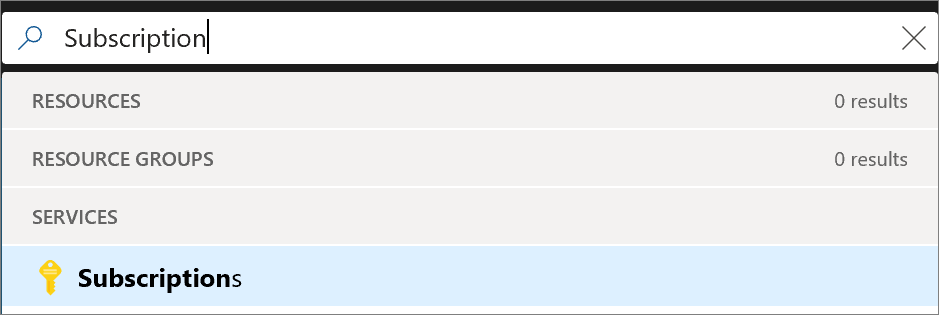

# Create an additional subscription in the Azure portal

You can create additional subscriptions for your account in Azure. You may want an additional subscription to avoid hitting subscription limits, to create separate environments for billing and security, or to isolate data for compliance reasons.

If you want to create Azure subscriptions under your organization's Enterprise Agreement, you must have the Account Owner role for your organization.

If you don't already have an Azure subscription, create a [free account](https://azure.microsoft.com/free).

## Create an additional Azure subscription

1. Sign in to the [Azure portal](https://portal.azure.com).
1. Search for **Subscriptions**.

   

1. Select **Add**.

   

You can also create additional subscriptions programmatically. For more information, see [Programmatically create Azure Enterprise subscriptions](../azure-resource-manager/programmatically-create-subscription.md).

## Next steps

- [Add or change Azure subscription administrators](billing-add-change-azure-subscription-administrator.md)
- [Move resources to new resource group or subscription](../azure-resource-manager/resource-group-move-resources.md?toc=/azure/billing/TOC.json)
- [Create management groups for resource organization and management](../governance/management-groups/create.md?toc=/azure/billing/TOC.json)
- [Cancel your subscription for Azure](billing-how-to-cancel-azure-subscription.md)

## Need help? Contact us.

If you have questions or need help,  [create a support request](https://go.microsoft.com/fwlink/?linkid=2083458).
