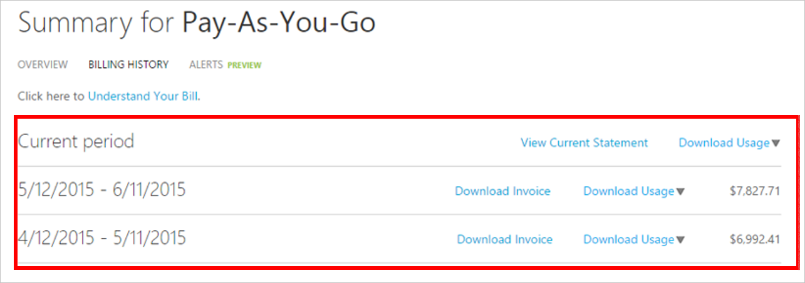
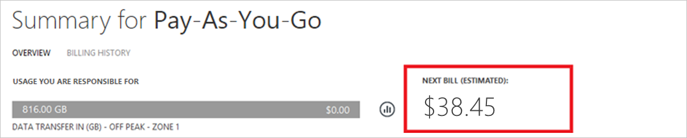
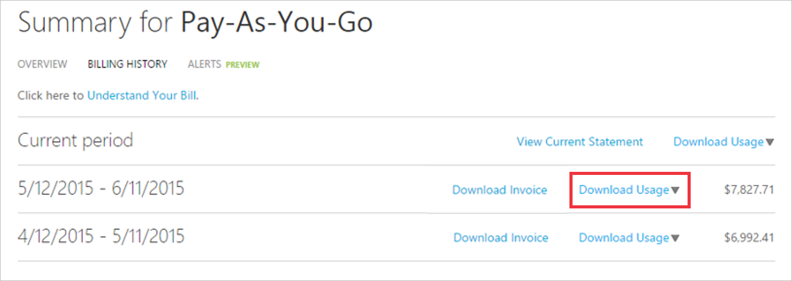

# Download or view your Azure billing invoice and daily usage data
You can download your invoice from the [Azure portal](https://portal.azure.com/#blade/Microsoft_Azure_Billing/SubscriptionsBlade) or have it sent in email. To download your daily usage, go to the [Azure Account Center](https://account.azure.com/Subscriptions). Only certain roles have permission to get billing invoice and usage information, like the Account Administrator. To learn more about getting access to billing information, see [Manage access to Azure billing using roles](billing-manage-access.md).

This article does not apply to Enterprise Agreement (EA) customers. If you’re an EA customer, your invoices are sent directly to the Enrollment Administrators.

[!INCLUDE [GDPR-related guidance](../../includes/gdpr-intro-sentence.md)]

> [!div class="nextstepaction"]
> [Help improve Azure billing docs](https://go.microsoft.com/fwlink/p/?linkid=2010091)

## Get your invoice in email (.pdf)
You can opt in and configure additional recipients to receive your Azure invoice in an email. This feature may not be available for certain subscriptions such as support offers, Enterprise Agreements, or Azure in Open.

1. Select your subscription from the [Subscriptions page](https://portal.azure.com/#blade/Microsoft_Azure_Billing/SubscriptionsBlade). Opt-in for each subscription you own. Click **Invoices** then **Email my invoice**. 

    
    
2. Click **Opt in** and accept the terms.

    
 
3. Once you've accepted the agreement, you can configure additional recipients. When a recipient is removed, the email address is no longer stored. If you change your mind, you need to re-add them.

    
    
If you don't get an email after following the steps, make sure your email address is correct in the [communication preferences on your profile](https://account.windowsazure.com/profile).

### Opt out from getting your invoice in email
If you don't want to get your invoice in email, click Opt out of emailed invoices. This removes any email addresses set to receive invoices in email. If you opt back in you will have to reconfigure recipients.

 

## Download invoice from Azure portal (.pdf)

1. Select your subscription from the [Subscriptions page](https://portal.azure.com/#blade/Microsoft_Azure_Billing/SubscriptionsBlade) in Azure portal as [a user with access to invoices](billing-manage-access.md).

2. Select **Invoices**. 

     

3. Click **Download Invoice** to view a copy of your PDF invoice. If it says **Not available**, see [Why don't I see an invoice for the last billing period?](#noinvoice)

    

4. You can also view your daily usage by clicking the billing period. 

For more information about your invoice, see [Understand your bill for Microsoft Azure](billing-understand-your-bill.md). For help managing costs, see [Prevent unexpected costs with Azure billing and cost management](billing-getting-started.md).

## Download usage from the Account Center (.csv)

1. Sign into the [Azure Account Center](https://account.windowsazure.com/subscriptions) as the Account Administrator.

2. Select the subscription for which you want the invoice and usage information.

3. Select **BILLING HISTORY**. 

    

4. You can see your statements for the last six billing periods and the current unbilled period. 

    

5. Select **View Current Statement** to see an estimate of your charges at the time the estimate was generated. This information is only updated daily and may not include all your usage. Your monthly invoice may differ from this estimate.

    

    

6. Select **Download Usage** to download the daily usage data as a CSV file. If you see two versions available, download version 2.

    

Only the Account Administrator can access the Azure Account Center. Other billing admins, such as an Owner, can get usage information using the [Billing APIs](billing-usage-rate-card-overview.md).

For more information about your daily usage, see [Understand your bill for Microsoft Azure](billing-understand-your-bill.md). For help managing costs, see [Prevent unexpected costs with Azure billing and cost management](billing-getting-started.md).

##  Why don't I see an invoice for the last billing period?

There could be several reasons that you don't see an invoice:

- You have a monthly credit amount with your subscription that you didn't exceed or you have a Free Trial. An invoice is only generated when you owe money.

- It's less than 30 days from the day you subscribed to Azure.

- The invoice isn't generated yet. Wait until the end of the billing period.

- If you're not the Account Administrator, older invoices may not be available to you.

## Need help? Contact support.
If you still have further questions, [contact support](https://portal.azure.com/?#blade/Microsoft_Azure_Support/HelpAndSupportBlade) to get your issue resolved quickly.

