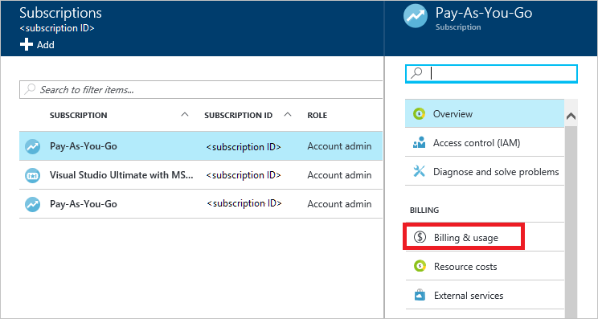
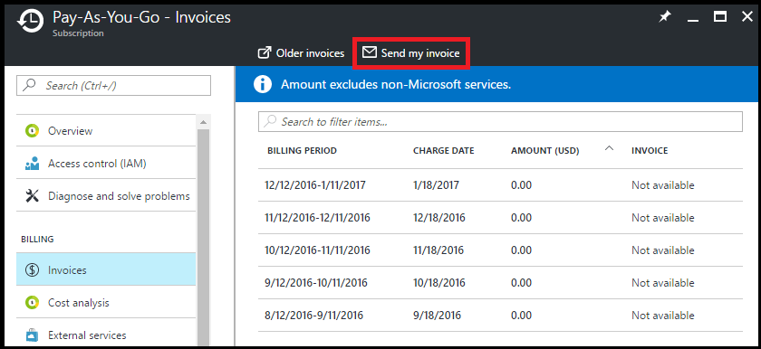
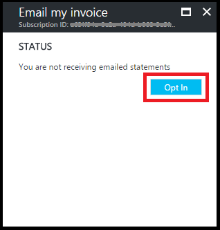
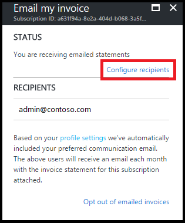

# View and download your Microsoft Azure invoice

For most subscriptions, you can download your invoice from the [Azure portal](https://portal.azure.com/#blade/Microsoft_Azure_Billing/SubscriptionsBlade) or have it sent in email. If you're an Azure customer with an Enterprise Agreement (EA customer), you can't download your organization's invoices. Invoices are sent to whoever is set up to receive invoices for the enrollment.

Only certain roles have permission to view invoices, like the Account Administrator or Enterprise Administrator. To learn more about getting access to billing information, see [Manage access to Azure billing using roles](billing-manage-access.md).

If you have a [Microsoft Customer Agreement](#check-your-access-to-a-microsoft-customer-agreement), you must be a billing profile Owner, Contributor, Reader, or Invoice manager to get your invoices. To learn more about billing roles for Microsoft Customer Agreements, see [Billing profile roles and tasks](billing-understand-mca-roles.md#billing-profile-roles-and-tasks).

## Download your Azure invoices (.pdf)

For most subscriptions, you can download your invoice from the Azure portal. If you have a Microsoft Customer Agreement, see [Download invoices for a Microsoft Customer Agreement](#download-invoices-for-a-microsoft-customer-agreement).

### Download invoices for an individual subscription

1. Select your subscription on the [Subscriptions page](https://portal.azure.com/#blade/Microsoft_Azure_Billing/SubscriptionsBlade) in the Azure portal as [a user with access to invoices](billing-manage-access.md).

2. Select **Invoices**.

    

3. Click **Download Invoice** to view a copy of your PDF invoice. If it says **Not available**, see [Why don't I see an invoice for the last billing period?](#noinvoice)

    

4. You can also view your daily usage by clicking the billing period.

For more information about your invoice, see [Understand your bill for Microsoft Azure](billing-understand-your-bill.md). For help managing your costs, see [Prevent unexpected costs with Azure billing and cost management](billing-getting-started.md).

### Download invoices for a Microsoft Customer Agreement

Invoices are generated for each [billing profile](billing-mca-overview.md#billing-profiles) in the Microsoft Customer Agreement. You must be a billing profile Owner, Contributor, Reader, or Invoice manager to download invoices from the Azure portal.

1. Sign in to the [Azure portal](https://portal.azure.com).
1. Search for *Cost Management + Billing*.
1. Select a billing profile. Depending on your access, you might need to select a billing account first.
1. Select **Invoices**.
1. In the invoice grid, find the row of the invoice you want to download.
1. Click the ellipsis (`...`) at the end of the row.
    
1. In the download context menu, select **Invoice**.

    

If you don't see an invoice for the last billing period, see [Why don't I see an invoice for the last billing period?](#noinvoice)

## Get your invoice in email (.pdf)

You can opt in and configure additional recipients to receive your Azure invoice in an email. This feature may not be available for certain subscriptions such as support offers, Enterprise Agreements, or Azure in Open. If you have a Microsoft Customer agreement, see the next section, [Get your billing profile invoices in email](#get-your-subscriptions-invoices-in-email).

### Get your subscription's invoices in email

1. Select your subscription on the [Subscriptions page](https://portal.azure.com/#blade/Microsoft_Azure_Billing/SubscriptionsBlade). Opt in for each subscription you own. Click **Invoices** then **Email my invoice**.

    

2. Click **Opt in** and accept the terms.

    

3. When you've accepted the agreement, you can configure additional recipients. When a recipient is removed, the email address is no longer stored. If you change your mind, you need to re-add them.

    

If you don't get an email after following the steps, make sure your email address is correct in the [communication preferences on your profile](https://account.windowsazure.com/profile).

### Opt out of getting your subscription's invoices in email

To opt out of getting your invoice by email, follow the preceding steps and click **Opt out of emailed invoices**. This option removes any email addresses set to receive invoices in email. You can reconfigure recipients if you opt back in.

 

### Get your Microsoft Customer Agreement invoices in email

If you have a Microsoft Customer Agreement, you can opt in to get your invoice in an email. All billing profile Owners, Contributors, Readers, and Invoice managers will get the invoice by email. Readers can't update the email invoice preference.

1. Sign in to the [Azure portal](https://portal.azure.com).
1. Search for **Cost Management + Billing**.
1. Select a billing profile. Depending on your access, you might need to select a billing account first.
1. Under **Settings**, select **Properties**.
1. Under **Email Invoice**, select **Update email invoice preference**.

    

1. Select **Opt in**.
1. Click **Update**.

### Opt out of getting your Microsoft Customer Agreement invoices in email

To opt out of getting your invoice by email, follow the preceding steps and click **Opt out**. All Owners, Contributors, Readers, and Invoice managers are opted out of getting the invoice by email, too. If you're a Reader, you can't change the email invoice preference.

###  Why don't I see an invoice for the last billing period?

There could be several reasons that you don't see an invoice:

- It's less than 30 days from the day you subscribed to Azure.

- The invoice isn't generated yet. Wait until the end of the billing period.

- You don't have permission to view invoices. If you have a Microsoft Customer Agreement, you must be the billing profile Owner, Contributor, Reader, or Invoice manager. For other subscriptions, you might not see old invoices if you aren't the Account Administrator. To learn more about getting access to billing information, see [Manage access to Azure billing using roles](billing-manage-access.md).

- If you have a Free Trial or a monthly credit amount with your subscription that you didn't exceed, you won't get an invoice unless you have a Microsoft Customer Agreement.

## Check your access to a Microsoft Customer Agreement
[!INCLUDE [billing-check-mca](../../includes/billing-check-mca.md)]

## Need help? Contact us.

If you have questions or need help, [create a support request](https://go.microsoft.com/fwlink/?linkid=2083458).

## Next steps

To learn more about your invoice and charges, see:

- [View and download your Microsoft Azure usage and charges](billing-download-azure-daily-usage.md)
- [Understand your bill for Microsoft Azure](billing-understand-your-bill.md)
- [Understand terms on your Azure invoice](billing-understand-your-invoice.md)
- [Understand terms on your Microsoft Azure detailed usage](billing-understand-your-usage.md)
- [View your organization's Azure pricing](billing-ea-pricing.md)

If you have a Microsoft Customer Agreement, see:

- [Understand the charges on the invoice for your billing profile](billing-mca-understand-your-bill.md)
- [Understand terms on the invoice for your billing profile](billing-mca-understand-your-invoice.md)
- [Understand the Azure usage and charges file for your billing profile](billing-mca-understand-your-usage.md)
- [View and download tax documents for your billing profile](billing-mca-download-tax-document.md)
- [View your organization's Azure pricing](billing-ea-pricing.md)
