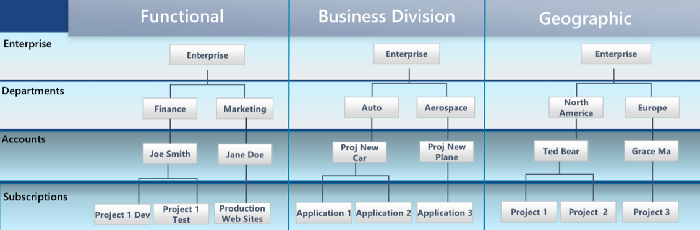
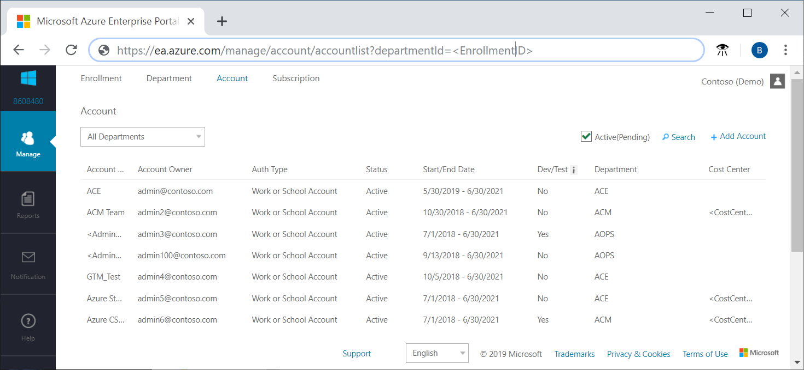
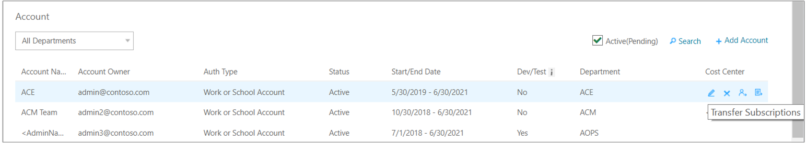

# Get started with the Azure EA portal

This article helps direct and indirect Azure EA customers to start using the [Azure EA portal](https://ea.azure.com) with basic information about:

- How the Azure EA portal is structured.
- Roles used in the Azure EA portal.
- How to start creating subscriptions.
- Analyze costs in the Azure EA portal and the Azure portal.

Here's a video that shows a full Azure EA portal onboarding session:

[Azure EA portal onboarding video ](https://www.youtube.com/watch?v=OiZ1GdBpo-I)

>[!VIDEO https://www.youtube.com/embed/OiZ1GdBpo-I]

## Azure EA portal hierarchy

The Azure EA portal hierarchy consists of:

**Microsoft Azure EA portal** - The Azure EA portal is an online management portal that helps you manage costs for your Azure EA services. You use it to create an Azure EA hierarchy including departments, accounts, and subscriptions. You also use it to reconcile the costs of your consumed services, download usage reports, and view price lists. And, you create API keys for your enrollment.

**Departments** - You create departments to help segment costs into logical groupings and then set a budget or quota at the department level.

**Accounts** – Accounts are organizational units in the Azure EA portal and they're used to manage subscriptions. Accounts also used for reporting.

**Subscriptions** – Subscriptions are the smallest unit in the Azure EA portal. They're containers for Azure services managed by the service administrator.

The following diagram illustrates simple Azure EA hierarchies.

## Enterprise user roles

To administer the Azure services in your enrollment, there are four distinct enterprise administrative user roles:

- Enterprise administrator
- Department administrator
- Account owner
- Service administrator

Roles are used to complete tasks in two different Microsoft Azure portals. The Azure EA portal (https://ea.azure.com) is used to help you to manage billing and costs. The Azure portal (https://portal.azure.com) is used to manage Azure services.

User roles are associated with a user account. To validate user authenticity, each user must have a valid Work, School, or Microsoft Account. Ensure that each account is associated with an email address that's actively monitored. Account notifications are sent to the email address.

When setting up users, you can assign multiple Work, School, or Microsoft accounts to the Enterprise Administrator role. However, you can assign only one Work, School, or Microsoft account to the Account Owner role. Additionally, a single Work, School, or Microsoft account can have both the Enterprise Administrator and Account Owner roles applied to it.

### Enterprise administrator

The enterprise administrator role has the highest level of access. Users with the role can:

- Manage accounts and account owners
- Manage other enterprise administrators
- Manage department administrators
- Manage notification contacts
- View usage across all accounts
- View unbilled charges across all accounts

You can have multiple enterprise administrators in an enterprise enrollment. You can grant read-only access to enterprise administrators. They all inherit the department administrator role.

### Department administrator

Users with the role can:

- Create and manage departments
- Create new account owners
- View usage details for the departments that they manage
- View costs, if granted necessary permissions

You can have multiple department administrators for each enterprise enrollment.

You can grant department administrators read-only access. To grant read-only access, edit or create a new department administrator and set the read-only option to **Yes**.

### Account owner

Users with the role can:

- Create and manage subscriptions
- Manage service administrators
- View usage for subscriptions

Each account requires a unique Work, School, or Microsoft Account. For more information about Azure EA Portal administrative roles, see [Understand Azure Enterprise Agreement administrative roles in Azure](billing-understand-ea-roles.md).

### Service administrator

The service administrator has permissions to manage services in the Azure portal and assign users to the coadministrator role.

## Activate your enrollment

To activate your service, the initial enterprise administrator opens the Azure EA portal at [https://ea.azure.com](https://ea.azure.com) and signs in using the email address from the invitation email.

If you have more than one enrollment, choose one to activate. By default, only active enrollments are shown. To view enrollment history, clear the **Active** option in the top right of the Azure EA portal.

Under Enrollment, the status shows **Active**.

Only existing Azure enterprise administrators can create other enterprise admins.

To create another enterprise admin:

- Sign in to [Azure EA portal](https://ea.azure.com)  and navigate to **Manage** > **Enrollment Detail** and click **+ Add Administrator** in the top-right corner of the page.

Make sure that you have the user's email addresses and preferred authentication method, such as Work or School authentication or Microsoft account. You need the information to add a user.

If you're not the EA administrator, contact an EA administrator to request that they add you to an enrollment. After you're added to an enrollment, you receive an activation email.

If your EA administrator can't assist you, create an [Azure EA portal support request](https://support.microsoft.com/supportrequestform/cf791efa-485b-95a3-6fad-3daf9cd4027c). Provide the following information:

- Enrollment number
- Email address to add and authentication type (Work, School, or Microsoft account)
- Email approval from an existing EA administrator
  - If the existing EA admin isn't available, contact your partner or software advisor to request that they change the contact details through the VLSC tool.

For more information about enterprise administrative roles, see [Understand Azure Enterprise Agreement administrative roles in Azure](billing-understand-ea-roles.md).

## Create an Azure EA department

Enterprise administrators and department administrators use departments to organize and report on enterprise Azure services and usage by department and cost center. The enterprise administrator can:

- Add or remove departments
- Associate an account to a department
- Create department administrators
- Allow department administrators to view price and costs

A department administrator can add new accounts to their departments. They can remove accounts from their departments, but not from the enrollment.

To add a department:

1. In the left navigation area, click **Manage**.
2. Click the **Department** tab, then click **+ Add Department** and then enter the required information.
3. The Department name is the only required field. It must be at least three characters.
4. When complete, click **Add**.

## Add a department admin

After a department is created, the Azure enterprise administrator can add department administrators and associate each one to a department. The department administrator can:

- Create other department administrators
- View and edit department properties like name or cost center
- Add an account for their departments
- Remove accounts from their departments
- Download usage details for their departments
- View the monthly usage and charges for their department if an enterprise administrator has granted them permission 1

### To add a department admin

As an enterprise administrator:

1. In the left navigation area, click **Manage**.
2. Click the **Department** tab and then click the department.
3. Click **+ Add Administrator** and add the required information.
4. For read-only access, set the **Read-Only** option to **Yes** and then click **Add**.

### To set read-only access

You can grant read-only access to department administrators. When creating a new department administrator:

- Set the read-only option to **Yes**.

To edit an existing department administrator:

1. Select a department and then click the pencil symbol next to the **Department Administrator** that you want to edit.
2. Set the read-only open to **Yes**. and then click **Save**.

Users with the enterprise administrator role automatically get department administrator permissions.

1 If you were given permission to view department monthly usage and charges but can't see them, contact your partner.

## Add an account

Account and subscription structure impact how they're administered and how they appear on your invoices and reports. Examples of typical organization include structuring by business divisions, functional teams, and geographic locations.

To add an account:

1. In the Azure EA portal, click **Manage** in the left navigation area.
2. Click the **Account** tab and then on the **Account** page, click **+Add Account**.
3. Select a department, or leave it as unassigned, and then select desired authentication type.
4. Type a friendly name to use to identify the account in reporting.
5. Type the **Account Owner Email** address to associate with the new account.
6. Confirm the email address and then click **Add**.

You can add another account by clicking **Add Another Account**, or you can click **Add** at the bottom-right corner of the left toolbar.

To confirm account ownership:

1. Sign in to the Azure EA portal.
2. Confirm account ownership by viewing the status. The status should change from **Pending** to **Start/End date**. The Start/End date is the date the user first signed in and the agreement end date.

## Change account owner

Enterprise administrators can use the Azure EA portal to transfer subscription account ownership in an enrollment. The action moves all subscriptions from a source user account a destination user account.

Important points about transferring user account information:

- Transfers from a Work or School account to another Work or School account are supported.
- Transfers from a Microsoft account to a Work or School account are supported.
- Transfers from a Work or School account to a Microsoft account are not supported.
- Transfers from a Microsoft account to another Microsoft account are supported. The target account must be a valid Azure Commerce account to be a valid target for transfers. For new accounts, you are asked to create an Azure Commerce account when signing in to the Azure EA portal. For existing accounts, you must first create a new Azure subscription before the account is eligible.
- When you complete a subscription transfer, Microsoft updates the account owner.

RBAC Policies:

- Only Azure subscription transfers between two organizational IDs in the same tenant preserve existing Azure role-based access control (RBAC) policies, service administrator role assignments, and coadministrator role assignments. Other subscription transfers result in losing your RBAC policies and service administrator coadministrator role assignments. Policies and administrator roles don't transfer across different directories. Service administrators are updated to the owner of destination account.
- When you perform subscription transfers between two organizational ID's in the same tenant, RBAC policies and existing service administrator and coadministrator roles are preserved.

Before changing an account owner:

1. View the **Account** tab and identify the source account. The source account must be active.
2. Identify the destination account. It must be active.

To transfer account ownership for all subscriptions:

1. In the left navigation area, click **Manage**.
2. Click the **Account** tab and hover over an account.
3. Click the change account owner symbol on the right. The symbol resembles a person.
4. Select an eligible account and then click **Next**.
5. Confirm the transfer and click **Submit**.

To transfer account ownership for a single subscription:

1. In the left navigation area, click **Manage**.
2. Click the **Account** tab and hover over an account.
3. Click the transfer subscriptions symbol on the right. The symbol resembles a page.
4. Select an eligible subscription and then click **Next**.
5. Confirm the transfer and then click **Submit**.

Here's a video that shows Azure EA portal user management:

[Azure EA portal user management video](https://www.youtube.com/watch?v=621jVkvmwm8)

>[!VIDEO https://www.youtube.com/embed/621jVkvmwm8]

## Create a subscription

Account owners can view and manage subscriptions. You can use subscriptions to give teams in your organization access to development environments and projects. For example test, production, development, and staging. When you create different subscriptions for each application environment, you help secure each environment. You can also assign a different service administrator account for each subscription. You can associate subscriptions with any number of services. The account owner creates subscriptions and assigns a service administrator account to each subscription in their account.

### Add a subscription

Use the following information to add a subscription.

The first time you add a subscription to your account, you're asked to accept the MOSA agreement and a rate plan. Although they aren't applicable to Enterprise Agreement customers, they're needed to create your subscription. Your Microsoft Azure Enterprise Agreement Enrollment Amendment supersedes the above items and your contractual relationship doesn't change. When prompted, select the box indicating that you accept the terms.

All new subscriptions are created with the default subscription name of _Microsoft Azure Enterprise_. You can update the subscription name to differentiate it from the other subscriptions in your enrollment. And, to ensure that it's recognizable in reports at the enterprise level.

To add a subscription:

1. In the Azure EA portal, sign in to the account.
2. Click the **Admin** tab and then click **Subscription** at the top of the page.
2. Verify that you're signed in as the account owner of the account.
3. Click **+Add Subscription** and then click **Purchase**.
  The first time you add a subscription to an account, you must provide your contact information. When adding additional subscriptions, your contact information is added for you.
4. Click **Subscriptions**, then select the subscription you created, and then click **Edit Subscription Details**.
5. Update the **Subscription Name** and **Service Administrator** then select the checkmark.
  The subscription name appears on reports and is the name of the project associated with the subscription in the development portal.

New subscriptions can take up to 24 hours to appear in the subscriptions list. After you've created a subscription, you can:

- [Edit subscription details](https://account.azure.com/Subscriptions)
- [Manage subscription services](https://portal.azure.com/#home)

## Transfer individual subscription to EA subscription

To transfer an individual subscription with pay-as-you-go rates to and EA subscription, you must create a new support request in the Azure portal. To create a support request, click **+ New support request** in the Help and Support area.

## View usage summary and download reports

Enterprise administrators can view a summary of their usage data, monetary commitment consumed, and charges associated with additional usage in the Azure EA portal. Charges are presented at the summary level across all accounts and subscriptions.

To view detailed usage for specific accounts

Download the Usage Detail report. Click **Reports** and then click the **Download Usage** tab. In the list of reports, click **Download** for the monthly report that want to get.

The report doesn't include any applicable taxes. There may be a latency of up to eight hours from the time when usage was incurred to when it's reflected on the report.

To view the Usage Summary reports and graphs:

1. In the Azure EA portal, in the left navigation area, click **Reports** and view the **Usage Summary** tab.  
  
2. Select a commitment term.
3. Toggle between **M** (Monthly) and **C** (Custom) on the top right of the page to view the **Usage Summary** with custom start and end dates.  
  
4. Select a period or month on the graph to view additional details.
5. The graph shows month over month usage with a breakdown of utilized usage, service overcharge, charges billed separately, and marketplace charges.
6. For the selected month, filter by departments, accounts, and subscriptions below the graph.
7. Toggle between **Charge by Services** and **Charge by Hierarchy**.
8. Expand and collapse between **Azure Service**, **Charges Billed Separately**, and **Azure Marketplace** to view details.

Here's a video that shows how to view usage:

[Azure EA portal usage video](https://www.youtube.com/watch?v=Cv2IZ9QCn9E)

>[!VIDEO https://www.youtube.com/embed/Cv2IZ9QCn9E]

### Download CSV reports

Enterprise Administrators use the Monthly Report Download page to download several reports as CSV files. They include:

- Balance and Charge
- Usage Detail
- Marketplace Charges
- Price Sheet

To download reports:

1. In the Azure EA portal, click **Reports**.
2. Click **Download Usage** at the top of the page.
3. Select **Download** next to the month's report.

There may be a latency of up to five days between the incurred usage date and when usage is shown in the reports.

Users downloading CSV files with Safari to Excel may experience formatting errors. To avoid errors open the file using a text editor.

Here's a video that shows how to download usage information:

[Azure EA portal usage video](https://www.youtube.com/watch?v=eY797htT1qg)

>[!VIDEO https://www.youtube.com/embed/eY797htT1qg]

## Schedule an onboarding call

If you want to schedule an in-person customer onboarding session, create a support request at [Azure EA Portal Support](https://support.microsoft.com/supportrequestform/e114582c-4e51-af46-10b1-1f0cc141e133). Select **Onboarding** as the **Issue Category**.

## Next steps
- Azure EA portal administrators should read [Azure EA portal administration](billing-ea-portal-administration.md) to learn about common administrative tasks.
- If you need help troubleshooting Azure EA portal issues, see [Troubleshoot Azure EA portal access](billing-ea-portal-troubleshoot.md).
