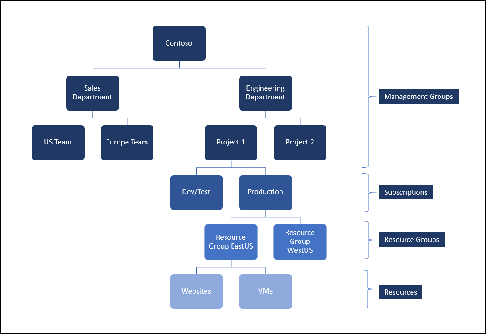
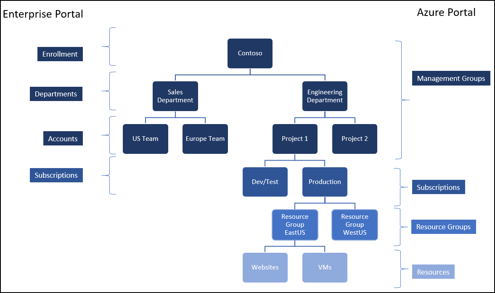

# Organize your resources with Azure Management Groups 

If you have multiple subscriptions, you can organize them into containers called “management groups" to help you manage access, policy, costs, and compliance across your subscriptions. As an example, you can apply policies to a management group that limit which resource types can be created.
 
A few items to note: 
* Management groups are currently available to Azure Enterprise Agreement customers. 
* Support for the following customers will be enabled in future releases. 
    * [Pay-As-You-Go](https://azure.microsoft.com/en-us/offers/ms-azr-0003p/)
    * [Cloud Solution Provider](https://partner.microsoft.com/en-us/cloud-solution-provider) 
    * [Enterprise Indirect Partners](https://www.microsoftpartnerserverandcloud.com/Pages/home.aspx)  
    * [Azure Government](https://azure.microsoft.com/en-us/overview/clouds/government/) 
    * [Azure Germany](https://azure.microsoft.com/en-us/overview/clouds/germany/)
    * [Azure China](https://www.azure.cn/)

Management groups can be organized into a hierarchy. The structure shown is a sample representation of a management group hierarchy that you can create:

### Management group administrator must belong to the same directory as management group
Like subscriptions, management groups also have a trust relationship with Azure AD. A management group hierarchy trusts a single directory to authenticate users. All admins associated with a management group hierarchy must belong to the same directory.

## View your enterprise's hierarchy using management groups in the Azure portal
The introduction of management groups is the first step in unifying the [Enterprise portal](https://ea.azure.com) and the Azure portal.

The [Enterprise Agreement (EA)](https://azure.microsoft.com/en-us/pricing/enterprise-agreement/https:/azure.microsoft.com/en-us/pricing/enterprise-agreement/) enrollment defines the shape and use of Azure services within a company and is the core governance structure. Within the enrollment, customers can subdivide the environment into departments, accounts, and finally, subscriptions. 

The management group structure is created in the environment that you have defined in the Enterprise portal. The entire hierarchy consisting of enrollment, departments, and accounts are mapped to corresponding management groups – all associated with the same directory. Where possible, an existing directory associated with the enrollment user accounts is selected. In some cases, a new directory is created and all existing enrollment users are invited into that directory. This new directory does not impact the directories associated with the subscriptions in the enrollment. Therefore, the hierarchy might get created in a directory different from the subscriptions. [Learn more](billing-enterprise-mgmt-grp-find.md) about how this process impacts the experience of navigating between the hierarchy and its subscriptions.

Here is how the current EA structure maps to management group hierarchy. The initial management group hierarchy is seeded with the hierarchy defined in your enterprise enrollment. 

The users from the Enterprise portal are added with a role to manage the mapped management group node.

|    EA role                                       |    Role on the mapped management   group node    |    Permissions on management   group node                                                          |
|--------------------------------------------------|--------------------------------------------------|----------------------------------------------------------------------------------------------------|
|    EA Administrator                              |    Resource Policy Contributor                   |    Can view costs, manage resource policy and view hierarchy at and   below the enrollment node    |
|    EA Administrator in read-only mode            |    Billing Reader                                |    Can read costs and view hierarchy at and below the enrollment node                              |
|    Department Administrator                      |    Billing Reader                                |    Can read costs and view hierarchy and below the department node                                 |
|    Department Administrator in read-only mode    |    Billing Reader                                |    Can read costs and view hierarchy and below the department node                                 |
|    Account Owner                                 |    Resource Policy Contributor                   |    Can view costs, manage resource policy and view hierarchy at and   below the account node       |

## View management groups in the Azure portal

To view an enrollment, department, or an account within the preview, sign in to the Azure portal with the link in the welcome email.   

### Viewing Costs 
On the detail screens of management groups, you see the current month to date costs.  These costs are based on usage and do not account for prepaid amounts, overages, included quantities, adjustments, and taxes.  

For management groups with the type of enrollment, the costs section shows you the commitment remaining.  This displayed cost is based on your current costs against commitment vs your total annual commitment.  

“Costs billed separately” are the monthly accumulation of separate changes like marketplace, overages, and other costs that do not go against your enrollment’s commitment.  For more information about the cost breakout, see the [Enterprise portal](https://ea.azure.com). 

### Enabling access to costs
If you are not seeing costs, see our [Troubleshoot enterprise cost views](https://aka.ms/enableazurecosts) document for help.  

### Delays between the Enterprise portal and Azure portal 
* During the preview, amounts displayed within the Azure portal might be delayed compared to values in the Enterprise portal. This issue is temporary and is being worked on.
* Updated settings in the Enterprise portal have a delay of several minutes before the updates are reflected in the Azure portal. 

## Administering your management groups
Management groups within the Azure portal are in preview and are read-only at this initial release. To make any updates, go to the Enterprise portal. Your updates are reflected in the Azure portal automatically. 
See the documentation within the enterprise portal for help on making edits and additions.   

## Policy Management
Resource Manager enables you to create customized policies for managing your resources. With management groups, polices can be assigned at any level in the hierarchy and the resources inherit those policies.  [Learn more](https://docs.microsoft.com/en-us/azure/azure-resource-manager/resource-manager-policy)

 Note: policy is not enforced across directories. 
