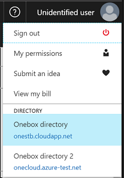

# Find an Azure subscription or management group

If you’re having trouble finding a subscription or management group in Azure, you might be looking in the wrong directory. This situation could happen when your account exists in multiple Azure Active Directories. Each [active directory is independent](https://docs.microsoft.com/en-us/azure/active-directory/active-directory-licensing-directory-independence) and access is not inherited across directories.      

## Switch directories 
You can easily switch directories in the Azure portal.
1.	Sign into the [Azure portal](https://portal.azure.com).
2.  Select your name in the top right of the screen. 
3.	The bottom of the menu lists all the directories you have access to.
4.	Select the directory you are looking to switch to. 

## Asset not found? 
If you are receiving an error message "Asset not found" when trying to access a subscription or management group, then you do not have the correct role to view this item.  Contact the administer of the subscription or management groups to be given access.  
* For subscriptions, reference [Azure Role-Based Access Control (RBAC)](https://docs.microsoft.com/en-us/azure/active-directory/role-based-access-control-configure) document for help on which role is needed.
* For management groups, RBAC access is not available and is coming soon. Contact your enterprise portal administer to have access assigned.   

## Improve your experience with management groups and subscriptions in the same directory 
You can transfer your subscriptions or your management groups into the directory you choose so that everything exists in the same place.  Consolidating subscriptions and management groups into the same directory helps reduce the need to switch directories and allow polices to be inherited.  

### Transfer your subscriptions 
If you're an enterprise portal administrator, [transfer ownership of the subscription](https://ea.azure.com/helpdocs/changeAccountOwnerForASubscription) to move the subscription to the directory with your management groups.

### Transfer your management groups
 The ability to move management groups is not available within the Azure portal and is coming soon.  
 

