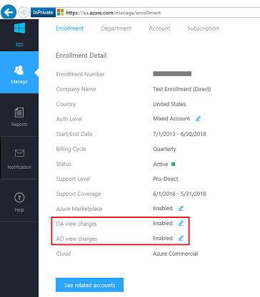

# Troubleshoot enterprise cost views 

Within enterprise enrollments, there are multiple settings that could cause users within the enrollment to not be able to view costs.  These settings are managed by the enrollment administrator, or by the partner if the enrollment is not purchased directly with Microsoft.  This article helps you understand what the settings are and how they impact the enrollment. These settings are independent of the [Azure RBAC Roles](https://docs.microsoft.com/azure/role-based-access-control/role-assignments-portal). 

## Enabling access to costs

Are you seeing a message Unauthorized, or *"Cost views are disabled in your enrollment."* when looking for cost information?

It might be due to one of the following reasons:

1. You’ve purchased Azure through an enterprise partner, and the partner hasn’t released pricing yet. To release pricing, contact your partner to do update the setting within the [Enterprise portal](https://ea.azure.com).
2. Alternatively, if you’re an EA Direct customer, there are a couple of possibilities:
    * You are an Account Owner and your Enrollment Administrator has disabled the "AO view charges" setting.  
    * You are a Department Administrator and your Enrollment Administrator has disabled the "DA view charges" setting.
    * Contact your Enrollment Administrator to get access. The Enrollment Admin can visit the [Enterprise portal](https://ea.azure.com/manage/enrollment) and update the setting as seen here:

## Asset is unavailable? 
If you are receiving an error message "This asset is unavailable" when trying to access a subscription or management group, then you do not have the correct role to view this item.  

Contact the administer of the subscription or management groups to be given access.  
* For subscriptions, reference [Azure Role-Based Access Control (RBAC)](https://docs.microsoft.com/azure/role-based-access-control/role-assignments-portal) document for help on which role is needed.
