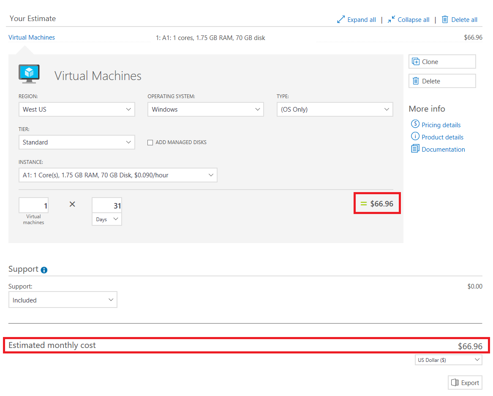
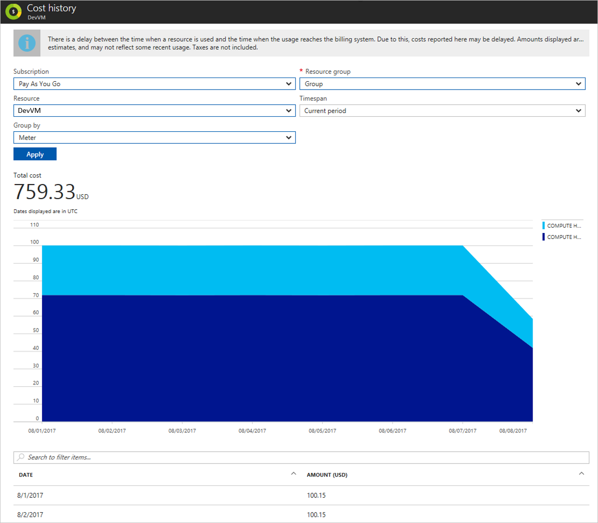

# Prevent unexpected charges with Azure billing and cost management

When you sign up for Azure, there are several things you can do to get a better idea of your spending. The [pricing calculator](https://azure.microsoft.com/pricing/calculator/) can provide an estimate of costs before you create an Azure resource. The [Azure portal](https://portal.azure.com/#blade/Microsoft_Azure_Billing/SubscriptionsBlade) provides you with the current cost breakdown and forecast for your subscription. If you want to group and understand costs for different projects or teams, look at [resource tagging](../azure-resource-manager/resource-group-using-tags.md). If your organization has a reporting system that you prefer to use, check out the [billing APIs](billing-usage-rate-card-overview.md).

- If your subscription is an Enterprise Agreement (EA), the public preview for seeing your costs in the Azure portal is available. If your subscription is through Cloud Solution Provider (CSP), or Azure Sponsorship, then some of the following features may not apply to you. See [Additional resources for EA, CSP, and Sponsorship](#other-offers) for more info.

- If your subscription is a Free Trial, [Visual Studio](https://azure.microsoft.com/pricing/member-offers/msdn-benefits-details/), Azure in Open (AIO), or BizSpark, your subscription is automatically disabled when all your credits are used. Learn about [spending limits](#spending-limit) to avoid having your subscription unexpectedly disabled.

- If you've signed up for [Azure free account](https://azure.microsoft.com/free/), [you can use some of the most popular Azure services for free for 12 months](billing-create-free-services-included-free-account.md). Along with the recommendations listed below, see [Avoid getting charged for free account](billing-avoid-charges-free-account.md).

## Get estimated costs before adding Azure services

### Estimate cost online using the pricing calculator

Check out the [pricing calculator](https://azure.microsoft.com/pricing/calculator/) to get an estimated monthly cost of the service you're interested in. You can add any first party Azure resource to get an estimate cost.

For example, an A1 Windows Virtual Machine (VM) is estimated to cost $66.96 USD/month in compute hours if you leave it running the whole time:

For more information on pricing, see this [FAQ](https://azure.microsoft.com/pricing/faq/). Or if you want to talk to an Azure salesperson, contact 1-800-867-1389.

### Review the estimated cost in the Azure portal

Typically when you add a service in the Azure portal, there's a view that shows you a similar estimated cost per month. For example, when you choose the size of your Windows VM, you see the estimated monthly cost for the compute hours:

###  Check if you have a spending limit on

If you have a subscription that uses credits, then the spending limit is turned on for you by default. This way, when you spend all your credits, your credit card doesn't get charged. See the [full list of Azure offers and the availability of spending limit](https://azure.microsoft.com/support/legal/offer-details/).

However, if you hit your spending limit, your services get disabled. That means your VMs are deallocated. To avoid service downtime, you must turn off the spending limit. Any overage gets charged onto your credit card on file. 

To see if you've got spending limit on, go to the [Subscriptions view in the Account Center](https://account.windowsazure.com/Subscriptions). A banner appears if your spending limit is on:

Click the banner and follow prompts to remove the spending limit. If you didn't enter credit card information when you signed up, you must enter it to remove the spending limit. For more information, see [Azure spending limit – How it works and how to enable or remove it](https://azure.microsoft.com/pricing/spending-limits/).

You can use the [Cloudyn](https://www.cloudyn.com/) service to create alerts that automatically notify stakeholders of spending anomalies and overspending risks. You can create alerts using reports that support alerts based on budget and cost thresholds. For more information on using Cloudyn, see [Tutorial: Review usage and costs](../cost-management/tutorial-review-usage.md).

This example uses the **Actual Cost Over Time** report to send a notification when your spending on an Azure VM  nears your total budget. In this scenario, you have a total budget of $20,000 and you want to receive a notification when costs are approaching half of your budget, $9,000, and an additional alert when costs reach $10,000.

1. From the menu at the top of the Cloudyn portal, select **Costs** > **Cost Analysis** > **Actual Cost Over Time**. 
2. Set **Groups** to **Service** and set **Filter on the service** to **Azure/VM**. 
3. In the top right of the report, select **Actions** and then select **Schedule report**.
4. To send yourself an email of the report at scheduled interval, select the **Scheduling** tab in the **Save or Schedule this** report dialog. Be sure to select **Send via email**. Any tags, grouping, and filtering you use are included in the emailed report. 
5. Select the **Threshold** tab and then select  **Actual Cost vs. Threshold**. 
   1. In the **Red alert** threshold box enter 10000. 
   2. In the **Yellow alert** threshold box enter 9000. 
   3. In the **Number of consecutive alerts** box, enter the number of consecutive alerts to receive. When you receive the total number of alerts that you specified, no additional alerts are sent. 
6. Select **Save**.

    

You can also choose the **Cost Percentage vs. Budget** threshold metric to create alerts. This allows you to specify the thresholds as percentages of your budget instead of currency values.

## Ways to monitor your costs when using Azure services

###  Add tags to your resources to group your billing data

You can use tags to group billing data for supported services. For example, if you run several VMs for different teams, then you can use tags to categorize costs by cost center (HR, marketing, finance) or environment (production, pre-production, test). 

The tags show up throughout different cost reporting views. For example, they're visible in your [cost analysis view](#costs) right away and detail usage .csv after your first billing period.

For more information, see [Using tags to organize your Azure resources](../azure-resource-manager/resource-group-using-tags.md).

###  Regularly check the portal for cost breakdown and burn rate

After you get your services running, regularly check how much they're costing you. You can see the current spend and burn rate in Azure portal.

1. Visit the [Subscriptions in the Azure portal](https://portal.azure.com/#blade/Microsoft_Azure_Billing/SubscriptionsBlade) and select a subscription.

2. If it's supported for your subscription, you  see the cost breakdown and burn rate.

    

3. Click **Cost analysis** in the list to the left to see the cost breakdown by resource. Wait 24 hours after you add a service for the data to populate.

    

4. You can filter by different properties like [tags](#tags), resource type, resource group, and timespan. Click **Apply** to confirm the filters and **Download** if you want to export the view to a Comma-Separated Values (.csv) file.

5. Additionally, you can click a resource to see your daily spend history and how much the resource costs each day.

    

We recommend you check the costs you see with the estimates you saw when you selected the services. If the costs are wildly different from the estimates, double check the pricing plan that you've selected for your resources.

### Consider enabling cost-cutting features like auto shutdown for VMs

Depending on your scenario, you can configure auto shutdown for your VMs in the Azure portal. For more information, see [Auto shutdown for VMs using Azure Resource Manager](https://azure.microsoft.com/blog/announcing-auto-shutdown-for-vms-using-azure-resource-manager/).

Auto shutdown isn't the same as when you shut down within the VM with power options. Auto shutdown stops and deallocates your VMs to stop additional usage charges. For more information, see pricing FAQ for [Linux VMs](https://azure.microsoft.com/pricing/details/virtual-machines/linux/) and [Windows VMs](https://azure.microsoft.com/pricing/details/virtual-machines/windows/) about VM states.

For more cost-cutting features for your development and test environments, check out [Azure DevTest Labs](https://azure.microsoft.com/services/devtest-lab/).

### Turn on and check out Azure Advisor recommendations

[Azure Advisor](../advisor/advisor-overview.md) is a feature that helps you reduce costs by identifying resources with low usage. Visit Advisor in the Azure portal:

Then, you can get actionable recommendations in the **Cost** tab in the Advisor dashboard:

For more information, see [Advisor Cost recommendations](../advisor/advisor-cost-recommendations.md).

## Reviewing costs at the end of your billing cycle

After the end of your billing cycle, your invoice will become available. You can also [download past invoices and detail usage files](billing-download-azure-invoice-daily-usage-date.md) to make sure you were charged correctly. For more information about comparing your daily usage with your invoice, see [Understand your bill for Microsoft Azure](billing-understand-your-bill.md).

### Billing API

Use our billing API to programmatically get usage data. Use the RateCard API and the Usage API together to get your billed usage. For more information, see [Gain insights into your Microsoft Azure resource consumption](billing-usage-rate-card-overview.md).

##  Additional resources and special cases

### EA, CSP, and Sponsorship customers
Talk to your account manager or Azure partner to get started.

| Offer | Resources |
|-------------------------------|-----------------------------------------------------------------------------------|
| Enterprise Agreement (EA) | [EA portal](https://ea.azure.com/), [help docs](https://ea.azure.com/helpdocs), and [Power BI report](https://powerbi.microsoft.com/documentation/powerbi-content-pack-azure-enterprise/) |
| Cloud Solution Provider (CSP) | Talk to your provider |
| Azure Sponsorship | [Sponsorship portal](https://www.microsoftazuresponsorships.com/) |

If you're managing IT for a large organization, we recommend reading [Azure enterprise scaffold](/azure/architecture/cloud-adoption-guide/subscription-governance) and the [enterprise IT white paper](https://download.microsoft.com/download/F/F/F/FFF60E6C-DBA1-4214-BEFD-3130C340B138/Azure_Onboarding_Guide_for_IT_Organizations_EN_US.pdf) (.pdf download, English only).

####  Preview Enterprise Agreement cost views within Azure portal 

Enterprise cost views are currently in Public Preview. Items to note:

- Subscription costs are based on usage and don't include prepaid amounts, overages, included quantities, adjustments, and taxes. Actual charges are computed at the Enrollment level.
- Amounts shown in the Azure portal might be different than what's in the Enterprise portal. Updates in the Enterprise portal may take a few minutes before the changes are shown in the Azure portal.
- If you aren't seeing costs, it might be for one of the following reasons:
    - You don't have permissions at the subscription level. To see enterprise cost views, you must be a Billing Reader, Reader, Contributor, or Owner at the subscription level.
    - You're an Account Owner and your Enrollment Administrator has disabled the "AO view charges" setting.  Contact your Enrollment Administrator to get access to costs. 
    - You're a Department Administrator and your Enrollment Administrator has disabled the "DA view charges" setting.  Contact your Enrollment Administrator to get access.
    - You bought Azure through a channel partner, and the partner didn't release pricing information.  
- If you update settings related to cost access in the Enterprise portal, there's a delay of a few minutes before the changes are shown in the Azure portal.
- Spending limit, and invoice guidance don't apply to EA Subscriptions.

### Check your subscription and access

To view costs, you must have [subscriptions-level access to billing information](billing-manage-access.md). Only the Account Admin can access the [Account Center](https://account.azure.com/Subscriptions), change billing information, and manage subscriptions. The Account Admin is the person who went through the sign-up process. For more information, see [Add or change Azure administrator roles that manage the subscription or services](billing-add-change-azure-subscription-administrator.md).

To see if you're the Account admin, go to [Subscriptions in the Azure portal](https://portal.azure.com/#blade/Microsoft_Azure_Billing/SubscriptionsBlade). Look at the list of subscriptions you have access to. Look under **My role**. If it says *Account admin*, then you're ok. If it says something else like *Owner*, then you don't have full privileges.

If you're not the Account admin, then somebody probably gave you partial access by using [Azure Active Directory Role-based Access Control](../role-based-access-control/role-assignments-portal.md) (RBAC). To manage subscriptions and change billing info, [find the Account Admin](billing-subscription-transfer.md#whoisaa). Ask the Account Admin to do the tasks or [transfer the subscription to you](billing-subscription-transfer.md).

If your Account admin is no longer with your organization and you need to manage billing, [contact us](https://go.microsoft.com/fwlink/?linkid=2083458).

### How to request a Service Level Agreement credit for a service incident

The Service Level Agreement (SLA) describes Microsoft’s commitments for uptime and connectivity. A service incident is reported when Azure services experience an issue that impacts uptime or connectivity, often referred to as an “outage.” If we do not achieve and maintain the Service Levels for each Service as described in the SLA, then you might be eligible for a credit towards a portion of your monthly service fees.

To request a credit:

1. Sign in to the [Azure portal](https://portal.azure.com/). If you have multiple accounts, make sure that you use the one that was affected by Azure downtime. This helps Support automatically collect the necessary background information and resolve the case faster.
2. Create a new support request.
3. Under **Issue type**, select **Billing**.
4. Under **Problem type**, select **Refund Request**.
5. Add details to specify that you’re asking for an SLA credit, mention the date/time/time-zone as well as the impacted services (VMs, Web Sites, etc.)
6. Verify your contact details and select the **Create** button to submit your request.

SLA thresholds vary by service. For example, SQL Web Tier has an SLA of 99.9%, VMs have an SLA of 99.95%, and SQL Standard Tier has an SLA of 99.99%.

For some services, there are prerequisites for the SLA to apply. For example, Virtual Machines must have two or more instances deployed in the same Availability Set.

For more information, see the [Service Level Agreements](https://azure.microsoft.com/en-us/support/legal/sla/) documentation and the [SLA summary for Azure services](https://azure.microsoft.com/en-us/support/legal/sla/summary/) documentation.

## Need help? Contact us.

If you have questions or need help,  [create a support request](https://go.microsoft.com/fwlink/?linkid=2083458).
