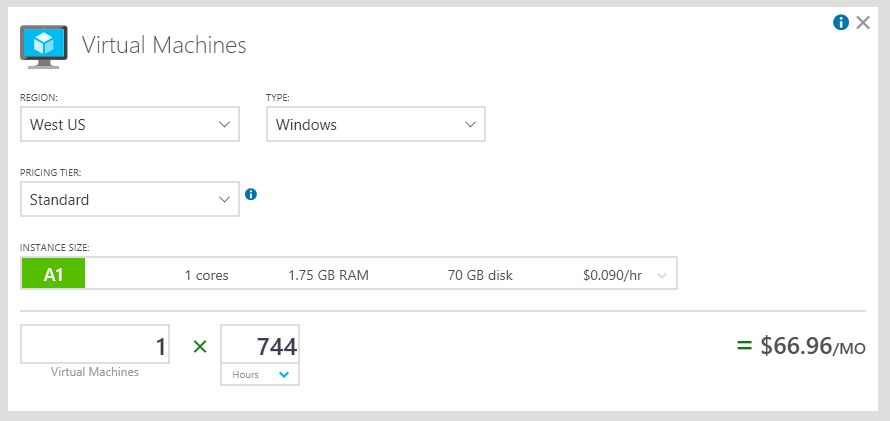
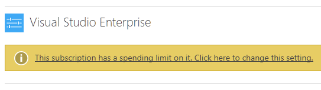
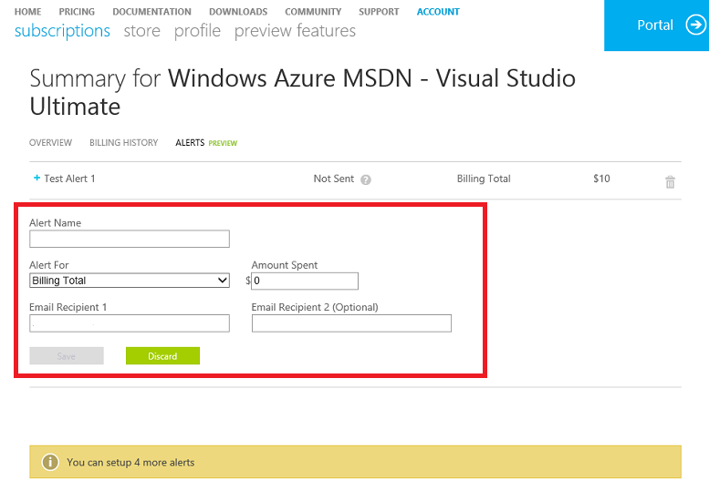
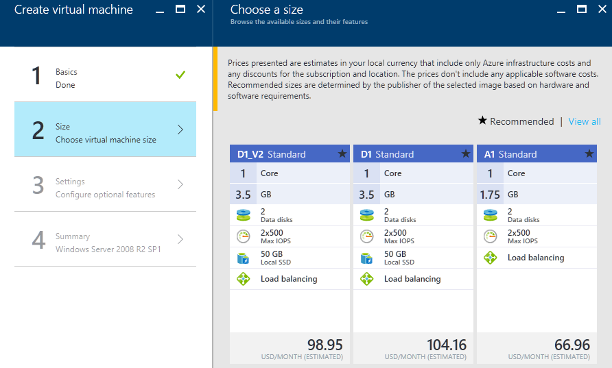
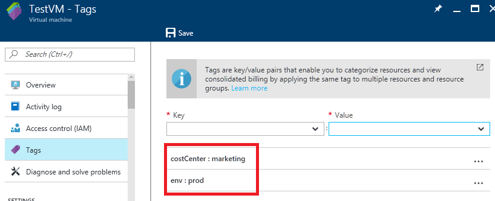
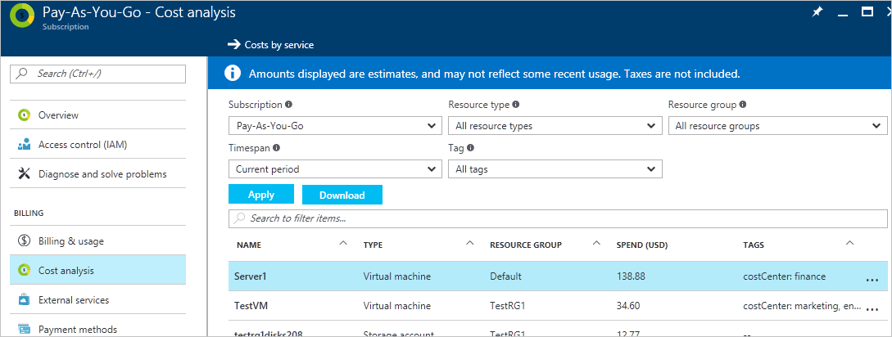
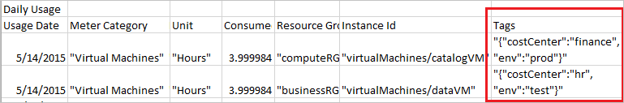

# Prevent unexpected costs with Azure billing and cost management

When you sign up for Azure, there are several things you can do to get a better idea of your spend. In the [Azure portal](https://portal.azure.com/#blade/Microsoft_Azure_Billing/SubscriptionsBlade), when you select the subscription, you can see your current cost breakdown and burn rate. You can also [download past invoices and detail usage files](billing-download-azure-invoice-daily-usage-date.md). If you want to group costs for resources used for different projects or teams, look at [resource tagging](../azure-resource-manager/resource-group-using-tags.md). If your organization has a reporting system that you prefer to use, check out the [billing APIs](billing-usage-rate-card-overview.md). 

For more information about your daily usage, see [Understand your bill for Microsoft Azure](billing-understand-your-bill.md).

If your subscription is through an Enterprise Agreement (EA), Cloud Solution Provider (CSP), or Azure Sponsorship, then many features in this article don't apply to you. Instead, we have a different set of tools that you can use for cost management. See [Additional resources for EA, CSP, and Sponsorship](#other-offers).

If your subscription is a Free Trial, [Visual Studio](https://azure.microsoft.com/pricing/member-offers/msdn-benefits-details/), Azure in Open (AIO), or BizSpark, then learn about [spending limits](#spending-limit) to avoid having your subscription unexpectantly disabled. 

## Day 0: Before you add Azure services

### Estimate cost online using the pricing calculator

Check out the [pricing calculator](https://azure.microsoft.com/pricing/calculator/) and [total cost of ownership calculator](https://aka.ms/azure-tco-calculator) to get an estimate the monthly cost of the service you're interested in. For example, an A1 Windows Virtual Machine (VM) is estimated to cost $66.96 USD/month in compute hours if you leave it running the whole time:

For more information, see [pricing FAQ](https://azure.microsoft.com/pricing/faq/). Or if you want to talk to a person, call 1-800-867-1389.

### Check your subscription and access

Viewing costs require [subscriptions-level access to billing information](billing-manage-access.md), but only the Account admin can access the [Account Center](https://account.windowsazure.com/Home/Index), change billing info, and manage subscriptions. The Account admin is the person who went through the sign-up process. For more information, see [Add or change Azure administrator roles that manage the subscription or services](billing-add-change-azure-subscription-administrator.md).

To see if you're the Account admin, go to the [Subscriptions blade in the Azure portal](https://portal.azure.com/#blade/Microsoft_Azure_Billing/SubscriptionsBlade) and look at the list of subscriptions you have access to. Look under **My Role**. If it says *Account admin*, then you're ok. If it says something else like *Owner*, then you don't have full privileges.

If you're not the Account admin, then somebody probably gave you partial access via [Azure Active Directory Role-based Access Control](../active-directory/role-based-access-control-configure.md) (RBAC). To manage subscriptions and change billing info, [find the Account admin](billing-subscription-transfer.md#whoisaa) and ask them to perform the tasks or [transfer the subscription to you](billing-subscription-transfer.md).

If your Account admin is no longer with your organization and you need to manage billing, [contact support](https://portal.azure.com/?#blade/Microsoft_Azure_Support/HelpAndSupportBlade). 

###  Check if you have a spending limit on

If you have a subscription that uses credits, then the spending limit is turned on for you by default. This way, when you spend all your credits, your credit card doesn't get charged. See the [full list of Azure offers and the availability of spending limit](https://azure.microsoft.com/support/legal/offer-details/).

However, if you hit your spending limit, your services get disabled. That means your VMs are deallocated. To avoid service downtime, you must turn off the spending limit. Any overage gets charged onto your credit card on file. 

To see if you've got spending limit on, go to the [Subscriptions view in the Account Center](https://account.windowsazure.com/Subscriptions). A banner appears if your spending limit is on:

Click the banner and follow prompts to remove the spending limit. If you didn't enter credit card information when you signed up, you must enter it to remove the spending limit. For more information, see [Azure spending limit – How it works and how to enable or remove it](https://azure.microsoft.com/pricing/spending-limits/).

### Set up billing alerts

Set up billing alerts to get emails when your usage costs exceed an amount that you specify. If you have monthly credits, set up alerts for when you use up a specified amount. For more information, see [Set up billing alerts for your Microsoft Azure subscriptions](billing-set-up-alerts.md).

> [!NOTE]
> This feature is still in preview so you should check your usage regularly.

You might want to use the cost estimate from the pricing calculator as a guideline for your first alert.

### Understand limits and quotas for your subscription

There are default limits to each subscription for things like the number of CPU cores and IP addresses. Be mindful of these limits. For more information, see [Azure subscription and service limits, quotas, and constraints](../azure-subscription-service-limits.md). You can request an increase to your limit or quota by [contacting support](https://portal.azure.com/?#blade/Microsoft_Azure_Support/HelpAndSupportBlade).

## Day 1: As you add services

### Review the estimated cost in the portal

Typically when you add a service in the Azure portal, there's a view that shows you a similar estimated cost per month. For example, when you choose the size of your Windows VM you see the estimated monthly cost for the compute hours:

###  Add tags to your resources to group your billing data

You can use tags to group billing data for supported services. For example, if you run several VMs for different teams, then you can use tags to categorize costs by cost center (HR, marketing, finance) or environment (production, pre-production, test). 

The tags show up throughout different cost reporting views. For example, they're visible in your [cost analysis view](#costs) right away and [detail usage .csv](#invoice-and-usage) after your first billing period.

For more information, see [Using tags to organize your Azure resources](../azure-resource-manager/resource-group-using-tags.md).

### Consider enabling cost-cutting features like auto-shutdown for VMs

Depending on your scenario, you could configure auto-shutdown for your VMs in the Azure portal. For more information, see [Auto-shutdown for VMs using Azure Resource Manager](https://azure.microsoft.com/blog/announcing-auto-shutdown-for-vms-using-azure-resource-manager/).

Auto-shutdown isn't the same as when you shut down within the VM with power options. Auto-shutdown stops and deallocates your VMs to stop additional usage charges. For more information, see pricing FAQ for [Linux VMs](https://azure.microsoft.com/pricing/details/virtual-machines/linux/) and [Windows VMs](https://azure.microsoft.com/pricing/details/virtual-machines/windows/) about VM states.

For more cost-cutting features for your development and test environments, check out [Azure DevTest Labs](https://azure.microsoft.com/services/devtest-lab/).

##  Day 2+: After using services, view usage

###  Regularly check the portal for cost breakdown and burn rate

After you get your services running, regularly check how much they're costing you. You can see the current spend and burn rate in Azure portal. 

1. Visit the [Subscriptions blade in Azure portal](https://portal.azure.com/#blade/Microsoft_Azure_Billing/SubscriptionsBlade).

2. Select your subscription you want to see. You might only have one to select.

3. You should see the cost breakdown and burn rate in the popup blade. It may not be supported for your offer (a warning would be displayed near the top). Wait 24 hours after you add a service for the data to populate.
    
    

4. You might want to pin the view to your dashboard.

    

5. Click **Cost analysis** in the list to the left to see the cost breakdown by resource.

    

6. You can filter by different properties like [tags](#tags), resource group, and timespan. Click **Apply** to confirm the filters and **Download** to export the view to a Comma-Separated Values (.csv) file.

7. Click a resource to see spend history and how much it was costing you each day.

    

We recommend that you check the costs you see with the estimates you saw when you selected the services. If the costs wildly differ from estimates, double check the pricing plan (A1 vs A0 VM, for example) that you've selected for your resources. 

#### View costs for all your subscriptions in the Billing blade

If you manage multiple subscriptions as the Account admin, you can see the aggregate bill amount and breakdown for all your subscriptions in the [Billing blade](https://portal.azure.com/#blade/Microsoft_Azure_Billing/BillingBlade). 

<!-- Add screenshots of multiple subs each with billed usage -->

### Turn on and check out Azure Advisor recommendations

[Azure Advisor](../advisor/advisor-overview.md) is a preview feature that helps you reduce costs by identifying resources with low usage. Turn it on in the Azure portal:

Then, you can get actionable recommendations in the **Cost** tab in the Advisor dashboard:

For more information, see [Advisor Cost recommendations](../advisor/advisor-cost-recommendations.md).

###  Get your invoice and detail usage after your first billing period

After your first billing period, you can download your Portable Document Format (.pdf) invoice and Comma-Separated Values (.csv) usage details. You can also opt in to have your invoice emailed to you. These files help to understand what is ultimately billed to you after tax, discounts, and credits. If you didn't have a payment method attached to your subscription, these files might be unavailable for you. For more information, see [How to get your Azure billing invoice and daily usage data](billing-download-azure-invoice-daily-usage-date.md) and [Understand your bill for Microsoft Azure](billing-understand-your-bill.md).

The tags that you set earlier show up in the detail usage .csv files:

### Billing API

Use our billing API to programmatically get usage data. Use the RateCard API and the Usage API together to get your billed usage. For more information, see [Gain insights into your Microsoft Azure resource consumption](billing-usage-rate-card-overview.md).

##  Additional resources for EA, CSP, and Sponsorship

Talk to your account manager or Azure partner to get started.

| Offer | Resources |
|-------------------------------|-----------------------------------------------------------------------------------|
| Enterprise Agreement (EA) | [EA portal](https://ea.azure.com/), [help docs](https://ea.azure.com/helpdocs), and [Power BI report](https://powerbi.microsoft.com/documentation/powerbi-content-pack-azure-enterprise/) |
| Cloud Solution Provider (CSP) | Talk to your provider |
| Azure Sponsorship | [Sponsorship portal](https://www.microsoftazuresponsorships.com/) |

If you're managing IT for a large organization, we recommend reading [Azure enterprise scaffold](../azure-resource-manager/resource-manager-subscription-governance.md) and the [enterprise IT white paper](http://download.microsoft.com/download/F/F/F/FFF60E6C-DBA1-4214-BEFD-3130C340B138/Azure_Onboarding_Guide_for_IT_Organizations_EN_US.pdf) (.pdf download, English only).

## Need help? Contact support

If you need help, [contact support](https://portal.azure.com/?#blade/Microsoft_Azure_Support/HelpAndSupportBlade) to get your issue resolved quickly.