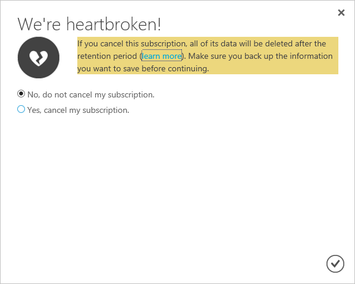

# Cancel your subscription for Azure
You can cancel your Azure subscription as the [Account Administrator](billing-subscription-transfer.md#whoisaa). After you cancel the subscription, your access to Azure services and resources ends.

Before you cancel your subscription:

* Back up your data. For example, if you're storing data in Azure storage or SQL, download a copy. If you have a virtual machine, save an image of it locally.
* Shut down your services. Go to the [resources page in the management portal](https://ms.portal.azure.com/?flight=1#blade/HubsExtension/Resources/resourceType/Microsoft.Resources%2Fresources), and **Stop** any running virtual machines, applications, or other services.
* Consider migrating your data. See [Move resources to new resource group or subscription](../azure-resource-manager/resource-group-move-resources.md).

If you cancel a paid [Azure Support plan](https://azure.microsoft.com/support/plans/), you are still billed monthly for the rest of the 6-months term.

## Cancel subscription via the Azure portal
1. Sign in to the [Azure portal](https://portal.azure.com) as the Account Administrator.

2. From the Azure services pane on the left, select **Subscriptions**.

    

3. Select the subscription that you want to cancel and click **Cancel Sub**.

    
4. Enter the subscription name and choose a cancellation reason. 
5. Click the **Cancel Sub** button at the bottom.

## Cancel subscription by using the Azure Account Center
1. Sign in to the [Azure Account Center](https://account.windowsazure.com/subscriptions) as the Account Administrator.
2. Under **Click a subscription to view details and usage**, select the subscription that you want to cancel.

    
3. On the right side of the page, select **Cancel Subscription**.

    
4. Select **Yes, cancel my subscription**.

    
5. Click  to close the dialog window and return to your subscription page.

## What happens after you cancel your subscription?
It can take up to 10 minutes for the cancellation to be reflected in the portal but billing is stopped immediately.

After you cancel your subscription, we wait 90 days before permanently deleting your data in case you need to access it or you change your mind. For more information, see [Microsoft Trust Center - How we manage your data](https://go.microsoft.com/fwLink/p/?LinkID=822930&clcid=0x409).

## Reactivate subscription
If you canceled your Pay-As-You-Go subscription accidentally, you can [reactivate it in the Accounts Center](billing-subscription-become-disable.md).

## Need help? Contact support.
If you still have questions, [contact support](https://portal.azure.com/?#blade/Microsoft_Azure_Support/HelpAndSupportBlade) to get your issue resolved quickly.
