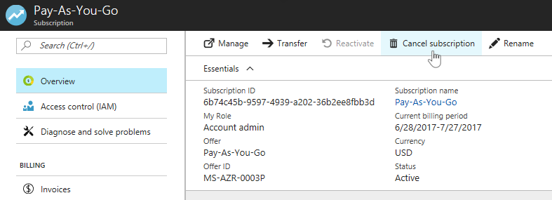

# Cancel your subscription for Azure

You can cancel your Azure subscription as the [Account Administrator](billing-subscription-transfer.md#whoisaa). After you cancel the subscription, your access to Azure services and resources ends.

Before you cancel your subscription:

* Back up your data. For example, if you're storing data in Azure storage or SQL, download a copy. If you have a virtual machine, save an image of it locally.
* Shut down your services. Go to the [resources page in the management portal](https://ms.portal.azure.com/?flight=1#blade/HubsExtension/Resources/resourceType/Microsoft.Resources%2Fresources), and **Stop** any running virtual machines, applications, or other services.
* Consider migrating your data. See [Move resources to new resource group or subscription](../azure-resource-manager/resource-group-move-resources.md).

If you cancel a paid Azure Support plan, you are still billed for the rest of the subscription term. For more information, see [Azure support plans](https://azure.microsoft.com/support/plans/).

## Cancel subscription using the Azure portal

1. Select your subscription from the [Subscriptions page in Azure portal](https://portal.azure.com/#blade/Microsoft_Azure_Billing/SubscriptionsBlade).
1. Select the subscription that you want to cancel and click **Cancel subscription**.

    
1. Follow prompts and finish cancellation.

## What happens after I cancel my subscription?

Once you cancel, billing is stopped immediately. However, it can take up to 10 minutes for the cancellation show in the portal.

After that, your services are disabled. That means your virtual machines are de-allocated, temporary IP addresses are freed, and storage is read-only.

If you cancel in the middle of a billing period, we send the final bill on your typical invoice date after the period ends. 

We wait 90 days before permanently deleting your data in case you need to access it or you change your mind. We don't charge you for retaining the data. To learn more, see [Microsoft Trust Center - How we manage your data](https://go.microsoft.com/fwLink/p/?LinkID=822930&clcid=0x409).

## Reactivate subscription

If you cancel your Pay-As-You-Go subscription accidentally, you can [reactivate it in the Accounts Center](billing-subscription-become-disable.md).

If your subscription is not Pay-As-You-Go, contact support within 90 days of cancellation to reactivate your subscription.

## Need help? Contact support.

If you still have questions, [contact support](https://portal.azure.com/?#blade/Microsoft_Azure_Support/HelpAndSupportBlade) to get your issue resolved quickly.
