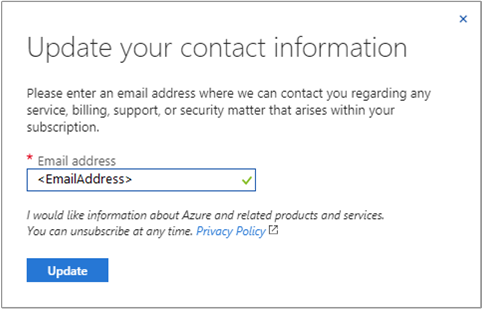
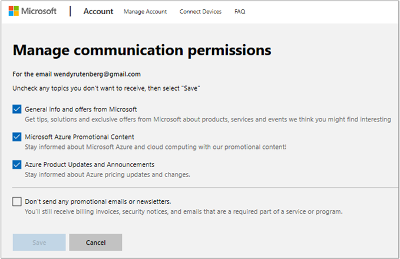

# Change the profile information for your Azure account

Microsoft uses the email address in the Account Administrator’s profile to send important billing, service, and recommendation-related notifications about an Azure account. We recommend that you specify an email address that you check regularly. As the Account Administrator, you can also update your profile to change the mailing address and phone number for the account.

Microsoft uses the email address in a user’s profile, an account user who is not the Account Administrator, to send service-related notifications and account recommendations. All billing notifications are sent to the Account Administrator. You can also update your profile to change your mailing address and phone number, but it doesn't change the account mailing address or phone number.

## Change your profile information

1. Sign in to the [Azure Account Center](https://account.azure.com/Profile).
1. Select the **Edit details** button, and then update the **Profile** information.

   

### Send notifications to an additional email address

You can have service notifications and account recommendations sent to an email address in addition to the Account Administrator's email address that's associated with your account. The Account Administrator’s email address gets important notifications about all the subscriptions under the account, including billing-related updates.

### Change the Account Administrator's email address in your profile

The Account Administrator is the person who set up the Azure account and who receives important email notifications about all the subscriptions under the account. We recommend that you specify a contact email address that the Account Administrator checks regularly.

### Update your sign-in email address

Updating the profile email address doesn't update your sign-in email address. To change your sign-in email address, you have to transfer ownership of the account.

### Update the billing address for your credit card

To learn how to update your billing information, see [Change the credit card used to pay for an Azure subscription](billing-how-to-change-credit-card.md).

### Update your country/region

Because of technical constraints, we can't change the country/region for an existing account. But you can create an account in the desired country/region and then contact Azure support to migrate your services to that account.

## Service and marketing emails

You're prompted in the [Azure portal](https://portal.azure.com) to verify or update your email address every 90 days. Microsoft sends emails to your profile email address with Azure account-related information for:

- Service notifications
- Security alerts
- Billing purposes
- Support
- Marketing communications
- Best practice recommendations, based on your Azure usage

Enter the email address where you want to receive communications about your account. By entering an email address, you're opting in to receive communications from Microsoft.

### Change your contact email address

You can change your contact email address by using one of the following methods:

* Sign in to the [Azure Account Center](https://account.azure.com/Profile). Select **Edit details** and then update the profile email address. Updating your profile email address doesn't update your sign-in email address.

* Go to the [Contact information](https://portal.azure.com/#blade/HubsExtension/ContactInfoBlade) area in the Azure portal and enter an email address. The address that you provide receives service and marketing communications. The email address in the Azure Account Center Profile is updated to match automatically. Updating your profile email address doesn't update your sign-in email address.

* In the [Azure portal](https://portal.azure.com/#blade/HubsExtension/ContactInfoBlade), select the icon with your initials or picture. Then, select the context menu (**...**). Next, select **My Contact Information** from the menu and enter an email address. The address that you provide receives service and marketing communications. The email address in your Azure Account Center Profile is updated to match automatically. Updating your profile email address doesn't update your sign-in email address.

### Opt out of marketing emails

To opt out of receiving marketing emails:

1. Go to the [request form](https://account.microsoft.com/profile/permissions-link-request) to submit a request by using your profile email address. You'll receive a link by email to update your preferences.
2. Select the link to open the **Manage communication permissions** page. This page shows you the types of marketing communications that the email address is opted in to. Clear any topics that you want to opt out of, and then select **Save**.

When you opt out of marketing communications, you still receive service notifications, based on your account.

## Change the subscription name

1. Sign in to the [Azure portal](https://portal.azure.com), select **Subscription** from the left pane, and then select the subscription that you want to rename.
1. Select **Overview**, and then select **Rename** from the command bar.
    
1. After you have changed the name, select **Save**.

## Need help? Contact us.

If you have questions or need help, [create a support request](https://go.microsoft.com/fwlink/?linkid=2083458).

## Next steps
- [View your billing accounts](billing-view-all-accounts.md)
