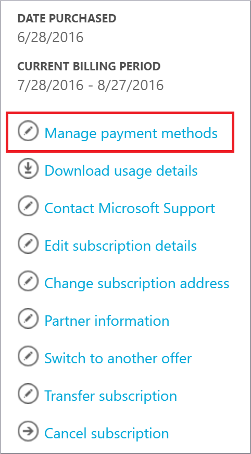
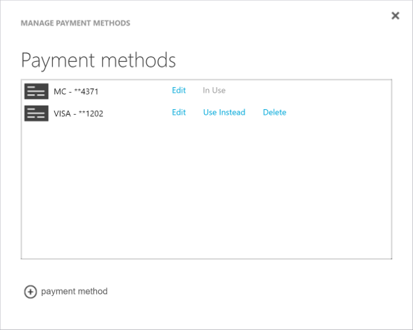

# Add, update, or remove a credit or debit card for Azure

In the Account Center, you can add a new credit card, update an existing credit card, or delete a credit card that you don't use. You must be [Account Administrator](billing-subscription-transfer.md#whoisaa) to make these changes.

**Want to switch to pay by invoice?** See [Pay for Azure subscriptions by invoice](billing-how-to-pay-by-invoice.md).
 

## Add a new credit or debit card

1. Sign in to the [Account Center](https://account.windowsazure.com/Subscriptions) as the Account Administrator.
1. Select a subscription.
1. On the right side of the page, select **Manage payment methods**.

    
1. Select “+” to add a card.

    
1. Enter credit or debit card details.
1. Select **Save**. 

If you get an error after you add the credit card, see [Credit card declined at Azure sign-up](billing-credit-card-fails-during-azure-sign-up.md).

## Update existing credit or debit card

If your credit card gets renewed and the number remains the same, update the existing credit card details like the expiration date. If your credit card number changes because the card is lost, stolen, or expired, follow the steps in the [Add a credit card as a payment method](#addcard) section. You don't need to update the CVV.

1. Sign in to the [Azure Account Center](https://account.windowsazure.com/Subscriptions) as the Account Administrator.
1. Select the subscription that's linked to the card.
1. Select **Manage payment methods**.
1. Select **Edit** next to the card you want to update.
1. Update the credit or debit card details.
1. Select **Save**.

## Use a different credit card for the Azure subscription

1. Sign in to the [Azure Account Center](https://account.windowsazure.com/Subscriptions) as the Account Administrator.
1. Select the subscription that's linked to the card.
1. On the right side of the page, select **Manage payment methods**.
1. Click **Use Instead** next to the card that you want to use. This also updates any other subscriptions currently associated with this card. 

## Remove a credit or debit card from the account

1. Sign in to the [Azure Account Center](https://account.windowsazure.com/Subscriptions) as the account administrator.
1. Select the subscription that's linked to the card.
3. On the right side of the page, select **Manage payment methods**.
4. Click **Delete** for the credit card that you want to delete.

If your credit card is associated with other active Microsoft subscriptions, you can't remove it from your Azure account. Remove the credit card from all active subscriptions that you have with Microsoft and try again.

## Frequently asked questions

### My subscription is disabled. Why can't I remove my credit card now?

After your subscription is disabled or canceled, we wait 90 days before permanently deleting your subscription. We keep your payment method on file during the retention period in case you want to reactivate the subscription. After that, the subscription is completely deleted.

If you need to remove your credit or debit card before the 90-day retention period ends, [reactivate your subscription](billing-subscription-become-disable.md). If you can't reactivate, [contact Azure support](https://portal.azure.com/?#blade/Microsoft_Azure_Support/HelpAndSupportBlade).

### Why do I keep getting "Your login session has expired. Please click here to log back in"?

If you keep getting this error message even if already you logged out and back in, try again with a private browsing session.

### How do I use a different card for each subscription I have?

Unfortunately, if your subscriptions are already using the same card, it's not possible to separate them to use different cards. However, when you sign up for a new subscription, you can choose to use a new payment method for that subscription.

### How do I make payments?

If you set up a credit card or a debit card as your payment method, we automatically charge your card after each billing period. You don't need to do anything.

If you're [paying by invoice](billing-how-to-pay-by-invoice.md), send your payment to the location listed at the bottom of your invoice.

### How do I make a one-time payment?

Unfortunately, Azure currently doesn't support one-time payments for credit or debit cards. 

### How do I change the tax ID?

To add or update tax ID, visit [**Profile** in Azure Account Center](https://account.azure.com/Profile), then select **Tax record**. This tax ID is used for tax exemption calculations and appears on your invoice.

## Need help? Contact support

If you still need help, [contact support](https://portal.azure.com/?#blade/Microsoft_Azure_Support/HelpAndSupportBlade) to get your issue resolved quickly.
