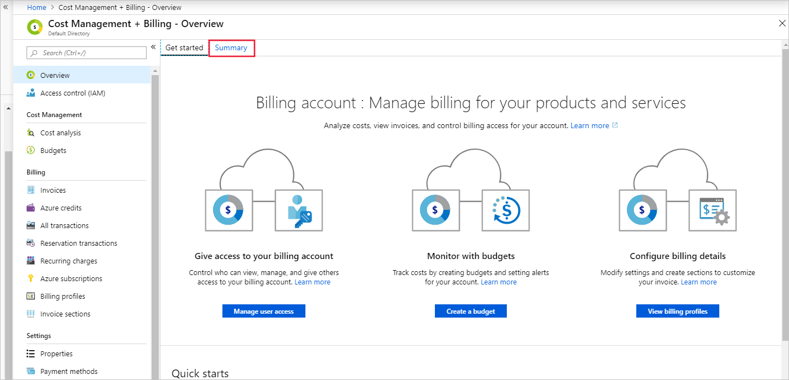
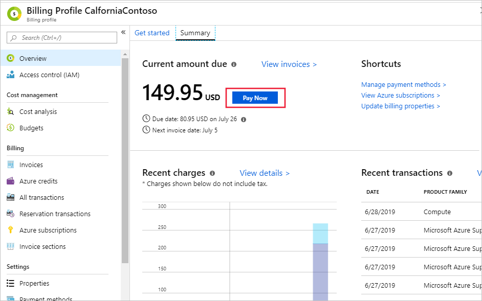

# How to pay your bill for Microsoft Azure

This article applies to customers with a Microsoft Customer Agreement who signed up for Azure through the Azure website. [Check your access to a Microsoft Customer Agreement](#check-access-to-a-microsoft-customer-agreement).

The default payment method of your billing profile can either be a credit card or check/wire transfer. If you have Azure credits, those are automatically applied to your invoice each billing period. To become eligible to pay by check/wire transfer, see [how to pay by invoice](billing-how-to-pay-by-invoice.md).

If your default payment method is check/wire transfer, you can send your payment to the address listed at the bottom of your invoice. Alternatively, you can pay online with a credit card in the Azure portal.

If your default payment method is a credit card, we will automatically charge your credit card each billing period after the invoice is generated. You can also pay online in the Azure portal if you'd like to use a different credit card or if the automatic charge fails.

## Pay now in the Azure portal

You must be a billing profile owner, contributor, or invoice manager to pay for invoices in the Azure portal.

1. Sign into the [Azure portal](https://portal.azure.com).
1. Search on **Cost Management + Billing**.
1. In the **Overview** blade, click the *Summary* tab.

    

1. If you have a due or past due invoice, you'll see the total amount due.
1. Click the blue **Pay now** button.

    

1. In the new blade, click **Select a payment method** to choose an existing credit card or add a new one.<!-- screenshot of select payment method link -->
1. Once the payment method is selected, click **Pay now**.

The status of the invoice will be updated to paid in the invoices blade. 

<!-- pay now from invoice blade -->

## Check access to a Microsoft Customer Agreement
[!INCLUDE [billing-check-mca](../../includes/billing-check-mca.md)]
