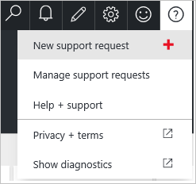
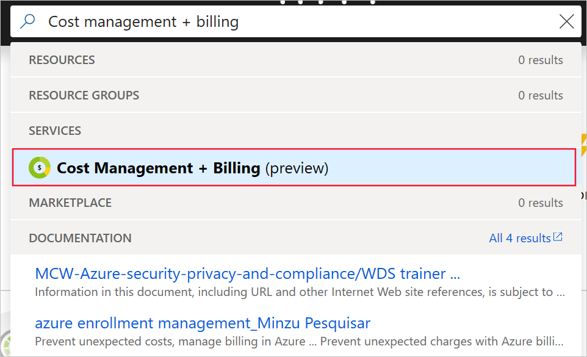
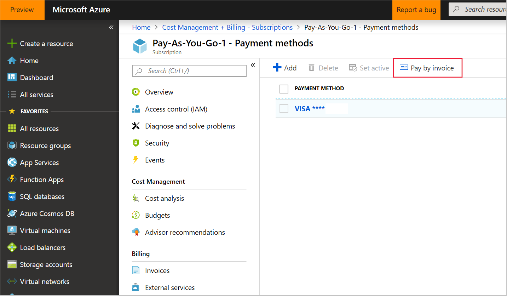

# Pay for your Azure subscription by invoice

If you switch to pay by invoice, that means you pay your bill within 30 days of the invoice date. To become eligible to pay for your Azure subscription by invoice, submit a request to Azure support. Once your request is approved, you can switch a subscription to invoice pay in the [Azure portal](https://portal.azure.com).

> [!IMPORTANT]
> * Invoice pay is only available for business accounts.
> * You must pay all outstanding charges before switching to invoice pay.
> * Once you switch to invoice pay, you can't switch back to credit or debit card payment.

## Request to pay by invoice

1. Sign in to the [Azure portal](https://portal.azure.com/). Select **Help + support** > **New support request**.

    

2. Select **Billing** as the **Issue type**. The *issue type* is the support request category. Select the subscription for which you want to pay by invoice, select a support plan, and then select **Next**.

3. Select **Pay by Invoice** in the **Problem Type** box. The *problem type* is the support request subcategory.

4. Enter the following information in the **Details** box, and then select **Next**.

         New or existing customer:
         If existing, current payment method:
         Order ID (requesting for invoice option):
         Account Admins Live ID (or Org ID) (should be company domain):
         Commerce Account ID:
         Company Name (as registered under VAT or Government Website):
         Company Address (as registered under VAT or Government Website):
         Company Website:
         Country:
         TAX ID/ VAT ID:
         Company Established on (Year):
         Any prior business with Microsoft:
         Contact Name:
         Contact Phone:
         Contact Email:
         Justification on why you prefer Invoice option over credit card:

        For cores increase, provide the following additional information:

         (Old quota) Existing Cores:
         (New quota) Requested cores:
         Specific region & series of Subscription:

    - The **Company name** and **Company address** should match the information that you provided for the Azure account. To view or update the information, see [Change your Azure account profile information](billing-how-to-change-azure-account-profile.md).
    - You must add your billing contact information in the Azure portal before the credit limit can be approved. The contact details should be related to the company's Accounts Payable or Finance department. To update the billing contact information, go to [Azure Account Center](https://account.azure.com/Profile).

5. Verify your contact information and preferred contact method, and then click **Create**.

If we need to run a credit check because of the amount of credit that you need, we'll send you a credit check application.

## Switch to invoice pay

Once you are approved to pay by invoice, you can switch your Azure subscription to the invoice payment method in the [Azure portal](https://portal.azure.com).

1. Sign in to the [Azure portal](https://portal.azure.com) as the Account Administrator.
1. Search for **Cost Management + Billing**.

    

1. Select the subscription you'd like to switch to invoice payment.
1. Select **Payment methods**.
1. In the command bar, click the **Pay by invoice** button.

    

## Need help? Contact us

If you have questions or need help, [create a support request](https://go.microsoft.com/fwlink/?linkid=2083458).

## Next steps
- If needed, update your billing contact information at the [Azure Account Center](https://account.azure.com/Profile).
