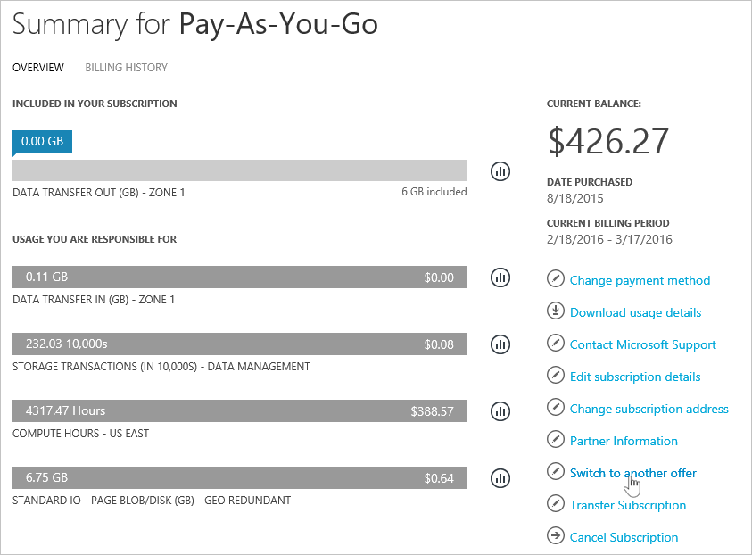
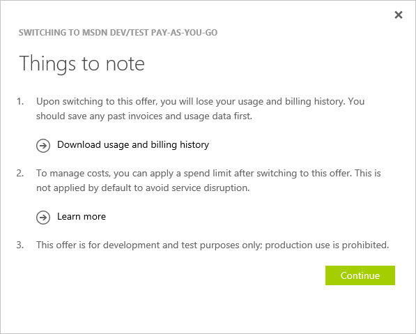
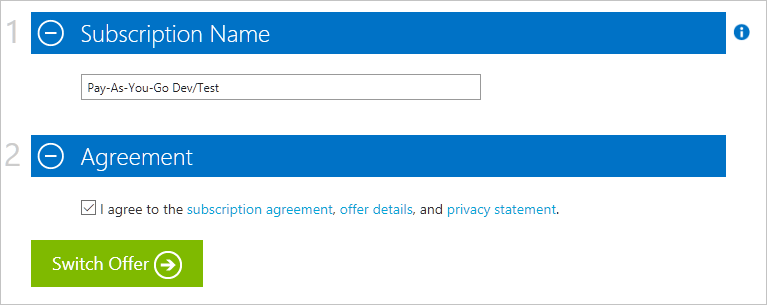

# Change your Azure subscription to a different offer

As a customer with an [individual subscription with pay-as-you-go rates](https://azure.microsoft.com/offers/ms-azr-0003p/), you can switch your Azure subscription to another offer in the [Account Center](https://account.windowsazure.com/Subscriptions). For example, you can use this feature to take advantage of the [monthly credits for Visual Studio subscribers](https://azure.microsoft.com/pricing/member-offers/msdn-benefits-details/).

**Just want to upgrade from Free Trial?** See [upgrade you subscription](billing-upgrade-azure-subscription.md).

## What's supported:

You can switch from an individual subscription with pay-as-you-go rates to:

- [Pay-As-You-Go Dev/Test](https://azure.microsoft.com/offers/ms-azr-0023p/)
- [Visual Studio Professional](https://azure.microsoft.com/offers/ms-azr-0059p/)
- [Visual Studio Test Professional](https://azure.microsoft.com/offers/ms-azr-0060p/)
- [MSDN Platforms](https://azure.microsoft.com/offers/ms-azr-0062p/)
- [Visual Studio Enterprise](https://azure.microsoft.com/offers/ms-azr-0063p/)
- [Visual Studio Enterprise (Bizspark)](https://azure.microsoft.com/offers/ms-azr-0064p/)

> [!NOTE]
> For other offer changes, [contact support](https://portal.azure.com/?#blade/Microsoft_Azure_Support/HelpAndSupportBlade).
>
>

## Switch subscription offer

> [!VIDEO https://channel9.msdn.com/Series/Microsoft-Azure-Tutorials/Switch-to-a-different-Azure-offer/player]
>
>

1. Sign in at [Azure Account Center](https://account.windowsazure.com/Subscriptions).
1. Select your individual subscription with pay-as-you-go rates.
1. Click **Switch to another offer**. The option is only available if you have a individual subscription with pay-as-you-go rates and have completed your first billing period.

   
1. **Select the offer you want** from the list of offers your subscription can be switched to. This list varies based on the memberships that your account is associated with. If nothing is available, check the [list of available offers you can switch to](#whats-supported) and make sure you have the right memberships.

   
1. Depending on the offer you’re switching to, you may see a note about the impact of switching. Go through this list carefully and follow the instructions before you proceed.

   
1. You can rename your subscription. By default, it is set to the new offer name. Click **Switch Offer** to complete the process.

   
1. Success! Your subscription is now switched to the new offer.

## Frequently asked questions
The following sections answer commonly asked questions.

### What is an Azure offer?

An Azure offer is the *type* of the Azure subscription you have. For example, [an subscription with pay-as-you-go rates](https://azure.microsoft.com/offers/ms-azr-0003p/), [Azure in Open](https://azure.microsoft.com/offers/ms-azr-0111p/), and [Visual Studio Enterprise](https://azure.microsoft.com/offers/ms-azr-0063p/) are all Azure offers. Each offer has different [terms](https://azure.microsoft.com/support/legal/offer-details/) and some have special benefits. The offer of your subscription can be found in the Account Center subscription page. Click the offer name to get more details.

   

### Why don't I see the button?

You might not see the **Switch to another offer** option if:

* You don't have a [subscription with pay-as-you-go rates](https://azure.microsoft.com/offers/ms-azr-0003p/). Currently only subscriptions with pay-as-you-go rates can be converted to another offer.
  * If you have a [Free Trial](https://azure.microsoft.com/free/), learn how to [upgrade to Pay-As-You-Go](billing-upgrade-azure-subscription.md).
  * To switch offer from a different subscription, [contact support](https://portal.azure.com/?#blade/Microsoft_Azure_Support/HelpAndSupportBlade).
* You're still in your first billing period; you must wait for your first billing period to end before you can switch offers.

### Why do I see "There are no offers available in your region or country at this time"?

* You might not be eligible for any offer switches. Check the [list of available offers you can switch to](#whats-supported) and make sure that you've activated the right benefits with Visual Studio or Bizspark.
* Some offers may not be available in all countries/regions.

### What does switching Azure offers do to my service and billing?

Here are the details of what happens when you switch Azure offers in the Account Center.

#### No service downtime

There is no service downtime for any users associated with the subscription. However, the offer you switch to may have restrictions. For instance, some offers prohibit production use, so you would need to move production resources to another subscription.

#### Quota increases are reset

When you switch offers, any [limit or quota increases above the default limit](../azure-supportability/resource-manager-core-quotas-request.md) are reset. There's no service downtime, even if you have more resources beyond the default limit. For example, you're using 200 cores on your subscription, then switching offers resets your cores quota back to the default of 20 cores. The VMs that use the 200 cores are unaffected and would continue to run. If you don't make another quota increase request, however, you can't provision any more cores.

#### Billing

On the day you switch, an invoice is generated for all outstanding charges. Then, your subscription is billed per the new offer’s pricing terms. Your subscription billing anniversary changes to the date on which you changed offers. Usage and billing data before the offer change is not retained, so we recommend that you download a copy before switching.

### Can I migrate from a subscription with pay-as-you-go rates to [Cloud Solution Provider](https://partner.microsoft.com/Solutions/cloud-reseller-overview) (CSP) or [Enterprise Agreement](https://azure.microsoft.com/pricing/enterprise-agreement/) (EA)?

* To migrate to CSP, see [Azure Pay-As-You-Go Subscription Migration to CSP](https://docs.microsoft.com/azure/cloud-solution-provider/migration/migration-from-payg-to-csp).
* To migrate to EA, have your Enrollment Admin add your account into the EA. Follow instructions in the invitation email to have your subscriptions moved under EA enrollment. To learn more, see [Associate an Existing Account](https://ea.azure.com/helpdocs/associateExistingAccount) in the EA portal.

### Can I migrate data and services to a new subscription?

* You can migrate the resources directly to the new subscription, see [Move resources to new resource group or subscription](../azure-resource-manager/resource-group-move-resources.md).
* To transfer ownership of an Azure subscription and everything in it to someone else, see [Transferring ownership of an Azure subscription](billing-subscription-transfer.md)

## Need help? Contact us.

If you have questions or need help, [create a support request](https://go.microsoft.com/fwlink/?linkid=2083458).

## Next steps
- [Start analyzing costs](../cost-management/quick-acm-cost-analysis.md)
