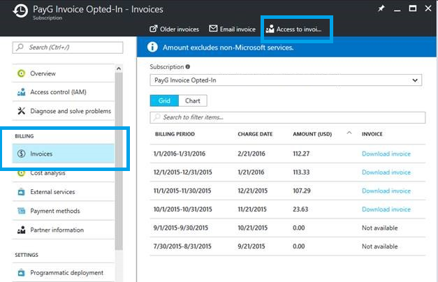
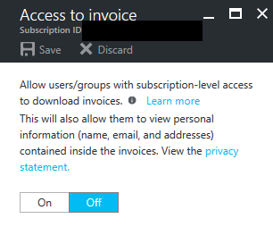
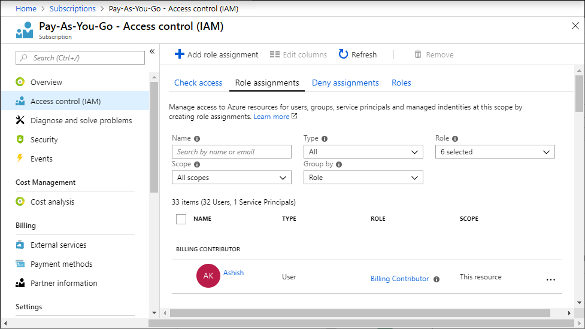
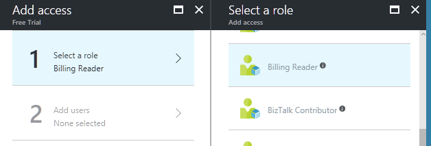
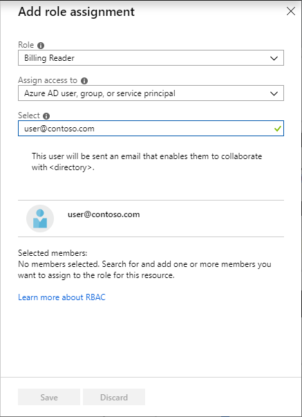
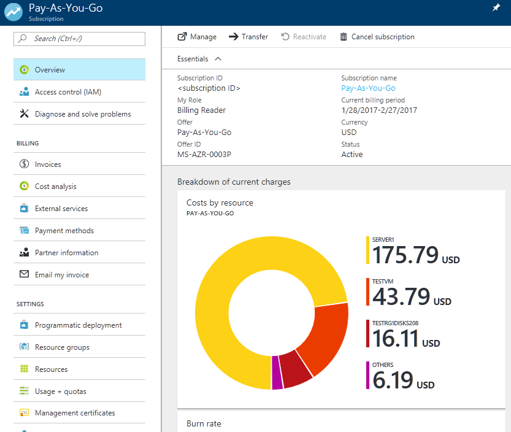

# Manage access to billing information for Azure using role-based access control

You can grant access for Azure billing information to members of your team by assigning one of the following user roles to your subscription: Account Administrator, Service Administrator, Co-administrator, Owner, Contributor, Reader, and Billing Reader. They would have access to billing information in the [Azure portal](https://portal.azure.com/), and they can use the [Billing APIs](billing-usage-rate-card-overview.md) to programmatically get invoices (once opted-in) and usage details. For more information about who can grant roles, and which roles can do what, see [Roles in Azure RBAC](../role-based-access-control/built-in-roles.md).

##  Allowing additional users to access invoices

The Account Administrator must opt in using the [Azure portal](https://portal.azure.com/) allow access to invoices for other users and via API.

1. As the Account Administrator, select your subscription from the [Subscriptions blade](https://portal.azure.com/#blade/Microsoft_Azure_Billing/SubscriptionsBlade) in Azure portal.

1. Select **Invoices** and then **Access to invoices**.

    

1. Turn **On** the access followed by saving the changes, to allow users in subscription scoped roles to download invoice.

    

Opting in allows Service Administrator, Co-administrator, Owner, Contributor, Reader, and Billing Reader on the subscription to download PDF invoices in the Azure portal. However, invoices older than December 2016 are available only to the Account Administrator for now.

The Account Administrator can also configure to have invoices sent via email. To learn more, see [Get your invoice in email](billing-download-azure-invoice-daily-usage-date.md).

## Adding users to the Billing Reader role

The Billing Reader role has read-only access to subscription billing information in Azure portal, and no access to services such as VMs and storage accounts. Assign the Billing Reader role to someone that needs access to the subscription billing information but not the ability to manage Azure services. This role is appropriate for users in an organization who only perform financial and cost management for Azure subscriptions.

1. Select your subscription from the [Subscriptions blade](https://portal.azure.com/#blade/Microsoft_Azure_Billing/SubscriptionsBlade) in Azure portal.

1. Select **Access control (IAM)** and then click **Add**.

    

1. Choose **Billing Reader** in the **Select a role** page.

    

1. Type the email for the user you want to invite, then click **OK** to send the invitation.

    

1. Follow instructions in the invite email to log in as a Billing Reader.

    

> [!NOTE]
> The Billing Reader feature is in preview, and does not yet support enterprise (EA) subscriptions or non-global clouds.

## Adding users to other roles

Users in other roles, such as Owner or Contributor, can access not just billing information, but Azure services as well. To manage these roles, see [Manage access using RBAC and the Azure portal](../role-based-access-control/role-assignments-portal.md).

## Who can access the [Account Center](https://account.windowsazure.com)?

Only the Account Administrator can log in to the Account center. The Account Administrator is the legal owner of the subscription. By default, the person who signed up for or bought the Azure subscription is the Account Administrator, unless the [subscription ownership was transferred](billing-subscription-transfer.md) to somebody else. The Account Administrator can create subscriptions, cancel subscriptions, change the billing address for a subscription, and manage access policies for the subscription.

## Need help? Contact support.

If you still have further questions, [contact support](https://portal.azure.com/?#blade/Microsoft_Azure_Support/HelpAndSupportBlade) to get your issue resolved quickly.
