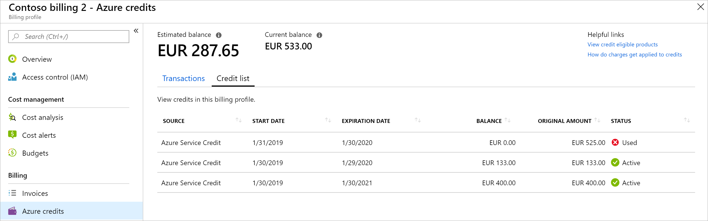

# Track Microsoft Customer Agreement Azure credit balance

You can check the Azure credit balance for Microsoft Customer Agreement in the Azure portal. You use credits to pay for charges that are covered by the credits.

You are charged when you use products that aren't covered by the credits or your usage exceeds your credit balance. For more information, see [Products that aren't covered by Azure credits.(#products-that-arent-covered-by-azure-credits).

This article applies to a billing account for a Microsoft Customer Agreement. [Check if you have access to a Microsoft Customer Agreement](#check-access-to-a-microsoft-customer-agreement).

## Check your credit balance

1. Sign in to the [Azure portal]( https://portal.azure.com).

2. Search for **Cost Management + Billing**.

    

3.  Select **Azure credits** from the left-hand side. Depending on your access, you may need to select a billing account or a billing profile and then select **Azure credits**.

4. The Azure credits page displays the following information:

   

   | Term               | Definition                           |
   |--------------------|--------------------------------------------------------|
   | Estimated balance  | Estimated amount of credits you have after considering all billed and pending transactions |
   | Current balance    | Amount of credits as of your last invoice. It doesn't include any pending transactions |
   | Transactions       | All billing transactions that affected your Azure credit balance |

   When your estimated balance drops to 0, you are charged for all your usage, including for products that are covered by credits.

6. Select **Credits list** to view list of credits for the billing profile. The credits list provides the following information:

   

   | Term | Definition |
   |---|---|
   | Estimated balance | Amount of Azure credit you have after subtracting unbilled credit eligible charges from your current balance|
   | Current balance | Amount of Azure credit you have before considering unbilled credit eligible charges. It is calculated by adding new Azure credits you've received to the credit balance at the time of your last invoice|
   | Source | The acquisition source of the credit |
   | Start date | The date when you acquired the credit |
   | Expiration date | The date when the credit expires |
   | Balance | The balance as of your last invoice |
   | Original amount | The original amount of credit |
   | Status | The current status of credit. Status can be active, used, expired, or expiring |

## How credits are used

In a billing account for a Microsoft customer agreement, you use billing profiles to manage your invoices and payment methods. A monthly invoice is generated for each billing profile and you use the payment methods to pay the invoice.

Azure credits are one of the payment methods. You get credit from Microsoft like promotional credit and service level credit. These credits are assigned to a billing profile. When an invoice is generated for the billing profile, credits are automatically applied to the total billed amount to calculate the amount that you need to pay. You pay the remaining amount with another payment method like check or wire transfer.

## Products that aren't covered by Azure credits

 The following products aren't covered by your Azure credits. You're charged for using these products regardless of your credit balance:

- Canonical
- Citrix XenApp Essentials
- Citrix XenDesktop
- Registered User
- Openlogic
- Remote Access Rights XenApp Essentials Registered User
- Ubuntu Advantage
- Visual Studio Enterprise (Monthly)
- Visual Studio Enterprise (Annual)
- Visual Studio Professional (Monthly)
- Visual Studio Professional (Annual)
- Azure Marketplace products
- Azure support plans

## Check access to a Microsoft Customer Agreement
[!INCLUDE [billing-check-mca](../../includes/billing-check-mca.md)]

## Need help? Contact support.

If you need help, [contact support](https://portal.azure.com/?#blade/Microsoft_Azure_Support/HelpAndSupportBlade) to get your issue resolved quickly.

## Next steps

- [Understand billing account for Microsoft Customer Agreement](billing-mca-overview.md)
- [Understand terms on your Microsoft Customer Agreement invoice](billing-mca-understand-your-invoice.md)
