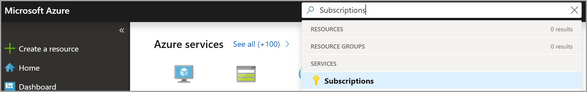
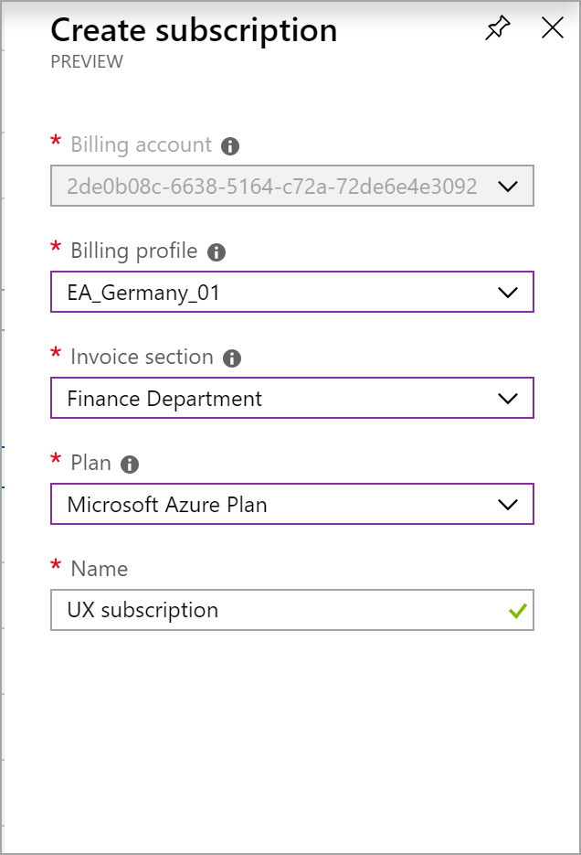

# Create an additional Azure subscription for Microsoft Customer Agreement

Create additional subscriptions for your billing account to set up separate environments for development and testing, security or to isolate data for compliance reasons.

This article applies to a billing account for a Microsoft Customer Agreement. [Check if you have access to a Microsoft Customer Agreement](#check-access). If you want to create subscriptions for other types of billing accounts, see [Create an additional subscription in the Azure portal](billing-create-subscription.md).

To create a subscription, you must be an **invoice section owner**, **invoice section contributor**, or **Azure subscription creator**. For more information, see [Subscription billing roles and tasks](billing-understand-mca-roles.md#subscription-billing-roles-and-tasks). To provide others permission to create Azure subscriptions for your billing account, see [Give others permission to create Azure subscriptions](#give-others-permission).

## Create a subscription

1. Sign in to the [Azure portal](https://portal.azure.com).

2. Search for **Subscriptions**.

   

3. Select **Add**

4. If you have access to multiple billing accounts, select the billing account for your Microsoft customer agreement.

   

5. Select a billing profile. The charges for your subscription will be billed to the selected billing profile. If you have access to only one billing profile, the selection will be greyed out.

6. Select an invoice section. The charges for your subscription will be billed to this section of the billing profile's invoice. If you have access to only one invoice section, the selection will be greyed out.

7. Select a plan for the subscription. Select **Microsoft Azure Plan for DevTest**, if you plan to use this subscription for development or testing workloads else use **Microsoft Azure Plan**. If you have access to only one plan, the selection will be greyed out.

8. Enter a name for the subscription. The name helps you to easily identify the subscription in the Azure portal.

9. Select **Create**.

## Give others permission

Add users as Azure subscription creators on an invoice section to give them permission to create Azure subscriptions.

1. Sign in to the [Azure portal](https://portal.azure.com).

2. Search for **Cost Management + Billing**.

   

3. Go to the invoice section. Depending on your access, you may need to select a billing account or billing profile. From the billing account or profile, select **Invoice sections** and then an invoice section from the list. Any subscriptions that will be created by the users will be billed to this invoice section.
   
           

4. Select **Access Management (IAM)** from the top-left side.

5. From the top of the page, select **Add**.

6. Select **Azure subscription creator** for role.

7. Enter the email address of the user to whom you want to give access.

8. Select **Save**.

## Check access
[!INCLUDE [billing-check-mca](../../includes/billing-check-mca.md)]

## Need help? Contact support

If you have questions or need help,  [create a support request](https://go.microsoft.com/fwlink/?linkid=2083458).

## Next steps

- [Give others permission to create Azure resources using built-in roles](../role-based-access-control/built-in-roles.md#built-in-role-descriptions)
- [Create a windows virtual machine](../virtual-machines/windows/quick-create-portal.md)
- [Create a linux virtual machine](../virtual-machines/linux/quick-create-portal.md)
- [Create management groups for resource organization and management](../governance/management-groups/create.md?toc=/azure/billing/TOC.json)
