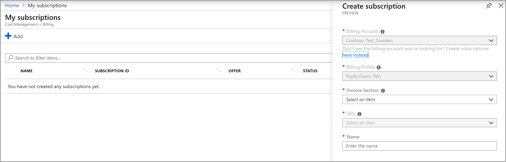

# Create an additional Azure subscription for your billing account

You can create additional subscriptions for your billing account in Azure. You may want an additional subscription to create separate environments for development and testing, security or to isolate data for compliance reasons.

This article applies to a billing account for a Microsoft Customer Agreement. [Check if you have access to a Microsoft Customer Agreement](#check-your-access-to-a-microsoft-customer-agreement). If you want to create subscriptions for other billing accounts, see [Create an additional subscription in the Azure portal](billing-create-subscription.md).

To create a subscription, you must be an **Owner**, **Contributor**, or **Azure Subscription Creator** on an invoice section. For more information, see [Subscription tasks].(billing-understand-mca-roles.md#subscription-tasks). To provide others permission to create Azure subscriptions for your billing account, see [Give others permission to create Azure subscriptions](#give-others-permission-to-create-azure-subscriptions).

## Create a subscription in the Azure portal

1. Sign in to the [Azure portal](https://portal.azure.com).

2. Search for **Subscriptions**.

   

3. Select **Add**

4. If you have access to multiple billing accounts, select the billing account for your Microsoft customer agreement.

   

5. Select a billing profile for the subscription. The charges for the subscription will show on the billing profile's invoice and will be paid using its payment methods. If you have access to only one billing profile, the selection will be greyed out.

6. Select an invoice section for the subscription. The charges for your subscription will show on this section of the billing profile's invoice. If you have access to only one invoice section, the selection will be greyed out.

7. Select a plan for the subscription. Select **Microsoft Azure Plan for Dev/Test**, if you plan to use this subscription for development/testing environment else use **Microsoft Azure Plan**. If you have access to only one plan, the selection will be greyed out.

8. Enter the friendly name for the subscription.

9. Select **Create**

## Give others permission to create Azure subscriptions

1. Sign in to the [Azure portal](http://portal.azure.com).

2. Search on **Cost Management + Billing**.

   

3. Go to the invoice section. Depending on your access, you may need to select a billing account or billing profile. From the billing account or profile, select **Invoice sections** and then an invoice section.

4. Select **Access Management (IAM)** from the top-left side.

5. From the top of the page, select **Add**.

6. Select **Azure subscription creator** for role.

   

7. Enter the email address of the user that you want to give permission.

8. Select **Save**.

## Check your access to a Microsoft Customer Agreement
[!INCLUDE [billing-check-mca](../../includes/billing-check-mca.md)]

## Next steps

- [Give others permission to create Azure resources using built-in roles](../role-based-access-control/built-in-roles.md#built-in-role-descriptions)
- [Create a windows virtual machine](../virtual-machines/windows/quick-create-portal.md)
- [Create a linux virtual machine](../virtual-machines/linux/quick-create-portal.md)
- [Create management groups for resource organization and management](../governance/management-groups/create.md?toc=/azure/billing/TOC.json)

## Need help? Contact us.

If you have questions or need help, [create a support request](https://portal.azure.com/#blade/Microsoft_Azure_Support/HelpAndSupportBlade/newsupportrequest).
