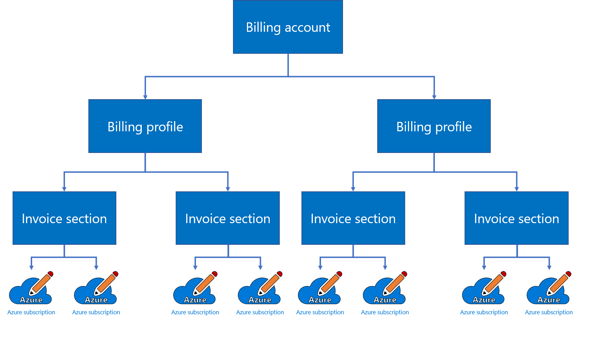

# Get started with your billing account for a Microsoft Customer Agreement

A billing account is created for each agreement you sign with Microsoft to use Azure. You use your billing account to manage billing and track costs. You can have access to multiple billing accounts. For example, you might have signed up for Azure for your personal projects. You could also have access to Azure through your organization's Enterprise Agreement or Microsoft Customer Agreement. For each of these scenarios, you would have a separate billing account.

This article applies to a billing account for a Microsoft Customer Agreement. [Check if you have access to a Microsoft Customer Agreement](#check-access-to-a-microsoft-customer-agreement).

## Understand billing account

Your billing account for the Microsoft Customer Agreement contains one or more billing profiles that let you manage your invoices and payment methods. Each billing profile contains one or more invoice sections that let you organize costs on the billing profile's invoice.

The following diagram shows the relationship between a billing account, the billing profiles, and invoice sections.

Roles on the billing account have the highest level of permissions. By default, only global administrators on your organization’s Azure Active Directory get access to the billing account. These roles should be assigned to users that need to view invoices, and track costs for your entire organization like finance or IT managers. For more information, see [billing account roles and tasks](billing-understand-mca-roles.md#billing-account-roles-and-tasks).

## Understand billing profiles

Use a billing profile to manage your invoice and payment methods. A monthly invoice is generated for Azure subscriptions and other products purchased using the billing profile. You use the payments methods to pay the invoice.

A billing profile is automatically created for your billing account. You can create new billing profiles to set up additional invoices. For example, you may want different invoices for each department or project in your organization.

You can also create invoice sections to organize costs on a billing profile's invoice. Charges for Azure subscriptions and products purchased for an invoice section show up on the section. The billing profile's invoice includes charges for all invoice sections.

Roles on the billing profiles have permissions to view and manage invoices and payment methods. Assign these roles to users who pay invoices like members of the accounting team in your organization. For more information, see [billing profile roles and tasks](billing-understand-mca-roles.md#billing-profile-roles-and-tasks).

### Monthly invoice generated for each billing profile

A monthly invoice is generated on the invoice date for each billing profile. The invoice contains all charges for previous month.

You can view the invoice, download documents and change setting to get future invoices by email, in the Azure portal. For more information, see [download invoices for a Microsoft Customer Agreement](billing-download-azure-invoice-daily-usage-date.md#download-invoices-for-a-microsoft-customer-agreement).

### Invoices paid through payment methods

Each billing profile has its own payment methods that are used to pay its invoices. The following payment methods are supported:

| Type             | Definition  |
|------------------|-------------|
|Azure credits    |  Credits are automatically applied to the total billed amount on your invoice to calculate the amount that you need to pay. For more information, see [track Azure credit balance for your billing profile](billing-mca-check-azure-credits-balance.md). |
|Check or wire transfer | You can pay the amount due for your invoice either through check or wire transfer. The instructions for payment are given on the invoice |

### Control Azure Marketplace and Reservation purchases by applying policies

Apply policies to control purchases made using a billing profile. You can set policies to disable purchase of Azure Reservations and Marketplace products. When the policies are applied, subscriptions created for the invoice sections in the billing profile can't be used to purchase Azure Reservations and Marketplace products.

### Allow users to create Azure subscriptions by enabling Azure plans

Azure plans are automatically enabled when you create a billing profile. All invoice sections in the billing profile get access to these plans. Users with access to the invoice section use the plans to create Azure subscriptions. They can't create Azure subscriptions unless an Azure plan is enabled for the billing profile. The following Azure plans are supported in billing accounts for Microsoft Customer Agreement:

| Plan             | Definition  |
|------------------|-------------|
|Microsoft Azure Plan   | Allow users to create subscriptions that can run any workloads. For more information, see [Microsoft Azure Plan](https://azure.microsoft.com/offers/ms-azr-0017g/) |
|Microsoft Azure Plan for Dev/Test | Allow Visual Studio subscribers to create subscriptions that are restricted for development or testing workloads. These subscriptions get benefits such as lower rates and access to exclusive virtual machine images in the Azure portal. For more information, see  [Microsoft Azure Plan for DevTest](https://azure.microsoft.com/offers/ms-azr-0148g/)|

## Understand invoice sections

Create invoice sections to organize the costs on a billing profile's invoice. For example, you may need a single invoice for your organization but want to organize costs by department, team, or project. For this scenario, you have a single billing profile where you create an invoice section for each department, team, or project.

When an invoice section is created, you can give others permission to create Azure subscriptions for the section. Any usage charges and purchases for the subscriptions are then reflected on the appropriate section of the invoice.

Roles on the invoice section have permissions to control who creates Azure subscriptions. Assign these roles to users who set up Azure environment for teams in our organization like engineering leads and technical architects. For more information, see [invoice section roles and tasks](billing-understand-mca-roles.md#invoice-section-roles-and-tasks).

## Check access to a Microsoft Customer Agreement
[!INCLUDE [billing-check-mca](../../includes/billing-check-mca.md)]

## Need help? Contact support

If you need help, [contact support](https://portal.azure.com/?#blade/Microsoft_Azure_Support/HelpAndSupportBlade) to get your issue resolved quickly.

## Next steps

See the following articles to learn about your billing account:

- [Understand Microsoft Customer Agreement administrative roles in Azure](billing-understand-mca-roles.md)
- [Create an additional Azure subscription for Microsoft Customer Agreement](billing-mca-create-subscription.md)
- [Create sections on your invoice to organize your costs](billing-mca-section-invoice.md)