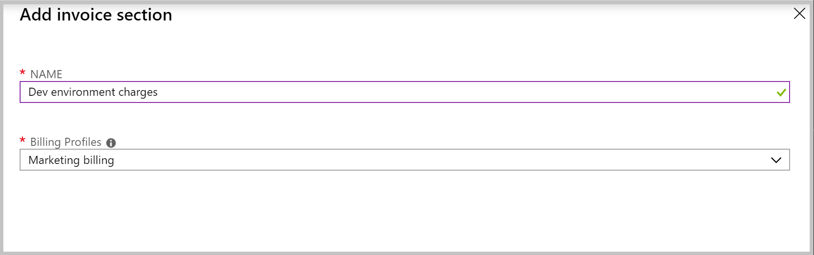

# Create sections on your invoice to organize your costs

Create sections on your invoice to organize your costs by a department, development environment, or based on your organization's needs. Then give others permission to create Azure subscriptions that are billed to the section. Any usage charges and purchases for the subscriptions are then billed to the section. You can view the total charges for the section on your invoice, in the Azure portal, or review them in Azure cost analysis. For more information, see [view transactions by invoice sections](billing-mca-understand-your-bill.md#view-transactions-by-invoice-sections).

This article applies to a billing account for a Microsoft Customer Agreement. [Check if you have access to a Microsoft Customer Agreement](#check-access-to-a-microsoft-customer-agreement).

## Create an invoice section in the Azure portal

To create an invoice section, you need to be a **billing profile owner** or a **billing profile contributor**. For more information, see [manage invoice sections for billing profile](billing-understand-mca-roles.md#manage-invoice-sections-for-billing-profile).

1. Sign in to the [Azure portal](https://portal.azure.com).

2. Search for **Cost Management + Billing**.

   

3. Select **Invoice sections** from the left-hand pane. Depending on your access, you may need to select a billing profile or a billing account and then select **Invoice sections**.

   

4. From the top of the page, select **Add**.

5. Enter a name for the invoice section and select a billing profile. You’ll see the section on this billing profile's invoice reflecting the usage of each subscription and purchases you’ve assigned to the section. 

   

6. Select **Create**.

## Check access to a Microsoft Customer Agreement
[!INCLUDE [billing-check-mca](../../includes/billing-check-mca.md)]

## Need help? Contact support

If you need help, [contact support](https://portal.azure.com/?#blade/Microsoft_Azure_Support/HelpAndSupportBlade) to get your issue resolved quickly.

## Next steps

- [Create an additional Azure subscription for Microsoft Customer Agreement](billing-mca-create-subscription.md)
- [Give others permission to create Azure subscription](billing-mca-create-subscription.md#give-others-permission)
- [Get billing ownership of Azure subscriptions from users in other billing accounts](billing-mca-request-billing-ownership.md)
