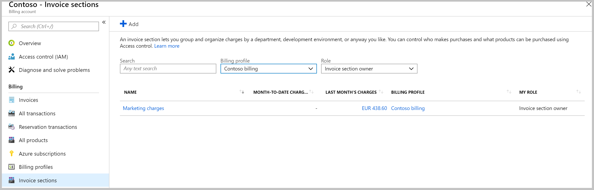
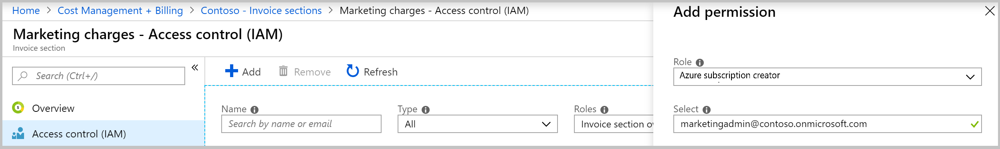

# Create sections on your invoice to group your charges

You can create a section on an invoice to group and organize charges for a department, development environment, or anyway you like. Then give others permission to create subscriptions for the section. Any Azure usage charges for that subscription then show on the invoice section. View the total charges for the section on your invoice, in the Azure portal, or review them in Azure cost analysis. For more information, see [Understanding invoice sections](billing-understand-mca-roles.md#manage-invoice-sections-for-billing-account).
<!--Todo fix the link -->

This article applies to a billing account for a Microsoft Customer Agreement. [Check if you have a Microsoft Customer Agreement](#check-your-access-to-a-billing-account-for-microsoft-customer-agreement).

## Create an invoice section in the Azure portal

To create an invoice section, you need to be a **Basic purchaser** on the Billing account. For more information, see [Billing account roles and tasks](billing-understand-mca-roles.md#manage-invoice-sections-for-billing-account).

1. Sign in to the [Azure portal]( http://portal.azure.com).

2. Search on **Cost Management + Billing**.

   

3. Select **Invoice sections** from the left-hand pane. Depending on your access, you may need to select a billing profile or a billing account and then select **Invoice sections**

   
    <!--Todo replace the screenshot with billing profile blade -->

4. From the top of the page, select **Add**.

5. Enter the name of the invoice section.

   
   <!--Todo update the screenshot -->

6. Select **Create**.

## Give permission to create Azure subscriptions

1. Sign in to the [Azure portal]( http://portal.azure.com).

2. Search on **Cost Management + Billing**.

   

3. Go to the invoice section. Depending on your access, you may need to select a billing account or billing profile. From the billing account or profile, select **Invoice sections** and then an invoice section.

4. Select **Access Management (IAM)** from the left-hand pane.

5. From the top of the page, select **Add**.

6. Select **Azure subscription creator** for role and enter the email address of the user.

   
  <!--TODO - Add screenshot for the IAM blade -->

7. Select **Save**.

## Check your access to a Billing account for Microsoft Customer Agreement
[!INCLUDE [billing-check-mca](../../includes/billing-check-mca.md)]

## Need help? Contact support

If you need help, [contact support](https://portal.azure.com/?#blade/Microsoft_Azure_Support/HelpAndSupportBlade) to get your issue resolved quickly.
