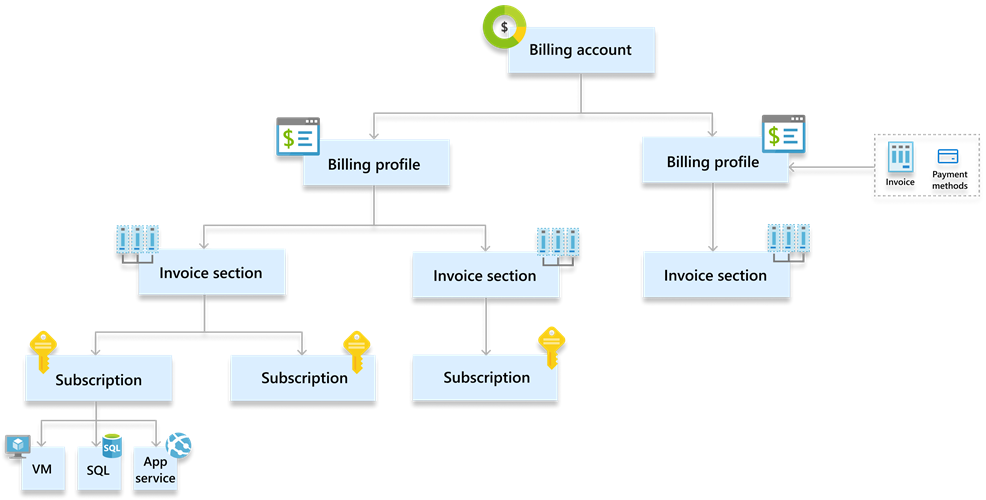
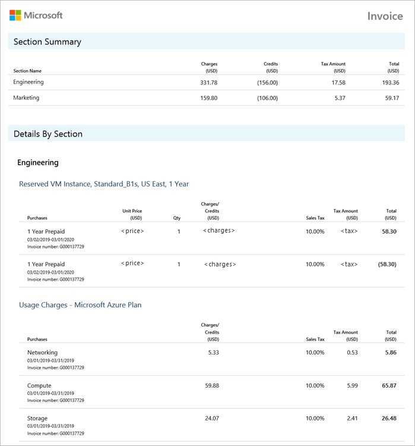
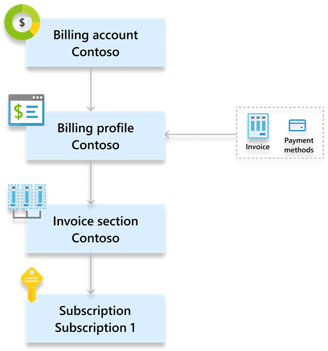
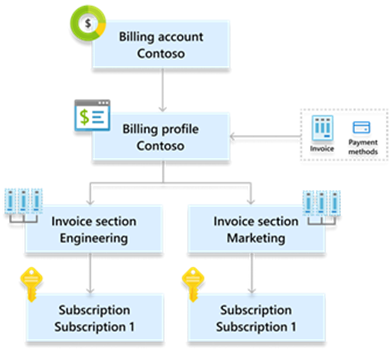
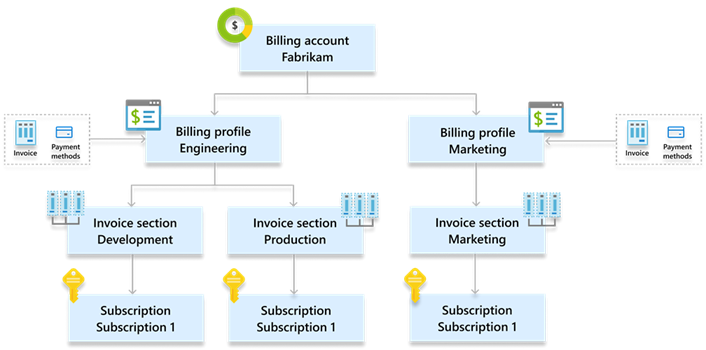
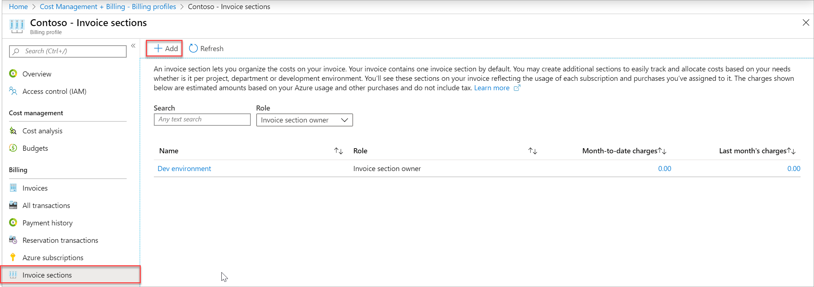
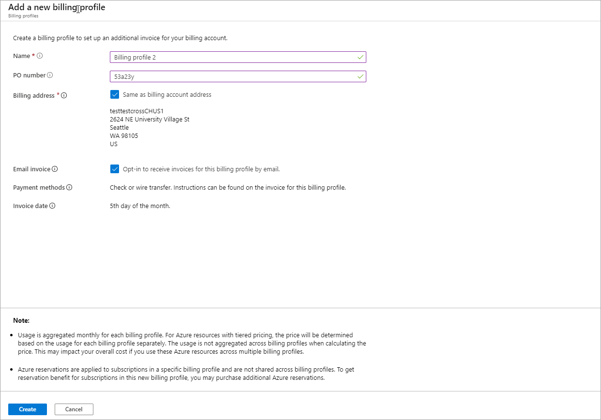
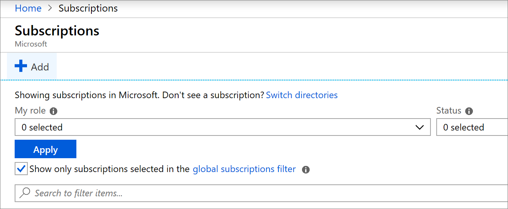
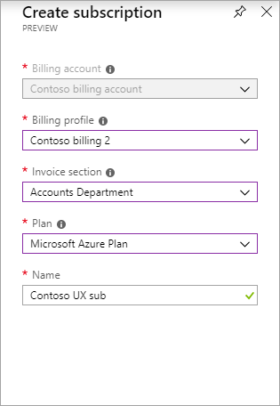
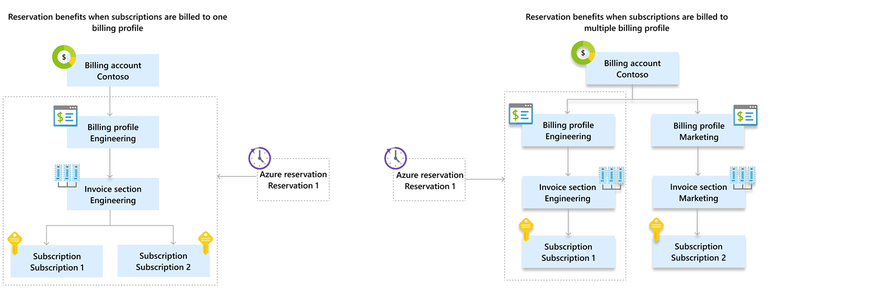

# Organize costs by customizing your billing account

Your billing account for Microsoft Customer Agreement provides you flexibility to organize your costs based on your needs whether it's by department, project, or development environment. 

This article describes how you can use the Azure portal to organize your costs. It applies to a billing account for a Microsoft Customer Agreement. [Check if you have access to a Microsoft Customer Agreement](#check-access-to-a-microsoft-customer-agreement).

## Use billing profiles and invoice sections to organize costs

In the billing account for a Microsoft Customer Agreement, you use billing profiles and invoice sections to organize your costs.

### Billing profile

A billing profile represents an invoice and the related billing information such as payment methods and billing address. A monthly invoice is generated at the beginning of the month for each billing profile in your account. The invoice contains charges for Azure usage and other purchases from the previous month.

A billing profile is automatically created along with your billing account when you sign up for Azure. You may create additional billing profiles to organize your costs in multiple monthly invoices. 

> [!IMPORTANT]
>
> Creating additional billing profiles may impact your overall cost. For more information, see [Things to consider before creating new billing profiles](#things-to-consider-before-creating-new-billing-profiles).

### Invoice section

An invoice section represents a grouping of costs in your invoice. An invoice section is automatically created for each billing profile in your account. You may create additional sections to organize your costs based on your needs. Each invoice section is displayed on the invoice with the charges incurred that month. 

The image below shows an invoice with two invoice sections - Engineering and Marketing. The summary and detail charges for each section is displayed in the invoice.

## Structure your billing account to organize your costs

This section describes common scenarios for organizing costs and corresponding billing account structures:

|Scenario  |Structure  |
|---------|---------|
|Jack signs-up for Azure and wants a single monthly invoice. | A billing profile and an invoice section. This structure is automatically set up for Jack when he signs up for Azure and doesn't require any additional steps. |

|Scenario  |Structure  |
|---------|---------|
|Contoso is a small organization that wants a single monthly invoice but group costs by their departments - marketing and finance.  | A billing profile for Contoso and an invoice section each for marketing and finance departments. |

|Scenario  |Structure  |
|---------|---------|
|Fabrikam wants separate invoices for their engineering and marketing departments. For engineering department, they want to group costs by environments - productions and development.  | A billing profile each for marketing and finance departments. For marketing department, an invoice section each for production and development environment. |

## Create an invoice section in the Azure portal

To create an invoice section, you need to be a **billing profile owner** or a **billing profile contributor**. For more information, see [Manage invoice sections for billing profile](billing-understand-mca-roles.md#manage-invoice-sections-for-billing-profile).

1. Sign in to the [Azure portal](https://portal.azure.com).

2. Search for **Cost Management + Billing**.

   

3. Select **Billing profiles** from the left-hand pane. From the list, select a billing profile. The new section will be displayed on the selected billing profile's invoice. 

   

4. Select **Invoice sections** from the left-hand pane and then select **Add** from the top of the page.

   

5. Enter a name for the invoice section. 

   

6. Select **Create**.

## Create a billing profile in the Azure portal

To create a billing profile, you need to be a **billing account owner** or a **billing account contributor**. For more information, see [Manage billing profiles for billing account](billing-understand-mca-roles.md#manage-billing-profiles-for-billing-account).

> [!IMPORTANT]
>
> Creating additional billing profiles may impact your overall cost. For more information, see [Things to consider before creating new billing profiles](#things-to-consider-before-creating-new-billing-profiles).

1. Sign in to the [Azure portal](https://portal.azure.com).

2. Search for **Cost Management + Billing**.

   

3. Select **Billing profiles** from the left-hand pane and then select **Add** from the top of the page.

   

4. Fill the form and click **Create**.

   

    |Field  |Definition  |
    |---------|---------|
    |Name     | A display name that helps you easily identify the billing profile in the Azure portal.  |
    |PO number    | An optional purchase order number. The PO number will be displayed on the invoices generated for the billing profile. |
    |Billing address   | The billing address will be displayed on the invoices generated for the billing profile. |
    |Email invoice   | Check the email invoice box to receive the invoices for this billing profile by email. If you don't opt in, you can view and download the invoices in the Azure portal.|

5. Select **Create**.

## Link charges to an invoice section and a billing profile

Once you have customized your billing account based on your needs, you can link subscriptions and other products to your desired invoice section and billing profile.

### Link a new subscription

1. Sign in to the [Azure portal](https://portal.azure.com).

2. Search for **Subscriptions**.

   

3. Select **Add** from the top of the page.

   

4. If you have access to multiple billing accounts, select your Microsoft Customer Agreement billing account.

   

5. Select the billing profile that will be billed for the subscription's usage. The charges for Azure usage and other purchases for this subscription will be displayed on the selected billing profile's invoice.

6. Select the invoice section to link the subscription's charges. The charges will be displayed under this section on the billing profile's invoice.

7. Select an Azure plan and enter a friendly name for your subscription. 

9. Click **Create**.  

Your new subscription is created. The charges for Azure usage and other purchases for this subscription will be billed to the selected billing profile. They will be displayed under the selected invoice section of the billing profile's invoice.

### Link existing subscriptions and other products

If you have existing Azure subscriptions or other products such as Azure Marketplace and App source resources, you can move them from their existing invoice section to another invoice section to reorganize their costs. 

> [!IMPORTANT]
>
> Subscriptions and other products can only be moved between invoice sections that belong to the same billing profile. Moving subscriptions and products across invoice sections in different billing profiles is not supported.

1. Sign in to the [Azure portal](https://portal.azure.com).

2. Search for **Cost Management + Billing**.

   

3. To link a subscription to a new invoice section, select **Azure subscriptions** from the left-side of the screen. For other products, select **Recurring charges**.

   

4. In the page, click on ellipsis (three dots) for the subscription or product that you want to link to a new invoice section. Select **Change invoice section**.

5. Select the new invoice section from the dropdown. The dropdown will only show invoice sections that are associated with the same billing profile as the existing invoice section.

    

6. Select **Save**.

## Things to consider before creating new billing profiles

### Cost of Azure usage may increase

In your billing account for a Microsoft Customer Agreement, Azure usage is aggregated monthly for each billing profile. The prices for Azure resources with tiered pricing are determined based on the usage for each billing profile separately. The usage is not aggregated across billing profiles when calculating the price. This may impact overall cost of Azure usage for accounts with multiple billing profiles.

Let's look at an example of how costs vary for two scenarios:

#### You only have one billing profile.

Let's assume you're using Azure block blob storage, which costs USD .00184 per GB for first 50 terabytes (TB) and then .00177 per GB for next 450 terabytes (TB). You used 100 TB in the subscriptions that are billed to your billing profile, here's how much you would be charged.

|  Tier pricing (USD) |Quantity | Amount (USD)|
|---------|---------|---------|
|.00184 for the first 50 TB/month    | 50 TB        | 92.0   |
|.00177 for the next 450 TB/month    |  50 TB         | 88.5   |
|Total     |     100 GB  | 180.5

The total charges for using 100 TB of data in this scenario is **180.5**

#### You have multiple billing profiles.

Now, let's assume you created another billing profile and used 50 GB through subscriptions that are billed to the first billing profile and 50 GB through subscriptions that are billed to the second billing profile, here's how much you would be charged.

`Charges for the first billing profile`

|  Tier pricing (USD) |Quantity | Amount (USD)|
|---------|---------|---------|
|.00184 for the first 50 TB/month    | 50 TB        | 92.0  |
|.00177 for the next 450 TB/month    |  0 TB         | 0.0  |
|Total     |     50 GB  | 92.0 

`Charges for the second billing profile`

|  Tier pricing (USD) |Quantity | Amount (USD)|
|---------|---------|---------|
|.00184 for the first 50 TB/month    | 50 TB        | 92.0  |
|.00177 for the next 450 TB/month    |  0 TB         | 0.0  |
|Total     |     50 GB  | 92.0 

The total charges for using 100 TB of data in this scenario is **184.0** (92.0 * 2).

### Azure reservation benefits might not be applied to all subscriptions

Azure reservations with shared scope are applied to subscriptions in a single billing profile and are not shared across billing profiles. 

In the first scenario in the above image, contoso has two subscriptions - subscription 1 and subscription 2, both billed to the engineering billing profile. In this scenario, Reservation 1 is applied to the engineering billing profile and would provide benefits to either of the subscriptions. In the second scenario, subscription 1 is billed to engineering billing profile and subscription 2 to the marketing billing profile. Reservation 1 is  applied to the engineering billing profile. However, it will provide benefits to subscription 1, which is the only subscription billed to the engineering billing profile.

## Check access to a Microsoft Customer Agreement
[!INCLUDE [billing-check-mca](../../includes/billing-check-mca.md)]

## Need help? Contact support

If you need help, [contact support](https://portal.azure.com/?#blade/Microsoft_Azure_Support/HelpAndSupportBlade) to get your issue resolved quickly.

## Next steps

- [Create an additional Azure subscription for Microsoft Customer Agreement](billing-mca-create-subscription.md)
- [Manage billing roles in the Azure portal](billing-understand-mca-roles.md#manage-billing-roles-in-the-azure-portal)
- [Get billing ownership of Azure subscriptions from users in other billing accounts](billing-mca-request-billing-ownership.md)
