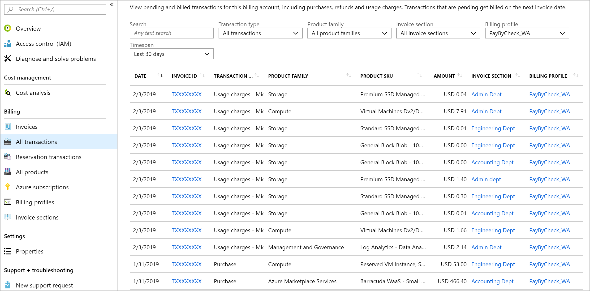
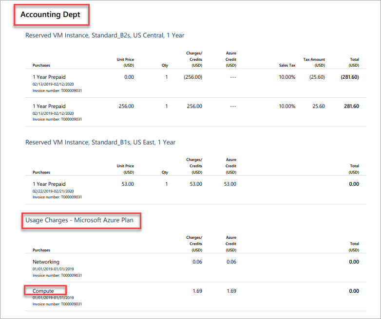

# Understand charges on your Microsoft Customer Agreement invoice

You can understand the charges on your invoice by analyzing the individual transactions. In the billing account for a Microsoft Customer Agreement, an invoice is generated every month for each billing profile. The invoice includes all charges from the previous month. You can view your invoices in the Azure portal. For more information, see [download invoices for a Microsoft Customer Agreement](billing-download-azure-invoice-daily-usage-date.md#download-invoices-for-a-microsoft-customer-agreement).

This article applies to a billing account for a Microsoft Customer Agreement. [Check if you have access to a Microsoft Customer Agreement](#check-access-to-a-microsoft-customer-agreement).

## View transactions for an invoice in the Azure portal

1. Sign in to the [Azure portal](https://www.azure.com).

2. Search for **Cost Management +Billing**.

    

3. Select **All transactions** from the left side of the page. Depending on your access, you might have to select a billing account, billing profile, or an invoice section and then select **All transactions**.

4. The All transactions page displays the following information:

    

    |Column  |Definition  |
    |---------|---------|
    |Date     | The date of transaction  |
    |Invoice ID     | The identifier for the invoice on which the transaction got billed. If you submit a support request, share the ID with Azure support to expedite your support request |
    |Transaction type     |  The type of transaction like purchase, cancel, and usage charges  |
    |Product family     | The category of product like compute for Virtual machines or database for Azure SQL database|
    |Product sku     | A unique code identifying the instance of your product |
    |Amount     |  The amount of transaction      |
    |Invoice section     | The transaction shows up on this section of billing profile's invoice |
    |Billing profile     | The transaction shows up on this billing profile's invoice |

5. Search for invoice ID to filter the transactions for the invoice.

### View transactions by invoice sections

Invoice sections help you organize the costs for a billing profile's invoice. For more information, see [understand invoice section](billing-mca-overview.md#invoice-sections). When an invoice is generated, charges for all the sections in the billing profile are shown on the invoice.

The following image shows charges for the Accounting Dept invoice section on a sample invoice.

When you've identified the charges for an invoice section, you can view the transactions in the Azure portal to understand the charges.

1. Go to the All transactions page in the Azure portal to view transactions for an invoice. For more information, see [view transactions for an invoice in the Azure portal](#view-transactions-for-an-invoice-in-the-azure-portal).

2. Filter by the invoice section name to view transactions.

## Review pending charges to estimate your next invoice

In the billing account for a Microsoft Customer Agreement, charges are estimated and considered pending until they are invoiced. You can view pending charges in the Azure portal to estimate your next invoice. Pending charges are estimated and they don't include tax. The actual charges on your next invoice will vary from the pending charges.

### View summary of pending charges

1. Sign in to the [Azure portal](https://portal.azure.com).

2. Search for **Cost Management +Billing**.

   

3. Select a billing profile. Depending on your access, you may have to select a billing account. From the billing account, select **Billing profiles** then select a billing profile.

4. Select **Summary** tab from the top of the screen.

5. The charges section display the month-to-date and last month's charges.

   

The month-to-date charges are the pending charges for the current month and are billed when the invoice is generated for the month. If the invoice for last month is still not generated, then last month's charges are also pending and will appear on your next invoice.

### View pending transactions

When you identify pending charges, you can understand the charges by analyzing the individual transactions that contributed to the charges. At this point, pending usage charges aren't displayed on the All transaction page. You can view the pending usage charges on the Azure subscriptions page. For more information, see [view pending usage charges](#view-pending-usage-charges)

1. Sign in to the [Azure portal](https://portal.azure.com).

2. Search for **Cost Management +Billing**.

   

3. Select a billing profile. Depending on your access, you may have to select a billing account. From the billing account, select **Billing profiles** then select a billing profile.

4. Select **All transactions** from the left side of the page.

5. Search for *pending*. Use the **Timespan** filter to view pending charges for current or last month.

   

### View pending usage charges

1. Sign in to the [Azure portal](https://portal.azure.com).

2. Search for *Cost Management +Billing*.

   

3. Select a billing profile. Depending on your access, you may have to select a billing account. From the billing account, select **Billing profiles** then select a billing profile.

4. Select **All subscriptions** one the left side of the page.

5. The Azure subscriptions page displays the current and last month's charges for each subscription in the billing profile. The month-to-date charges are the pending charges for the current month and are billed when the invoice is generated for the month. If the invoice for last month is still not generated, then last month's charges are also pending.

    

## Analyze your Azure usage charges

Use the Azure usage and charges CSV file to analyze your usage-based charges. You can download the file for an invoice or for pending charges. For more information, see [get your Azure billing invoice and daily usage data](billing-download-azure-invoice-daily-usage-date.md).

### View detailed usage by invoice section

You can filter the Azure usage and charges file to reconcile the usage charges for your invoice sections.

The following steps walk you through reconciling compute charges for the Accounting Dept invoice section:

 | Invoice PDF | Azure usage and charges CSV |
 | --- | --- |
 |Accounting Dept |invoiceSectionName |
 |Usage Charges - Microsoft Azure Plan |productOrderName |
 |Compute |serviceFamily |

1. Filter the **invoiceSectionName** column in the CSV file to **Accounting Dept**.
2. Filter the **productOrderName** column in the CSV file to **Microsoft Azure Plan**.
3. Filter the **serviceFamily** column in the CSV file to **Microsoft.Compute**.

### View detailed usage by subscription

You can filter the Azure usage and charges CSV file to reconcile usage charges for your subscriptions. To view all subscriptions in a billing profile, see [view pending usage charges](#view-pending-usage-charges).

When you identify charges for a subscription, use the Azure usage and charges CSV file to analyze the charges.

The following image shows the list of subscriptions in the Azure portal.

Filter the **subscriptionName** column in the Azure usage and charges CSV file to **WA_Subscription** to view the detailed usage charges for WA_Subscription.

## Pay your bill

Instructions for paying your bill are shown at the bottom of the invoice. [Learn how to pay](billing-mca-understand-your-invoice.md#how-to-pay).

If you've already paid your bill, you can check the status of the payment on the Invoices page in the Azure portal.

## Check access to a Microsoft Customer Agreement
[!INCLUDE [billing-check-mca](../../includes/billing-check-mca.md)]

## Need help? Contact us.

If you have questions or need help,  [create a support request](https://go.microsoft.com/fwlink/?linkid=2083458).

## Next steps

To learn more about your invoice and detailed usage, see:

- [How to get your Azure billing invoice and daily usage data](billing-download-azure-invoice-daily-usage-date.md)
- [Understand terms on your Microsoft Customer Agreement invoice](billing-mca-understand-your-invoice.md)
- [Understand terms on your Microsoft Customer Agreement usage CSV](billing-mca-understand-your-usage.md)
