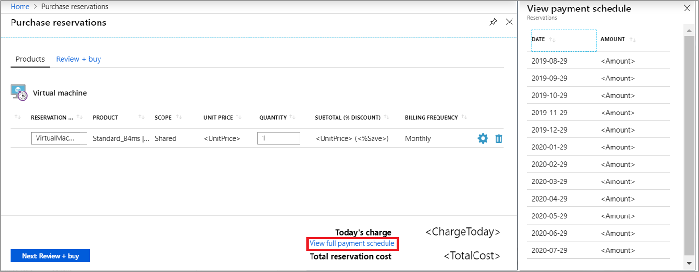

# Purchase reservations with monthly payments

Until now, Azure reservations required payment up front. Now you can pay for reservations with monthly payments. Unlike an up-front purchase where you pay the full amount, the monthly payment option divides the total cost of the reservation evenly over each month of the term. The total cost of up-front and monthly reservations is the same and you don't pay any extra fees when you choose to pay monthly.

Your monthly payment amount may vary, depending on the current month's market exchange rate for your local currency.

Monthly payments are available for:

- Virtual machines
- SQL Database
- SQL Data Warehouse
- Cosmos DB
- App Service stamp fee

Purchase reservations in the [Azure portal](https://portal.azure.com/?Microsoft_Azure_Reservations_EnableMultiCart=true&amp;paymentPlan=true#blade/Microsoft_Azure_Reservations/CreateBlade).

While making a reservation purchase, you can view the payment schedule. Click **View full payment schedule**.

To view the payments schedule after purchase, select a reservation, click the **Reservation order ID**, and then click the **Payments** tab.

## View payments made

You can view payments that were made using APIs, usage data, and in cost analysis. For reservations paid for monthly, the frequency value is shown as **recurring** in usage data and Reservation Charges API. For reservations paid up front, the value is shown as **onetime**.

Cost analysis shows monthly purchases in the default view. Apply the **purchase** filter for **Charge type** and **recurring** for **Frequency** to see all purchases. To view only reservations, apply a filter for **Reservation**.

## Switch to monthly payments at renewal

When you renew a reservation, you can change the billing frequency to monthly.

## Exchange and refunds

Like other reservations, you can refund or exchange reservations purchased with monthly billing. Currently, you can submit a support request to start an exchange or refund for a reservation purchased with monthly billing.

When you exchange a reservation that's paid for monthly, the total lifetime cost of the new purchase should be greater than the leftover payments that are canceled for the returned reservation. There are no other limits or fees for exchanges. You can exchange a reservation that's paid for up front to purchase a new reservation that's billed monthly. However, the lifetime value of the new reservation should be greater than the prorated value of the reservation being returned.

If canceling a reservation that's paid for monthly, Microsoft might apply a cancellation fee to the future committed payments that are canceled. The remaining committed payments accrue towards the $50,000 USD refund limit.

For more information about exchange and refunds, see [Self-service exchanges and refunds for Azure Reservations](billing-azure-reservations-self-service-exchange-and-refund.md).

## FAQ

Q. Does Azure offer "Partial up-front reservations?" 
A. No. Because the costs for reservations paid up front and monthly are the same, Microsoft doesn't support partial up-front payments.

Q. Are monthly payments available for the Microsoft Cloud Solution Provider (CSP) program? 
A. Yes, partners can purchase reservations for their CSP customers in the Azure portal. The ability to purchase reservations with monthly billing isn't available in the Partner center.

Q. I'm a US Azure Government customer, can I pay monthly for reservation purchases? 
A. Not currently.

Q. When can I exchange or refund myself in the Azure portal, instead of creating a Support ticket? 
A. Not currently. Requests to exchange and refund reservations with monthly payments are handled by Azure support.

## Next steps

- To learn more about reservations, see [What are Azure Reservations?](billing-save-compute-costs-reservations.md)
- To learn about tasks you should accomplish before buying a reservation, see [Determine the right VM size before you buy](../virtual-machines/windows/prepay-reserved-vm-instances.md#determine-the-right-vm-size-before-you-buy)
