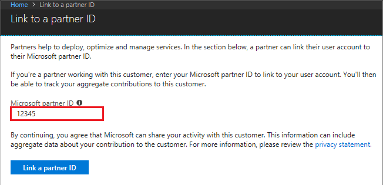
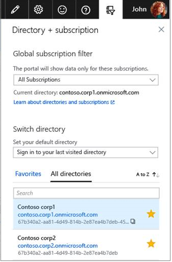

---
title: Link Azure account to partner ID | Microsoft Docs
description: Track engagements with Azure customers by linking partner ID to the user account that you use to manage the customer's resources. 
services: billing
author: dhirajgandhi
ms.author: cwatson
ms.date: 03/12/2018
ms.service: billing
ms.devlang: na
ms.topic: conceptual
ms.tgt_pltfrm: na
ms.workload: na
---

# Link partner ID to your Azure accounts

As a partner, you can track your impact across your customer engagements by linking your partner ID to the accounts used for managing customer's resources.

This feature is available in a public preview.

## Get access from your customer

Before you link your partner ID, your customer must give you access to their Azure resources by using one of the following options:

- **Guest user:** Your customer can add you as a guest user and assign any RBAC roles. For more information, see [Add guest users from another directory](https://docs.microsoft.com/azure/active-directory/active-directory-b2b-what-is-azure-ad-b2b).

- **Directory account:**  Your customer can create a new user from your organization in their directory and assign any RBAC role.

- **Service principal:**  Your customer can add an app or script from your organization in their directory and assign any RBAC role. The identity of the app or script is known as service principal.

## Link partner ID

When you have access to the customer's resources, use Azure portal, PowerShell, or CLI to link your Microsoft Partner Network ID (MPN ID) to your user ID or service principal. You have to link the partner ID in each customer tenant.

### Use Azure portal to link new partner ID

1. Go to [link to a partner ID](https://portal.azure.com/#blade/Microsoft_Azure_Billing/managementpartnerblade) in the Azure portal.

2. Sign in to the Azure portal.

3. Enter the Microsoft partner ID.The partner ID is the [Microsoft Partner Network(MPN)](https://partner.microsoft.com/) ID of your organization.

  

4. To link partner ID for another customer, use the directory switcher. Under Switch directory, choose your directory.

  

### Use PowerShell to link new partner ID

1. Install the [AzureRM.ManagementPartner](https://www.powershellgallery.com/packages/AzureRM.ManagementPartner) PowerShell Module.

2. Sign in to the customer's tenant either with the user account or service principal, For more information, see [Login with Powershell](https://docs.microsoft.com/powershell/azure/authenticate-azureps?view=azurermps-5.2.0).
 
   ```azurepowershell-interactive
    C:\> Connect-AzureRmAccount -TenantId XXXXXXXX-XXXX-XXXX-XXXX-XXXXXXXXXXXX 
   ```


3. Link the new partner ID. The partner ID is the [Microsoft Partner Network(MPN)](https://partner.microsoft.com/) ID of your organization.

    ```azurepowershell-interactive
    C:\> new-AzureRmManagementPartner -PartnerId 12345 
    ```

#### Get the linked partner ID
```azurepowershell-interactive
C:\> get-AzureRmManagementPartner 
```

#### Update the linked partner ID
```azurepowershell-interactive
C:\> Update-AzureRmManagementPartner -PartnerId 12345 
```
#### Delete the linked partner ID
```azurepowershell-interactive
C:\> remove-AzureRmManagementPartner -PartnerId 12345 
```

### Use CLI to link new partner ID
1.  Install the CLI Extension.

    ```azurecli-interactive
    C:\ az extension add --name managementpartner
    ``` 

2.  Sign in to the customer's tenant with the user account or service principal. For more information, see [Log in with Azure CLI](https://docs.microsoft.com/cli/azure/authenticate-azure-cli?view=azure-cli-latest).

    ```azurecli-interactive
    C:\ az login --tenant <tenant>
    ``` 

3.  Link the new partner ID. The partner ID is the [Microsoft Partner Network(MPN)](https://partner.microsoft.com/) ID of your organization.

     ```azurecli-interactive
     C:\ az managementpartner create --partner-id 12345
      ```  

#### Get the linked partner ID
```azurecli-interactive
C:\ az managementpartner show
``` 

#### Update the linked partner ID
```azurecli-interactive
C:\ az managementpartner update --partner-id 12345
``` 

#### Delete the linked partner ID
```azurecli-interactive
C:\ az managementpartner delete --partner-id 12345
``` 

## Next steps

Join the discussion in the [Microsoft Partner Community](https://aka.ms/PALdiscussion) to receive updates or send feedback.

## Frequently Asked Questions

**Who can link the partner ID?**

Any user from the partner organization who is managing customer's resource can link the partner ID to the account.

**Once a partner ID is linked can it be changed?**

Yes, linked partner ID can be changed, added, or removed.

**What if a user has an account in multiple customer tenants?**

The link between the partner ID and the account is done for each customer tenant.  You have to link the partner ID in each customer tenant.

**Can other partner or customer edit or remove the link to the partner ID?**

The link is associated at the account level. Only you can edit or remove the link to the partner ID. The customer and other partner can't change the link to the partner ID. 
