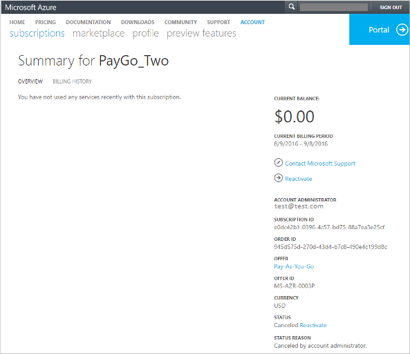

# Why is my Azure subscription disabled and how do I reactivate it?
You might have your Azure subscription disabled because you reached your spending limit, have an overdue bill, hit your credit card limit, or because the subscription was canceled by the account administrator. See what issue applies to you and follow the steps in this article to get your subscription reactivated.

## You reached your spending limit
When your usage exhausts the monthly amounts included with your subscription, we disable your service for the remainder of that billing month. Your service is disabled to protect you from accidentally incurring charges for usage beyond the amount included with your subscription. You can remove the spending limit and [set up billing alerts for your Microsoft Azure subscriptions](billing-set-up-alerts.md) to help you monitor and manage billing activity for your Azure accounts.

To remove your spending limit,

1. Log in to the [Azure Account Center](https://account.windowsazure.com/Home/Index).
2. Click **Subscriptions**.
3. Select a subscription.
4. Click **Subscription reached the Spending Limit and has been disabled to prevent charges**.

    If you don't see that option, click **Remove spending limit** in the subscription **Status** area.
5. Select one of the following options:

| Option | Effect |
| --- | --- |
| Remove spending limit indefinitely |Removes the spending limit until you turn it back on. |
| Remove spending limit for the current billing period |Removes the spending limit but the spending limit restarts for the next billing period. |

If you have a Free Trial subscription and you remove the spending limits, your subscription converts to Pay-As-You-Go at the end of the free trial.

## Your bill is past due
Pay your outstanding balance in full. See the article [Why have you received a notification that your Azure subscription has a past due balance?](billing-azure-subscription-past-due-balance.md#how-to-resolve-the-issue)

## The bill exceeds your credit card limit
To resolve this issue, [switch to a different credit card](billing-how-to-change-credit-card.md). Or if you're representing a business, you can [switch to pay by invoice](https://azure.microsoft.com/pricing/invoicing/).

## The subscription was canceled by the Account Administrator
If you're the account administrator, reactivate your Pay-As-You-Go subscription by using the following steps:

1. Log in to the [Azure Account Center](https://account.windowsazure.com/Home/Index).
2. Select the canceled subscription.
3. Click **Reactivate**.

For other subscription types, [contact support](https://portal.azure.com/?#blade/Microsoft_Azure_Support/HelpAndSupportBlade) to have your subscription reactivated.

## Need help? Contact support.
If you still need help, [contact support](https://portal.azure.com/?#blade/Microsoft_Azure_Support/HelpAndSupportBlade) to get your issue resolved quickly.
