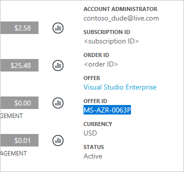
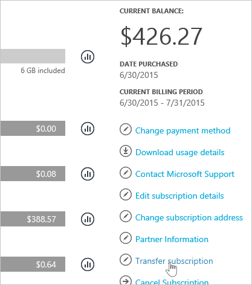
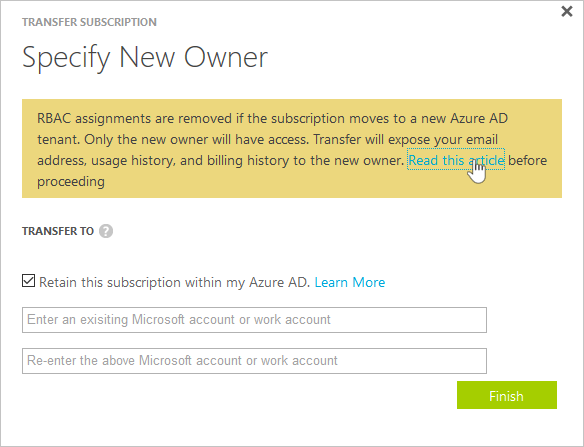
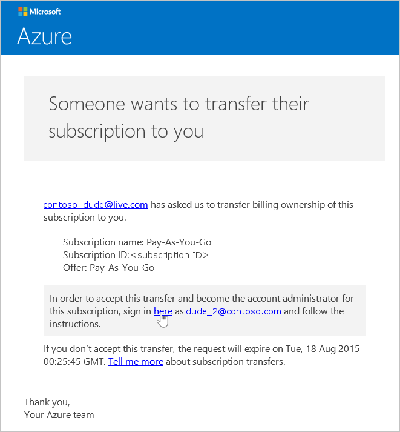
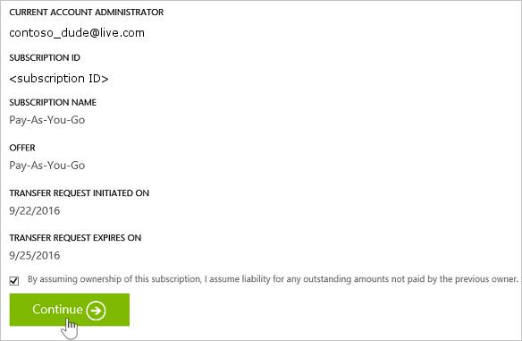
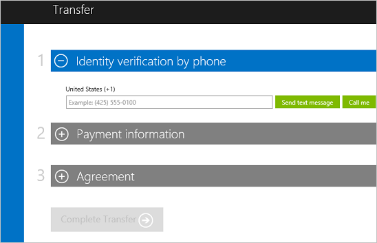

# Transfer ownership of an Azure subscription to another account

Transfer your subscription to another user in the Account Center to change the Account Admin and hand over subscription billing ownership. To change your subscription to a different offer, see [Switch your Azure subscription to another offer](billing-how-to-switch-azure-offer.md).

> [!IMPORTANT]
> 
> If you transfer a subscription to a new Azure AD tenant, all role assignments in [role-based access control (RBAC)](../role-based-access-control/overview.md) are permanently deleted from the source tenant and are not migrated to the target tenant.

> [!div class="nextstepaction"]
> [Help improve Azure billing docs](https://go.microsoft.com/fwlink/p/?linkid=2010091)

## Transfer ownership of an Azure subscription

> [!VIDEO https://channel9.msdn.com/Series/Microsoft-Azure-Tutorials/Transfer-an-Azure-subscription/player]
>
>

1. Sign in at [Azure Account Center](https://account.windowsazure.com/Subscriptions) as the Account Admin. To find out who is the Account Admin of the subscription, see [Frequently asked questions](#faq).

1. Select the subscription to transfer.

1. Verify that your subscription is eligible for self-serve transfer by checking the **Offer** and **Offer ID** with the [supported offers list](#supported).

   
1. Click **Transfer subscription**.

   
1. Specify the recipient.

   > [!IMPORTANT]
   > 
   > If you transfer a subscription to a new Azure AD tenant, all role assignments in [role-based access control (RBAC)](../role-based-access-control/overview.md) are permanently deleted from the source tenant and are not migrated to the target tenant.

   

1. The recipient automatically gets an email with an acceptance link.

   
1. The recipient clicks the link and follows the instructions, including entering their payment information.

   

   
1. Success! The subscription is now transferred.

## Transfer subscription ownership for Enterprise Agreement (EA) customers

The Enterprise Administrator can transfer ownership of subscriptions within an enrollment. To get started, see [Transfer Account Ownership](https://ea.azure.com/helpdocs/changeAccountOwnerForASubscription) in the EA portal.

## Next steps after accepting ownership of a subscription

1. You are now the Account Admin. Review and update the Service Admin, Co-Admins, and other RBAC roles. To learn more, see [Add or change Azure subscription administrators](billing-add-change-azure-subscription-administrator.md) and [Manage access using RBAC and the Azure portal](../role-based-access-control/role-assignments-portal.md).
1. Update credentials associated with this subscription's services including:
   1. Management certificates that grant the user admin rights to subscription resources. For more information, see [Create and upload a management certificate for Azure](../cloud-services/cloud-services-certs-create.md)
   1. Access keys for services like Storage. For more information, see [About Azure storage accounts](../storage/common/storage-create-storage-account.md)
   1. Remote Access credentials for services like Azure Virtual Machines. 
1. If you're working with a partner, consider updating the partner ID on this subscription. You can update the partner ID in the [Azure portal](https://portal.azure.com).

## What's supported:

Self-serve subscription transfer is available for the offers or subscription types listed in the following table. Currently you can't transfer a Free Trial or [Azure in Open (AIO)](https://azure.microsoft.com/offers/ms-azr-0111p/) subscriptions. For a workaround, see [Move resources to new resource group or subscription](../azure-resource-manager/resource-group-move-resources.md). To transfer other subscriptions, like [Sponsorship](https://azure.microsoft.com/offers/ms-azr-0036p/) or support plans, [contact support](https://portal.azure.com/?#blade/Microsoft_Azure_Support/HelpAndSupportBlade).

| Offer Name                                                                             | Offer Number |
|----------------------------------------------------------------------------------------|--------------|
| [Enterprise Agreement (EA)](https://azure.microsoft.com/pricing/enterprise-agreement/)\*|MS-AZR-0017P        |
| [Microsoft Partner Network](https://azure.microsoft.com/offers/ms-azr-0025p/)          | MS-AZR-0025P        |
| [MSDN Platforms](https://azure.microsoft.com/offers/ms-azr-0062p/)                     | MS-AZR-0062P        |
| [Pay-As-You-Go](https://azure.microsoft.com/offers/ms-azr-0003p/)                      | MS-AZR-0003P        |
| [Pay-As-You-Go Dev/Test](https://azure.microsoft.com/offers/ms-azr-0023p/)             | MS-AZR-0023P        |
| [Visual Studio Enterprise](https://azure.microsoft.com/offers/ms-azr-0063p/)           | MS-AZR-0063P        |
| [Visual Studio Enterprise: BizSpark](https://azure.microsoft.com/offers/ms-azr-0064p/) | MS-AZR-0064P        |
| [Visual Studio Professional](https://azure.microsoft.com/offers/ms-azr-0059p/)         | MS-AZR-0059P        |
| [Visual Studio Test Professional](https://azure.microsoft.com/offers/ms-azr-0060p/)    | MS-AZR-0060P        |

\* [Via the EA portal](#EA)

## Frequently asked questions (FAQ)

###  Who is the Account Administrator of the subscription?

The Account Administrator is the person who signed up for or bought the Azure subscription. They're authorized to access the [Account Center](https://account.azure.com/Subscriptions) and perform various management tasks like create subscriptions, cancel subscriptions, change the billing for a subscription, or change the Service Administrator. If you're not sure who the account administrator is for a subscription, use the following steps to find out.

1. Visit the [Subscriptions page in Azure portal](https://portal.azure.com/#blade/Microsoft_Azure_Billing/SubscriptionsBlade).
1. Select the subscription you want to check, and then look under **Settings**.
1. Select **Properties**. The account administrator of the subscription is displayed in the **Account Admin** box.

### Does everything transfer? Including resource groups, VMs, disks, and other running services?

All your resources like VMs, disks, and websites transfer to the new owner. However, any [administrator roles](billing-add-change-azure-subscription-administrator.md) and [Role-based Access Control (RBAC)](../role-based-access-control/role-assignments-portal.md) policies you've set up do not transfer across different directories. Also, [app registrations](../active-directory/develop/quickstart-v1-integrate-apps-with-azure-ad.md) and other tenant-specific services don't transfer along.

###  Why don't I see the "Transfer subscription" button?

Unfortunately, self-serve subscription transfer isn't available for your offer or country. To transfer your subscription, [contact support](https://portal.azure.com/?#blade/Microsoft_Azure_Support/HelpAndSupportBlade).

### Does a subscription transfer result in any service downtime?

There is no impact to the service. Transferring the subscription cancels the subscription under the current Account Administrator and creates a subscription under the recipient's account. The new subscription is associated to the underlying Azure services. The subscription ID remains the same.

### How do I use this process to change the directory for subscription?

An Azure subscription is created in the directory that the Account Administrator belongs to. To change the directory, transfer the subscription to a user account in the target directory. When that user completes the steps to accept transfer, the subscription is automatically moved to the target directory.

### If I take over billing ownership of a subscription from another organization, do they continue to have access to my resources?

If the subscription is transferred to another tenant, the users associated with the previous tenant lose access to the subscription. Even if a user is not a Service Admin or Co-admin anymore, they might still have access to the subscription through other security mechanisms, including:

* Management certificates that grant the user admin rights to subscription resources. For more information, see [Create and Upload a Management Certificate for Azure](../cloud-services/cloud-services-certs-create.md).
* Access keys for services like Storage. For more information, see [About Azure storage accounts](../storage/common/storage-create-storage-account.md).
* Remote Access credentials for services like Azure Virtual Machines.

If the recipient needs to restrict access to their resources, they should consider updating any secrets associated with the service. Most resources can be updated by using the following steps:

  1. Go to the [Azure portal](https://portal.azure.com).
  2. On the Hub menu, select **All resources**.
  3. Select the resource.
  4. In the resource blade, click **Settings**. Here you can view and update existing secrets.

### If I transfer the subscription in the middle of the billing cycle, does the recipient pay for the entire billing cycle?

The sender is responsible for payment for any usage that was reported up to the point that the transfer is completed. The recipient is responsible for usage reported from the time of transfer onwards. There may be some usage that took place before transfer but was reported afterwards. The usage is included in the recipient's bill.

### Does the recipient have access to usage and billing history?

  The only information available to the recipient is the amount of the last bill or if the subscription was transferred before the first bill was generated, the current balance. The rest of the usage and billing history does not transfer with the subscription.

### Can the offer be changed during a transfer?

The offer must remain the same. To change your offer, see [Switch your Azure subscription to another offer](billing-how-to-switch-azure-offer.md).

### Can I transfer a subscription to a user account in another country?

No, transferring a subscription to a user account in another country is not supported. The recipient's user account must be in the same country.

### Can the recipient use a different payment method?

Yes. But the subscription billing history is split across two accounts.  

### Is the payment method impacted after I transferred an Azure subscription?

To accept a subscription transfer, a credit card or similar payment method must be provided to pay for the subscription. For example, if Bob transfers a subscription to Jane and Jane accepts the transfer, Jane must provide a payment method to pay for the subscription. After the transfer is complete, Jane is billed for the subscription not Bob.

### How do I migrate data and services for my Azure subscription to new subscription?

If you can't transfer subscription ownership, you can manually migrate your resources. See [Move resources to new resource group or subscription](../azure-resource-manager/resource-group-move-resources.md).

## Need help? Contact support.

If you still need help, [contact support](https://portal.azure.com/?#blade/Microsoft_Azure_Support/HelpAndSupportBlade) to get your issue resolved quickly.