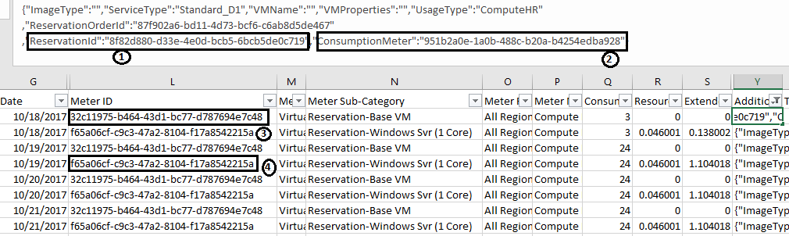
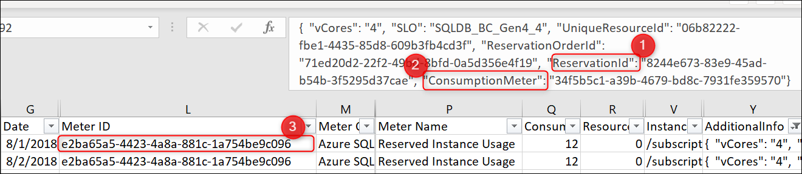
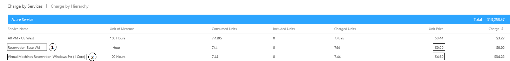

# Understand Azure reservation usage for your Enterprise enrollment

Use the **ReservationId** from [Reservations page](https://portal.azure.com/?microsoft_azure_marketplace_ItemHideKey=Reservations&Microsoft_Azure_Reservations=true#blade/Microsoft_Azure_Reservations/ReservationsBrowseBlade) and the usage file from the [EA portal](https://ea.azure.com) to evaluate your reservation usage. You can also see the reservation usage in the usage summary section of [EA portal](https://ea.azure.com).

If you bought the reservation in a Pay-As-You-Go billing context, see [Understand reservation usage for your Pay-As-You-Go subscription.](billing-understand-reserved-instance-usage.md)

## Usage for Reserved Virtual Machines Instances

For the following sections, assume that you are running a Standard_D1_v2 Windows VM in the east US region and your reservation information looks like the following table:

| Field | Value |
|---| --- |
|ReservationId |8f82d880-d33e-4e0d-bcb5-6bcb5de0c719|
|Quantity |1|
|SKU | Standard_D1|
|Region | eastus |

The hardware portion of the VM is covered because the deployed VM matches the reservation attributes. To see what Windows software isn't covered by the reservation, see [Azure Reserve VM Instances Windows software costs](billing-reserved-instance-windows-software-costs.md).

### Usage in CSV file for Reserved VM Instances

You can download the Enterprise usage CSV file from the Enterprise portal. In the CSV file, filter on **Additional Info** and type in your **ReservationID**. The following screenshot shows the fields related to the reservation:

1. **ReservationId** in **Additional Info** field represents the reservation that's applied to the VM.
2. **ConsumptionMeter** is the meter ID for the VM.
3. **Meter ID** is the reservation meter with $0 cost. The cost of the running VM is paid by the reserved VM instance.
4. Standard_D1 is one vCPU VM and the VM is deployed without the Azure Hybrid Benefit. So this meter covers the extra charge of Windows software. To find the meter corresponding to the D series 1 core VM, see [Azure Reserve VM Instances Windows software costs](billing-reserved-instance-windows-software-costs.md).  If you have the Azure Hybrid Benefit, this extra charge isn't applied.

## Usage for SQL Database & Cosmos DB reserved capacity reservations

The following sections use Azure SQL Database as example to describe the usage report. You can use same steps to get usage for Azure Cosmos DB as well. 

Assume that you are running a SQL Database Gen 4 in the east US region and your reservation information looks like the following table:

| Field | Value |
|---| --- |
|ReservationId |8244e673-83e9-45ad-b54b-3f5295d37cae|
|Quantity |2|
|Product| SQL Database Gen 4 (2 Core)|
|Region | eastus |

### Usage in CSV file 

Filter on **Additional Info** and type in your **Reservation ID**, and choose the required **Meter Category** - Azure SQL database or Azure Cosmos DB. The following screenshot shows the fields related to the reservation.

1. **ReservationId** in the **Additional Info** field is the reservation that's applied to the SQL Database resource.
2. **ConsumptionMeter** is the meter ID for the SQL Database resource.
3. **Meter ID** is the reservation meter with  $0 cost. Any SQL Database resource that qualifies for the reservation shows this meter ID in the CSV file.

## Usage summary page in Enterprise portal

Your Azure reservation usage also shows up in usage summary section of Enterprise portal:

1. You aren't charged for the hardware component of the VM as it is covered by reservation. For a SQL Database reservation, you see a line with **Service Name** as Azure SQL Database reserved capacity usage.
2. In this example, you don't have the Azure Hybrid Benefit so you're charged for the Windows software used with the VM.

## Next steps

To learn more about Azure Reservations, see the following articles:

- [What are Azure Reservations?](billing-save-compute-costs-reservations.md)
- [Prepay for Virtual Machines with Azure Reserved VM Instances](../virtual-machines/windows/prepay-reserved-vm-instances.md)
- [Prepay for SQL Database compute resources with Azure SQL Database reserved capacity](../sql-database/sql-database-reserved-capacity.md) 
- [Manage Azure Reservations](billing-manage-reserved-vm-instance.md)
- [Understand how the reservation discount is applied](billing-understand-vm-reservation-charges.md)
- [Understand reservation usage for your Pay-As-You-Go subscription](billing-understand-reserved-instance-usage.md)
- [Windows software costs not included with Reservations](billing-reserved-instance-windows-software-costs.md)

## Need help? Contact support

If you still have further questions, [contact support](https://portal.azure.com/?#blade/Microsoft_Azure_Support/HelpAndSupportBlade) to get your issue resolved quickly.

