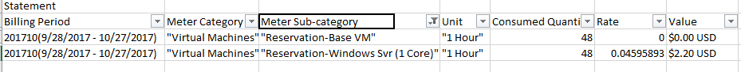

# Understand reserved instance usage for your Pay-As-You-Go subscription

Understand the usage of an Azure Reserved VM Instance by using the ReservationId from [Reservation page](https://portal.azure.com/?microsoft_azure_marketplace_ItemHideKey=Reservations&Microsoft_Azure_Reservations=true#blade/Microsoft_Azure_Reservations/ReservationsBrowseBlade) and the usage file from the [Azure Accounts portal](https://account.azure.com).

>[!NOTE]
>This article does not apply to EA customers. If you are an EA customer, see [Understand  Reserved Instance usage for your Enterprise enrollment.](billing-understand-reserved-instance-usage-ea.md) 
>This article also assumes that the reserved instance is applied to a single subscription. If the reserved instance is applied to more than one subscription, reserved instance benefit may span multiple usage csv files. 

For the following section, assume that you are running a Standard_DS1_v2 Windows VM in the east US region and your reserved instance information looks like the following table:

| Field | Value |
|---| :---: |
|ReservationId |8117adfb-1d94-4675-be2b-f3c1bca808b6|
|Quantity |1|
|SKU | Standard_DS1_v2|
|Region | eastus |

## Reserved instance application

The hardware portion of the VM is covered because the deployed VM matches the reserved instance attributes. To see what Windows software isn't covered by the Reserved Instance, go to [Azure Reserve VM Instances Windows software costs.](billing-reserved-instance-windows-software-costs.md)

### Statement section of csv
This section of your csv shows the total  usage for your reserved instance. Apply the filter on Meter Subcategory field that contains "Reservation-" and your data looks like the following screenshot:

Reservation-Base VM line has the total number of hours that are covered by the reserved instance. This line is $0.00 because the reserved instance covers it. Reservation-Windows Svr (1 Core) line covers the cost of Windows software.

### Daily usage section of csv
Filter on additional info and type in your **Reservation ID**. The following screenshot shows the fields related to the reserved instance. 

1. **ReservationId** in Additional Info field is the reserved instance that was used to apply benefit to the VM.
2. ConsumptionMeter is the Meter Id for the VM.
3. Reservation-Base VM Meter Subcategory line represents the $0 cost line in statement section. Cost of running this VM is already paid by the reserved instance.
4. This is the Meter Id for reserved instance. Cost of this meter is $0. Any VM that qualifies for reserved instance has this MeterId in the csv to account for the cost. 
5. Standard_DS1_v2 is one vCPU VM and the VM is deployed without Azure Hybrid Benefit. Therefore, this meter covers the extra charge of Windows software. See [Azure Reserve VM Instances Windows software costs.](billing-reserved-instance-windows-software-costs.md) to find the meter corresponding to D series 1 core VM. If Azure Hybrid Benefit is used, this extra charge is not applied. 

## Next steps
To learn more about reserved instances, see the following articles:

- [What are Azure Reserved VM Instances?](billing-save-compute-costs-reservations.md)
- [Prepay for Virtual Machines with Azure Reserved VM Instances](../virtual-machines/windows/prepay-reserved-vm-instances.md)
- [Manage reserved instances in Azure](billing-manage-reserved-vm-instance.md)
- [Understand how the reserved instance discount is applied](billing-understand-vm-reservation-charges.md)
- [Understand reserved instance usage for your Enterprise enrollment](billing-understand-reserved-instance-usage-ea.md)
- [Windows software costs not included with reserved instances](billing-reserved-instance-windows-software-costs.md)

## Need help? Contact support

If you still have further questions, [contact support](https://portal.azure.com/?#blade/Microsoft_Azure_Support/HelpAndSupportBlade) to get your issue resolved quickly.
