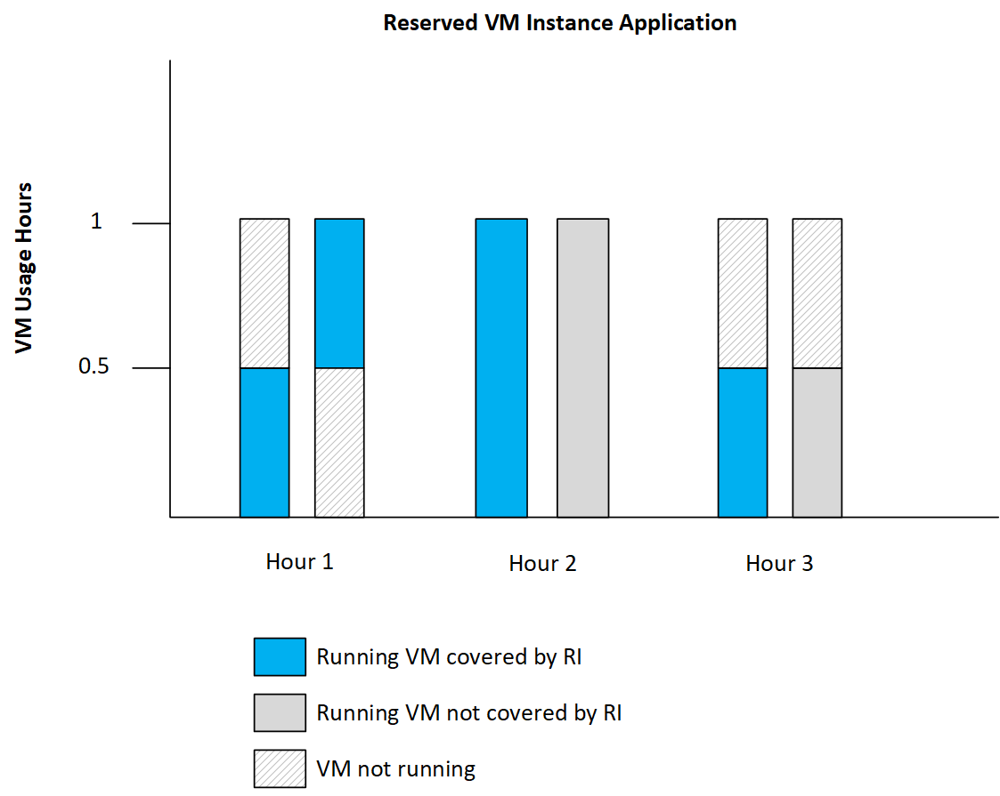

---
title: Understand Azure Reserved VM Instances discount | Microsoft Docs
description: Learn how Azure Reserved VM Instance discount is applied to running virtual machines. 
services: 'billing'
documentationcenter: ''
author: yashesvi
manager: yashar
editor: ''

ms.service: billing
ms.devlang: na
ms.topic: conceptual
ms.tgt_pltfrm: na
ms.workload: na
ms.date: 08/08/2018
ms.author: cwatson
---
# Understand how the Azure reservation discount is applied to virtual machines

After you buy an Azure Reserved Virtual Machine Instance, the reservation discount is automatically applied to virtual machines that match the attributes and quantity of the reservation. A reservation covers the compute costs of your virtual machines.

For SQL Database reserved capacity, see [Understand Azure Reserved Instances discount](billing-understand-reservation-charges.md).

The following table illustrates the costs for your virtual machine after you purchase a Reserved VM Instance. In all cases, you're charged for storage and networking at the normal rates.

| Virtual Machine Type  | Charges with Reserved VM Instance |
|-----------------------|--------------------------------------------|
|Linux VMs without additional software | The reservation covers your VM infrastructure costs.|
|Linux VMs with software charges (For example, Red Hat) | The reservation covers the infrastructure costs. You're charged for additional software.|
|Windows VMs without additional software |The reservation covers the infrastructure costs. You're charged for Windows software.|
|Windows VMs with additional software (For example, SQL server) | The reservation covers the infrastructure costs. You're charged for Windows software and for additional software.|
|Windows VMs with [Azure Hybrid Benefit](https://docs.microsoft.com/azure/virtual-machines/windows/hybrid-use-benefit-licensing) | The reservation covers the infrastructure costs. The Windows software costs are covered by the Azure Hybrid Benefit. Any additional software is charged separately.| 

## Application of reservation discount to non-Windows VMs

 The Azure reservation discount is applied to running VM instances on an hourly basis. The reservations that you have purchased are matched to the usage emitted by the running VMs to apply the reservation discount. For VMs that may not run the full hour, the reservation will be filled from other VMs not using a reservation, including concurrently running VMs. At the end of the hour, the reservation application for VMs in the hour is locked. In the event a VM does not run for an hour or concurrent VMs within the hour do not fill the hour of the reservation, the reservation is underutilized for that hour. The following graph illustrates the application of a reservation to billable VM usage. The illustration is based on one reservation purchase and two matching VM instances.

1. Any usage that’s above the reservation line gets charged at the regular pay-as-you-go rates. You're not charge for any usage below the reservations line, since it has been already paid as part of reservation purchase.
2. In hour 1, instance 1 runs for 0.75 hours and instance 2 runs for 0.5 hours. Total usage for hour 1 is 1.25 hours. You're charged the pay-as-you-go rates for the remaining 0.25 hours.
3. For hour 2 and hour 3, both instances ran for 1 hour each. One instance is covered by the reservation and the other is charged at pay-as-you-go rates.
4. For hour 4, instance 1 runs for 0.5 hours and instance 2 runs for 1 hour. Instance 1 is fully covered by the reservation and 0.5 hours of instance 2 is covered. You’re charged the pay-as-you-go rate for the remaining 0.5 hours.

To understand and view the application of your Azure Reservations in billing usage reports, see [Understand reservation usage](https://go.microsoft.com/fwlink/?linkid=862757).

## Application of reservation discount to Windows VMs

When you're running Windows VM instances, the reservation is applied to cover the infrastructure costs. The application of the reservation to the VM infrastructure costs for Windows VMs is the same as for non-Windows VMs. You're charged separately for Windows software on a per vCPU basis. See [Windows software costs with Reservations](https://go.microsoft.com/fwlink/?linkid=862756). You can cover your Windows licensing costs with [Azure Hybrid Benefit for Windows Server] (https://docs.microsoft.com/azure/virtual-machines/windows/hybrid-use-benefit-licensing).

## Next steps

To learn more about Azure Reservations, see the following articles:

- [What are Azure Reservations?](billing-save-compute-costs-reservations.md)
- [Prepay for Virtual Machines with Azure Reserved VM Instances](../virtual-machines/windows/prepay-reserved-vm-instances.md)
- [Prepay for SQL Database compute resources with Azure SQL Database reserved capacity](../sql-database/sql-database-reserved-capacity.md)
- [Manage Azure Reservations](billing-manage-reserved-vm-instance.md)
- [Understand reservation usage for your Pay-As-You-Go subscription](billing-understand-reserved-instance-usage.md)
- [Understand reservation usage for your Enterprise enrollment](billing-understand-reserved-instance-usage-ea.md)
- [Understand reservation usage for CSP subscriptions](https://docs.microsoft.com/partner-center/azure-reservations)
- [Windows software costs not included with Reservations](billing-reserved-instance-windows-software-costs.md)

## Need help? Contact support

If you still have further questions, [contact support](https://portal.azure.com/?#blade/Microsoft_Azure_Support/HelpAndSupportBlade) to get your issue resolved quickly.
