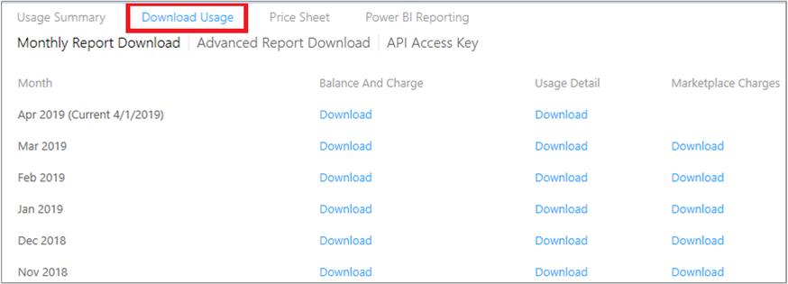

# Understand your Azure Enterprise Agreement bill

Azure customers with an Enterprise Agreement receive an invoice when they exceed the organization's credit or use services that aren't covered by the credit.

Your organization's credit includes your monetary commitment. The monetary commitment is the amount your organization paid upfront for usage of Azure services. You can add monetary commitment funds to your Enterprise Agreement by contacting your Microsoft account manager or reseller.  

## Invoices for most customers

This section doesn't apply to Azure customers in Australia, Japan, or Singapore. If you are in one of those countries/regions, see [Invoices for other customers](#invoices-for-other-customers).

You receive an Azure invoice when one of the following occurs during your billing cycle:

- **Service overage**: Your organization's usage charges exceed your credit balance.
- **Charges billed separately**: The services your organization used aren't covered by the credit. You're invoiced for the following services regardless of your credit balance:
    - Canonical
    - Citrix XenApp Essentials
    - Citrix XenDesktop
    - Registered User
    - Openlogic
    - Remote Access Rights XenApp Essentials Registered User
    - Ubuntu Advantage
    - Visual Studio Enterprise (Monthly)
    - Visual Studio Enterprise (Annual)
    - Visual Studio Professional (Monthly)
    - Visual Studio Professional (Annual)
- **Marketplace charges**: Azure Marketplace purchases and usage are not covered by your organization's credit. So, you're invoiced for Marketplace charges regardless of your credit balance. In the Enterprise Portal, an Enterprise Administrator can enable and disable Marketplace purchases.

## Review charges for most customers
This section doesn't apply to Azure customers in Australia, Japan, or Singapore. If you are in one of those countries, see [Review charges for other customers](#review-charges-for-other-customers).

To review and verify the charges on your invoice, you must be an Enterprise Administrator. For more information, see [Understand Azure Enterprise Agreement administrative roles in Azure](billing-understand-ea-roles.md). If you don't know who the Enterprise Administrator is for your organization, [contact support](https://portal.azure.com/?#blade/Microsoft_Azure_Support/HelpAndSupportBlade).

Your invoice shows all of your Azure usage, followed by any Marketplace charges. If you have a credit balance, it's applied to Azure usage.

Compare your combined total amount shown in the Enterprise portal in **Reports** > **Usage Summary** with your Azure invoice. The amounts in the **Usage Summary** don't include tax.

1. Sign-in to the [Enterprise portal](https://ea.azure.com).
1. Select **Reports**.
1. On the top right corner of the tab, switch the view from **M** to **C** and match the period on the invoice.  
    
1. The combined amount of **Total Usage** and **Azure Marketplace** should match the **Total Extended Amount** on your invoice.
1. To get more details about your charges, go to **Download Usage**.  
    

## Invoices for other customers

This section only applies to Azure customers in Australia, Japan, or Singapore.

You receive one or more Azure invoices when the following occurs:

- **Service overage**: Your organization's usage charges exceed your credit balance.
- **Charges billed separately**: The services your organization used aren't covered by the credit. You're invoiced for the following services regardless of your credit balance:
    - Canonical
    - Citrix XenApp Essentials
    - Citrix XenDesktop
    - Registered User
    - Openlogic
    - Remote Access Rights XenApp Essentials Registered User
    - Ubuntu Advantage
    - Visual Studio Enterprise (Monthly)
    - Visual Studio Enterprise (Annual)
    - Visual Studio Professional (Monthly)
    - Visual Studio Professional (Annual)
- **Marketplace charges**: Azure Marketplace purchases and usage are not covered by your organization's credit and are billed separately. In the Enterprise Portal, an Enterprise Administrator can enable and disable Marketplace purchases.

When you have charges due for service overages and charges that are billed separately during the billing period, you get one invoice. It includes both types of charges. Marketplaces charges are always invoiced separately.

## Review charges for other customers

This section only applies if you are in Australia, Japan or Singapore.

To review and verify the charges on your invoice, you must be an Enterprise Administrator. For more information, see [Understand Azure Enterprise Agreement administrative roles in Azure](billing-understand-ea-roles.md). If you don't know who the Enterprise Administrator is for your organization, [contact support](https://portal.azure.com/?#blade/Microsoft_Azure_Support/HelpAndSupportBlade).

### Review service overage invoice

Compare your total usage amount in the Enterprise portal in **Reports** > **Usage Summary** with your service overage invoice. The service overage invoice includes usage that exceeds your organization's credit, and/or services that aren't covered by the credit. The amounts on the **Usage Summary** don't include tax.

1. Sign-in to the [Enterprise portal](https://ea.azure.com).
1. Select **Reports**.
1. On the top right corner of the tab, switch the view from **M** to **C** and match the period on the invoice.  
    
1. The **Total Usage** amount should match the **Total Extended Amount** on your service overage invoice.  
1. To get more information about your charges, go to **Download Usage** > **Advanced Report Download**. The report doesn't include taxes or charges for reservations or marketplace charges.  
      

The following table lists the terms and descriptions shown on the invoice and on the **Usage Summary** in the Enterprise portal:

|Invoice term|Usage Summary term|Description|
|---|---|---|
|Total Extended Amount|Total Usage|The total pre-tax usage charge for the specific period before the credit is applied.|
|Commitment Usage|Commitment Usage|The credit applied during that specific period.|
|Total Sale|Total Overage|The total usage charge that exceeds your credit amount. This amount doesn't include tax.|
|Tax Amount|Not applicable|Tax that applies to the total sale amount for the specific period.|
|Total Amount|Not applicable|The amount due for the invoice after the credit is applied and tax is added.|

### Marketplace invoice

This section only applies if you are in Australia, Japan or Singapore.

Compare your Azure Marketplace total on **Reports** > **Usage Summary** in the Enterprise portal with your marketplace invoice. The marketplace invoice is only for Azure Marketplace purchases and usage. The amounts on the **Usage Summary** don't include tax.

1. Sign-in to the [Enterprise portal](https://ea.azure.com).
1. Select **Reports**.
1. On the top right corner of the tab, switch the view from **M** to **C** and match the period on the invoice.  
       
1. The **Azure Marketplace** total should match the **Total Sale** on your marketplace invoice.
1. To get more information about your usage-based charges, go to **Download Usage**. Under **Marketplace Charges**, select **Download**. This report doesn't include taxes or show one-time purchases.  
     

## Need help? Contact us.

If you have questions or need help,  [create a support request](https://go.microsoft.com/fwlink/?linkid=2083458).

## Next steps
- [View and download your Azure usage and charges](billing-download-azure-daily-usage.md)
