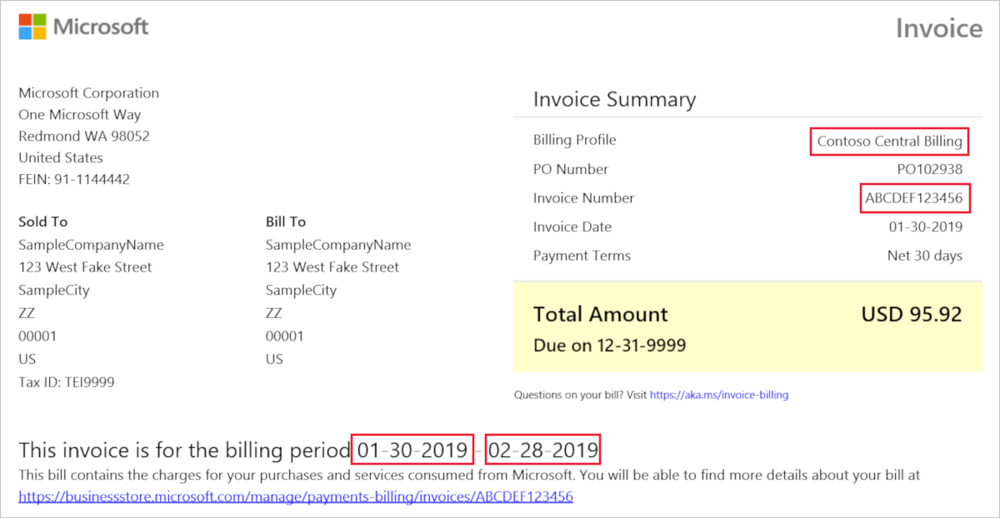

# Understand the Azure charges on your Microsoft Customer Agreement invoice

This article applies to a billing account for a Microsoft Customer Agreement. Check if you have a [Microsoft Customer Agreement](billing-mca-overview.md#check-your-access-to-a-microsoft-customer-agreement).

To understand your Azure charges, compare your invoice with the detailed daily usage file and the transaction history in the Azure portal.

## Option 1: Compare usage and costs with usage file

The detailed usage CSV file shows your charges by billing
period and daily usage. To get the file, see
[Get your Azure billing invoice and daily usage
data](billing-download-azure-invoice-daily-usage-date.md).

Your usage charges are displayed at the meter level. The screenshots and tables below map information from the invoice PDF to the detailed usage CSV.

### Invoice Summary

 | Invoice PDF value | Usage CSV key|
 | --- | --- |
 |Contoso Central Billing |billingProfileName |
 |ABCDEF123456 |invoicename |
 |01-30-2019 |billingPeriodStartDate |
 |02-28-2019 |billingPeriodEndDate |

### Details by Invoice Section

 | Invoice PDF value | Usage CSV key|
 | --- | --- |
 |IT Department |invoiceSectionName |
 |Usage Charges - Azure Standard |productOrderName |
 |Storage |serviceFamily |

The following steps walk you through finding daily usage for the example IT department in the detailed usage CSV file:

1. Filter the **invoiceSectionName** column in the CSV file to the department name in the PDF file. In this example, the department name is *IT Department*.
2. Filter the **productOrderName** column in the CSV file to the product order name in the PDF file. In this example, the product order name is *Usage Charges - Azure Standard*.
3. Filter the **serviceFamily** column in the CSV file to the service family in the PDF file. In this example, the service family name is *storage*.

To learn more, see:

- [Understand your Azure invoice](billing-understand-your-invoice-mca.md)
- [Understand your Azure detailed usage](billing-understand-your-invoice.md)

## Option 2: Compare the usage and costs with the Azure portal

The Azure portal can also help you verify the charges in your invoice.
1. In the Azure portal, search on **Cost Management + Billing**.
2. Select the Billing profile of the invoice.
3. Under Billing, select **All transactions**.
4. Search for the invoice ID to view all transactions for the invoice.

## Resources billed by usage meters

Azure doesn't directly bill based on the resource cost. Charges for a resource are calculated by using one or more meters. These meters are used to track a resource’s usage throughout its lifetime. These meters are then used to calculate the bill.

For example, when you create a single Azure resource, like a virtual machine, it has one or more meter instances created. These meters are used to track the usage of the resource over time. Each meter emits usage records that are used by Azure to calculate the bill.

For example, a single virtual machine (VM) created in Azure may have the following meters created to track its usage:

- Compute Hours
- IP Address Hours
- Data Transfer In
- Data Transfer Out
- Standard Managed Disk
- Standard Managed Disk Operations
- Standard IO-Disk
- Standard IO-Block Blob Read
- Standard IO-Block Blob Write
- Standard IO-Block Blob Delete

When the VM is created, each one of those meters begins emitting usage records. This usage and the meter's price is tracked in the Azure metering system.

## Pay your bill

Instructions for paying your bill are listed at the bottom of the invoice. [Learn how to pay](billing-understand-your-invoice-mca.md#how-to-pay).

If you've already paid your bill and want to check the status of the payment, [create a support ticket](https://portal.azure.com/?#blade/Microsoft_Azure_Support/HelpAndSupportBlade).

## Need help? Contact us

If you have questions or need help, [create a support request](https://portal.azure.com/#blade/Microsoft_Azure_Support/HelpAndSupportBlade/newsupportrequest).

## Next steps

To learn more about your invoice and detailed usage, see:

- [How to get your Azure billing invoice and daily usage data](billing-download-azure-invoice-daily-usage-date.md)
- [Understand terms on your Microsoft Azure invoice](billing-understand-your-invoice-mca.md)
- [Understand terms on your Microsoft Azure detailed usage](billing-understand-your-usage.md)
