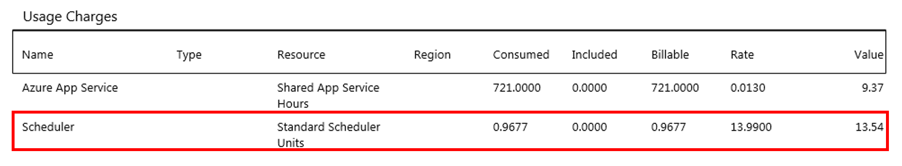
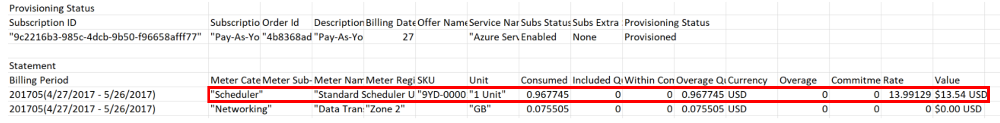
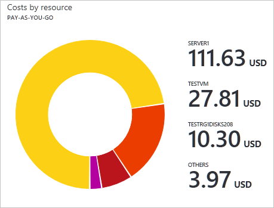
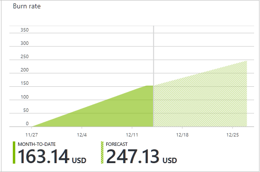
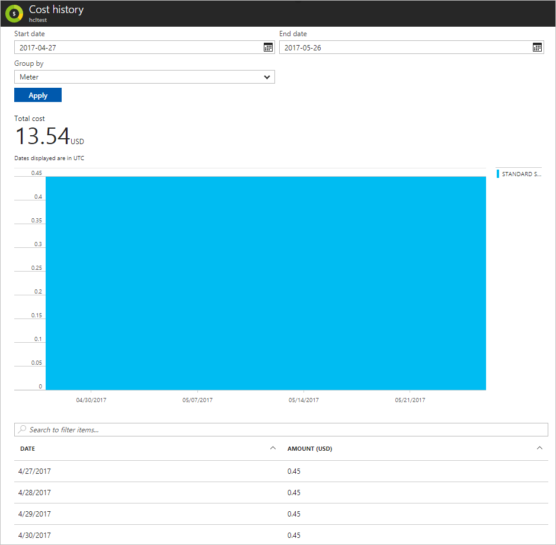

# Understand your Microsoft Azure bill
To understand your Azure bill, you compare your invoice with the detailed daily usage file and with cost management reports in the Azure portal.

This article doesn't apply to Azure customers with an Enterprise Agreement (EA customers). If you're an EA customer, see [Understand your bill for Azure customers with an Enterprise Agreement](billing-understand-your-bill-ea.md).

This article doesn't apply to Azure customers with a [Microsoft Customer Agreement](#check-access-to-a-microsoft-customer-agreement). If you have a Microsoft Customer Agreement, see [Understand the Azure charges on your Microsoft Customer Agreement invoice](billing-mca-understand-your-bill.md).

For an explanation of how billing works in the Azure Cloud Solution Provider (Azure CSP) program, including the billing cycle, pricing, and usage, see [Azure CSP Billing Overview](/azure/cloud-solution-provider/billing/azure-csp-billing-overview/).

## Review your charges

>[!VIDEO https://www.youtube.com/embed/3YegFD769Pk]

If there's a charge on your invoice that you want more information about, you can compare usage and costs with the usage file or with the Azure portal.

### Option 1: Compare usage and costs with usage file

The detailed usage CSV file shows your charges by billing period and daily usage. To download or view the file, see [Get your Azure billing invoice and daily usage data](billing-download-azure-invoice-daily-usage-date.md).

Your usage charges are displayed at the meter level. The following terms mean the same thing in both the invoice and the detailed usage file. For example, the billing cycle on the invoice is the same as the billing period shown in the detailed usage file.

 | Invoice (PDF) | Detailed usage (CSV)|
 | --- | --- |
|Billing cycle | Billing Period |
 |Name |Meter Category |
 |Type |Meter Subcategory |
 |Resource |Meter Name |
 |Region |Meter Region |
 |Consumed |Consumed Quantity |
 |Included |Included Quantity |
 |Billable |Overage Quantity |

The **Usage Charges** section of your invoice shows the total value for each meter that was consumed during your billing period. For example, the following image shows a usage charge for the Azure Scheduler service.

The **Statement** section of your detailed usage CSV shows the same charge. Both the *Consumed* amount and *Value* match the invoice.

To see a daily breakdown of the charge, go to the **Daily Usage** section of the CSV file. Filter for *Scheduler* under *Meter Category*. You can see which days the meter was used and how much was consumed. The *Resource* and *Resource group* information is also shown for comparison. The *Consumed* values should add up to and match what's shown on the invoice.

To get the cost per day, multiply the *Consumed* amounts with the *Rate* value from the **Statement** section.

To learn more, see:

- [Understand your Azure invoice](billing-understand-your-invoice.md)
- [Understand your Azure detailed usage](billing-understand-your-invoice.md)

### Option 2: Compare the usage and costs in the Azure portal

The Azure portal can also help you verify your charges. To get a quick overview of your invoiced usage and charges, view the cost management charts.

1. In the Azure portal, go to [Subscriptions](https://portal.azure.com/#blade/Microsoft_Azure_Billing/SubscriptionsBlade).
1. Select your subscription > **Cost analysis**.
1. Filter by **Timespan**.
1. To continue the previous example, you see a usage charge for the Azure Scheduler service.

   

1. Select the row that shows the charge to see the daily cost breakdown.

   

To learn more, see [Prevent unexpected costs with Azure billing and cost management](billing-getting-started.md#costs).

## External services billed separately

External services, or marketplace charges, are for resources that have been created by third-party software vendors. Those resources are available for use from the Azure marketplace. For example, a Barracuda Firewall is an Azure marketplace resource offered by a third-party. All charges for the firewall and its corresponding meters appear as external service charges.

External service charges are billed separately. The charges don't show up on your Azure invoice. To learn more, see [Understand your Azure external service charges](billing-understand-your-azure-marketplace-charges.md).

## Resources billed by usage meters

Azure doesn't directly bill based on the resource cost. Charges for a resource are calculated by using one or more meters. Meters are used to track a resource’s usage throughout its lifetime. These meters are then used to calculate the bill.

For example, when you create a single Azure resource, like a virtual machine, it has one or more meter instances created. Meters are used to track the usage of the resource over time. Each meter emits usage records that are used by Azure to calculate the bill.

For example, a single virtual machine (VM) created in Azure may have the following meters created to track its usage:

- Compute Hours
- IP Address Hours
- Data Transfer In
- Data Transfer Out
- Standard Managed Disk
- Standard Managed Disk Operations
- Standard IO-Disk
- Standard IO-Block Blob Read
- Standard IO-Block Blob Write
- Standard IO-Block Blob Delete

When the VM is created, each meter begins emitting usage records. This usage and the meter's price is tracked in the Azure metering system.

## Pay your bill

If you set up a credit card or a debit card as your payment method, the payment is charged automatically within 10 days after the billing period ends. On your credit card statement, the line item would say **MSFT Azure**.

To change the credit or debit card that's charged, see [Add, update, or remove a credit or debit card for Azure](billing-how-to-change-credit-card.md).

If you [pay by invoice](billing-how-to-pay-by-invoice.md), send your payment to the location listed at the bottom of your invoice.

To check the status of your payment, [create a support ticket](https://portal.azure.com/?#blade/Microsoft_Azure_Support/HelpAndSupportBlade).

## Tips for cost management

- Estimate costs by using the:
  - [Azure pricing calculator](https://azure.microsoft.com/pricing/calculator/)
  - [Total cost of ownership calculator](https://aka.ms/azure-tco-calculator)
  - [Detailed pricing information for each service](https://azure.microsoft.com/pricing/)
- [Review your usage and costs regularly in the Azure portal](billing-getting-started.md#costs).

## Check access to a Microsoft Customer Agreement
[!INCLUDE [billing-check-mca](../../includes/billing-check-mca.md)]

## Need help? Contact us.

If you have questions or need help,  [create a support request](https://go.microsoft.com/fwlink/?linkid=2083458).

## Learn more

- [Get your Azure billing invoice and daily usage data](billing-download-azure-invoice-daily-usage-date.md)
- [Understand terms on your Microsoft Azure invoice](billing-understand-your-invoice.md)
- [Understand terms on your Microsoft Azure detailed usage](billing-understand-your-usage.md)
- [Azure portal cost management](https://docs.microsoft.com/azure/billing/billing-getting-started)
- [Prevent unexpected costs with Azure billing and cost management](billing-getting-started.md#costs)
