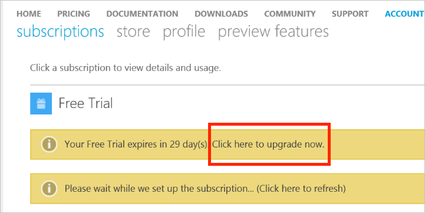
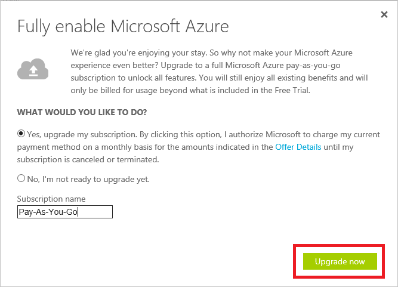

# Upgrade your Free Trial or Microsoft Imagine Azure subscription to Pay-As-You-Go

Upgrade your [Free Trial](https://azure.microsoft.com/free/) or [Microsoft Imagine](https://azure.microsoft.com/offers/ms-azr-0144p/) subscription to [Pay-As-You-Go](https://azure.microsoft.com/offers/ms-azr-0003p/) in the Azure Account Center.

1. Sign in to the [Azure Account Center](https://account.windowsazure.com/subscriptions).
2. In the subscription status section, select the **Upgrade now** banner.
   
    
3. Confirm your upgrade.
   
    

 When you upgrade from a Free Trial subscription, you keep your remaining credit for the full 30 days after you created the subscription. You also have access to free services for 12 months.
 
 If you want to [transfer the subscription](billing-subscription-transfer.md) after upgrading, you must wait until the subscription offer ID changes to **MS-AZR-003P**. The offer ID changes when

* You consume all the remaining credit, or
* 30 days pass since the start of the free trial
