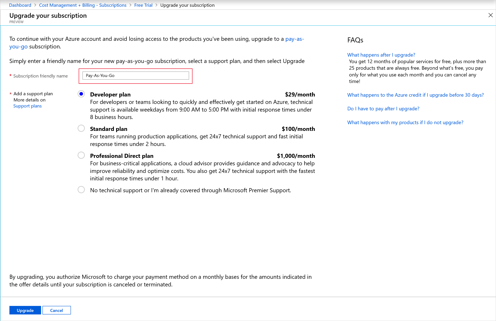
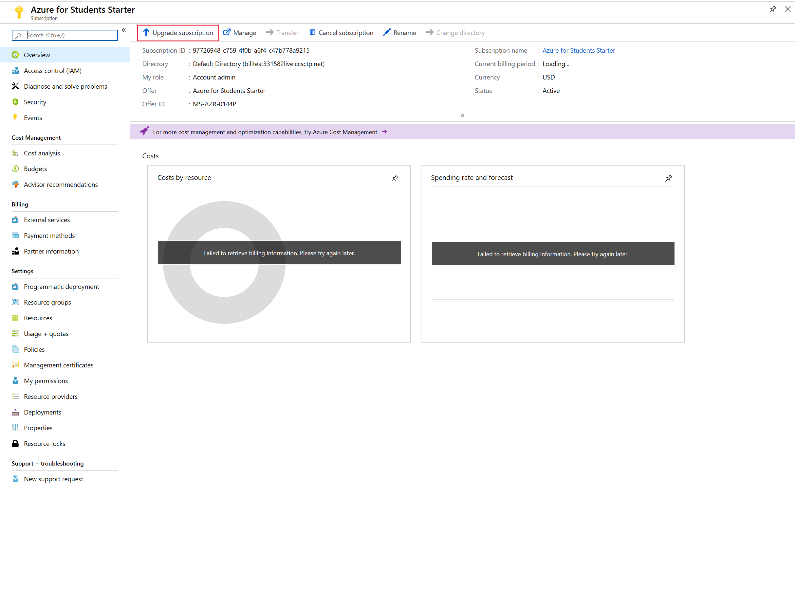

# Upgrade your Free Trial or Azure for Students Starter subscription to Pay-As-You-Go

If you have a [Free Trial](https://azure.microsoft.com/free/) or an [Azure for Students Starter](https://azure.microsoft.com/offers/ms-azr-0144p/) subscription, you can upgrade to [Pay-As-You-Go](https://azure.microsoft.com/offers/ms-azr-0003p/) in the Azure portal. If you have an Azure for Students Starter subscription and are eligible for a Free Trial, you can upgrade to Free Trial.

## Upgrade your Free Trial to Pay-As-You-Go

When you upgrade from a Free Trial subscription, you keep your remaining credit for the full 30 days after you created the subscription. You also have access to free services for 12 months.

1. Sign in to the [Azure portal](https://portal.azure.com)
1. Search on **Subscriptions.**

    

1. Select your Free Trial subscription.
1. In the subscription overview blade, click **Upgrade subscription** in the command bar.

    

1. If you don't already have a payment method for your Free Trial subscription, you'll be prompted to add one.
1. You might need to enter a phone number to verify your identity.
1. Type in a name for your subscription. By default, the name is *Pay-As-You-Go.*

     

1. Choose a support plan for your subscription. To learn more about support plans, see [Azure support plans](https://azure.microsoft.com/us/support/plans/).

1. Click **Upgrade**.

If you want to [transfer the subscription](billing-subscription-transfer.md) after upgrading, you must wait until the subscription offer ID changes to **MS-AZR-003P**. The offer ID changes when:

* You consume all the remaining credit, or
* 30 days pass since the start of the free trial

## Upgrade your Azure for Students Starter subscription to Pay-As-You-Go

When you follow the steps below, we will give you the option to upgrade to a Free Trial if you are eligible.

1. Sign in to the [Azure portal](https://portal.azure.com)
1. Search on **Subscriptions.**

    

1. Select your Azure for Students Starter subscription.
1. In the subscription overview blade, click **Upgrade subscription** in the command bar.

    

1. If you're upgrading to Pay-As-You-Go and don't already have a payment method for your subscription, you'll be prompted to add one.
1. You might need to enter a phone number to verify your identity.
1. Type in a name for your subscription.
1. If you're upgrading to Pay-As-You-Go, choose a support plan for your subscription. To learn more about support plans, see [Azure support plans](https://azure.microsoft.com/us/support/plans/).

1. Click **Upgrade**.

## Next steps

Now that you have a Pay-As-You-Go subscription, see [Prevent unexpected charges with Azure billing and cost management.](billing-getting-started.md)
