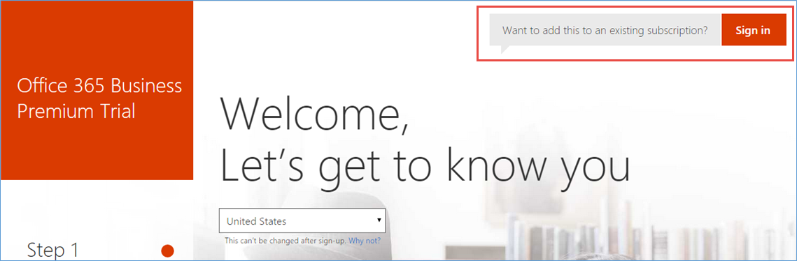
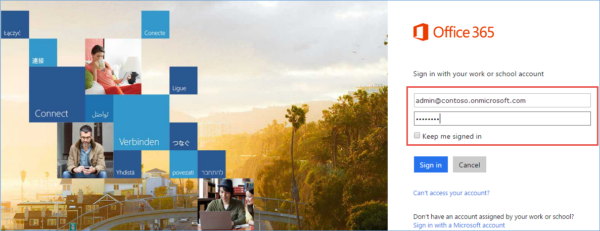
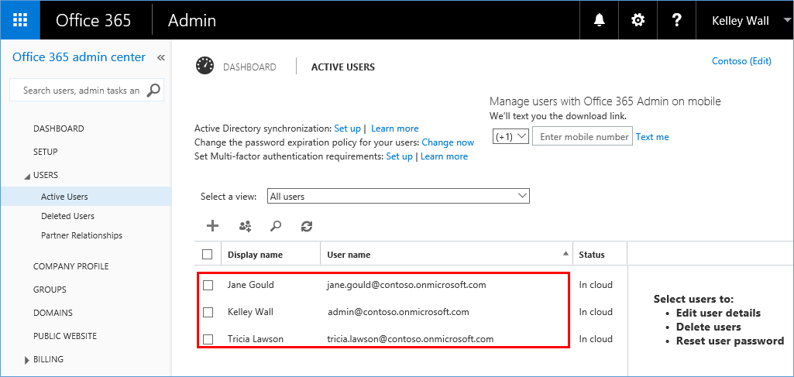
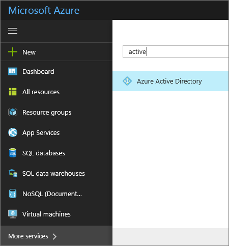
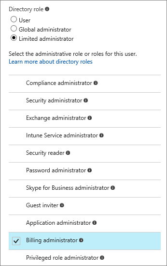

# Sign up for an Office 365 subscription with your Azure account
If you're Azure subscriber, you can use your Azure account to sign up for an Office 365 subscription. If you're part of an organization that has an Azure subscription, you can create Office 365 subscriptions for users in your existing Azure Active Directory (Azure AD). Sign up to Office 365 using an account that has Global Admin or Billing Admin permissions in your Azure Active Directory tenant. For more information, see [Check my account permissions in Azure AD](#RoleInAzureAD) and [Assigning administrator roles in Azure Active Directory](../active-directory/users-groups-roles/directory-assign-admin-roles.md).

If you already have both an Office 365 account and an Azure subscription, you can [Associate an Office 365 tenant to an Azure subscription](billing-add-office-365-tenant-to-azure-subscription.md).

## Get an Office 365 subscription by using your Azure account

1. Go to the [Office 365 product page](https://products.office.com/business), and select a plan.
2. Click **Sign in** on the upper-right corner of the page.

    
3. Sign in with your Azure account credentials. If you're creating a subscription for your organization, use an Azure account that's a member of the Global Admin or Billing Admin directory role in your Azure Active Directory tenant.

    
4. Click **Try now**.

    
5. On the order receipt page, click **Continue**.

    

Now you're all set. 
If you created the Office 365 subscription for your organization, use the following steps to check that your Azure AD users are now in Office 365.

1. Open the Office 365 admin center.
2. Expand **USERS**, and then click **Active Users**.

    

After you sign up, the Office 365 subscription is added to the same Azure Active Directory instance that your Azure subscription belongs to. For more information, see [More about Azure and Office 365 subscriptions](billing-use-existing-office-365-account-azure-subscription.md#more-about-subs) and [How Azure subscriptions are associated with Azure Active Directory](../active-directory/fundamentals/active-directory-how-subscriptions-associated-directory.md).

## Check my account permissions in Azure AD
1. Sign in to the [Azure portal](https://portal.azure.com/).
2. Click **All services**, and then search for **Active Directory**.

    
3. Click **Users and groups** > **All users**.
4. Select the user name. 

    

5. Click **Directory role**.
  
    
6.  The role **Global administrator** or **Limited administrator** > **Billing administrator** is required to create an Office 365 subscription for users in your existing Azure Active Directory.

    

## Need help? Contact support.
If you still need help, [contact support](https://portal.azure.com/?#blade/Microsoft_Azure_Support/HelpAndSupportBlade) to get your issue resolved quickly. 
