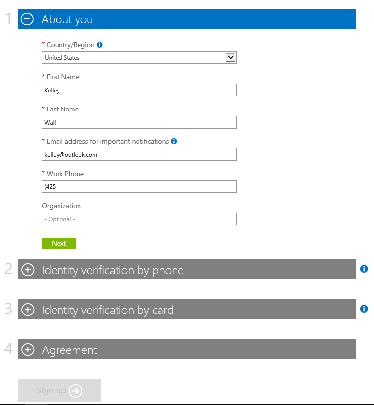
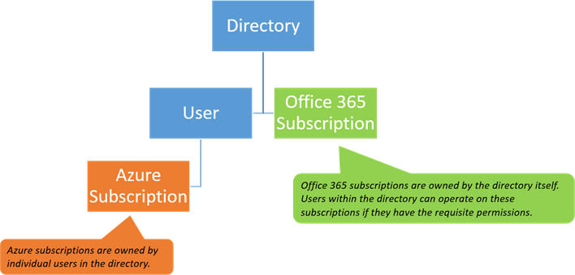

# Sign up for an Azure subscription with your Office 365 account
If you have an Office 365 subscription, use your Office 365 account to create an Azure subscription. You can sign in to the [Azure portal](https://portal.azure.com/) without an Azure subscription by using your Office 365 user name and password. But if you want to set up virtual machines or use other Azure services, you must create an Azure subscription for your account. If you're part of an organization that wants to use Azure services, add other people in your organization to the subscription after it's created.  

If you already have both an Office 365 account and an Azure subscription, see [Associate an Office 365 tenant to an Azure subscription](billing-add-office-365-tenant-to-azure-subscription.md).

## Get an Azure subscription by using your Office 365 account

To sign up for Azure, use the Azure free link and sign up to Azure by using your Office 365 user name and password. 

1. Go to [Azure.com](https://azure.microsoft.com/). 
2. Click **Start free**.
3. Sign in by using your Office 365 user name and password. The account you use doesn't need to have administrator permissions. If you have more than one Office 365 account, make sure you use the credentials for the Office 365 account that you want to associate with your Azure subscription. 

   

4. Enter the required information and complete the sign-up process.

    

- If you need to add other people to in your organization to the Azure subscription, see [Get started with access management in the Azure portal](../active-directory/role-based-access-control-what-is.md). 
- If you want to add an administrator to help manage the subscription, see [Add or change Azure administrator roles that manage the subscription or services](billing-add-change-azure-subscription-administrator.md).

## <a id="more-about-subs">More about Azure and Office 365 subscriptions</a>
Office 365 and Azure use the Azure AD service to manage users and subscriptions. The Azure directory is like a container in which you can group users and subscriptions. To use the same user accounts for your Azure and Office 365 subscriptions, you need to make sure that the subscriptions are created in the same directory. Keep in mind the following points:

* A subscription gets created under a directory.
* Users belong to directories.
* A subscription lands in the directory of the user who creates the subscription. So your Office 365 subscription is tied to the same account as your Azure subscription.
* Azure subscriptions are owned by individual users in the directory.
* Office 365 subscriptions are owned by the directory itself. Users with the right permissions within the directory can manage these subscriptions.

For more information, see [How Azure subscriptions are associated with Azure Active Directory](../active-directory/active-directory-how-subscriptions-associated-directory.md).

## Need help? Contact support.
If you still need help, [contact support](https://portal.azure.com/?#blade/Microsoft_Azure_Support/HelpAndSupportBlade) to get your issue resolved quickly. 