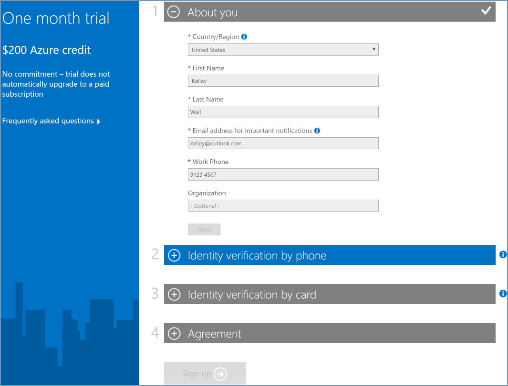
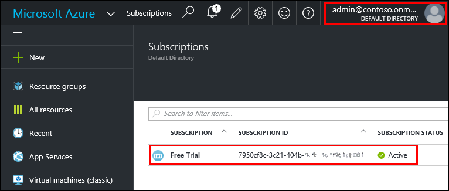

# Share your Office 365 Azure AD tenant and its users with a new Azure subscription or vice versa
If you already have an Office 365 subscription, you can use the existing Office 365 user accounts with a new Azure subscription. Alternatively, if you're Azure subscriber, you can get an Office 365 subscription for the users in your existing Azure Active Directory (AD). The account you use for the Office 365 sign-up must be a member of the Global Admin or Billing Admin directory role in your Azure Active Directory tenant. [Learn how to determine the role in Azure Active Directory](#how-to-know-your-role-in-your-azure-active-directory).

If you already have both an Office 365 account and an Azure subscription, see [Associate an Office 365 tenant to an Azure subscription](billing-add-office-365-tenant-to-azure-subscription.md).

This article doesn’t apply to Enterprise Agreement (EA) customers. 

## Get Azure subscription for existing Office 365 user accounts

To sign up for Azure, use the Azure free link and sign up to Azure using the Office 365 user name that has administrator permissions to your Office 365 Azure AD tenant. 

1. Go to [Azure.com](https://azure.microsoft.com/). 
2. Click **Start free**.
2. Sign in by using the Office 365 user name and password that has administrator permissions to your Office 365 Azure AD tenant.

    
3. Enter the required information and complete the sign-up process.

    

Now you're all set. Use the following steps to check that your Office 365 users are appearing in Azure.

1. Go to the [Azure portal](https://portal.azure.com). 
2. Click **Browse**, and then click **Azure Active Directory**.

    
3. Click **Users and groups** > **All users**.

## Get Office 365 subscription for users in existing Azure Active Directory
If you already have an Azure subscription and want to get an Office 365 subscription, sign in to Office 365 with your Azure account and complete the sign-up. The account you use for the Office 365 sign-up must be a member of the Global Admin or Billing Admin directory role in your Azure Active Directory tenant. After you complete the sign-up, the Office 365 subscription is added to the same Azure Active Directory instance that your Azure subscription belongs to. 

To subscribe to Office 365, follow these steps:

1. Go to the [Office 365 product page](https://products.office.com/business), and then select a plan that is suitable for you.
2. After you select the plan, the following page is displayed. Do not fill in the form. Click **Sign in** on the upper-right corner of the page.

    
3. Sign in with your account credentials. In this example, it is Kelley’s account.

    
4. Click **Try now**.

    
5. On the order receipt page, click **Continue**.

    

Now you're all set. In the Office 365 admin center, you should see users from the Contoso directory showing up as active users. To verify this, follow these steps:

1. Open the Office 365 admin center.
2. Expand **USERS**, and then click **Active Users**.

    

## How to know your role in your Azure Active Directory
1. Sign in to the [Azure portal](https://portal.azure.com/).
2. Click **Browse**, and then click **Active Directory**.

    
3. Click **USERS**.

    
4. Click the user. In this example, the user is Kelley Wall.

    Notice the field of **ORGANIZATIONAL ROLE**.

    

## More about Azure and Office 365 subscriptions
Office 365 and Azure use the Azure Active Directory service to manage users and subscriptions. Consider an Azure directory as a container in which you can group users and subscriptions. To use the same user account for your Azure and Office 365 subscriptions, you need to make sure that the subscriptions are created in the same directory. Keep in mind the following points:

* A subscription gets created under a directory.
* Users belong to directories.
* A subscription lands in the directory of the user who creates the subscription. So your Office 365 subscription is tied to the same account as your Azure subscription.
* Azure subscriptions are owned by individual users in the directory.
* Office 365 subscriptions are owned by the directory itself. Users with the right permissions within the directory can manage these subscriptions.

For more information, see [How Azure subscriptions are associated with Azure Active Directory](../active-directory/active-directory-how-subscriptions-associated-directory.md).

## Need help? Contact support.
If you still need help, [contact support](https://portal.azure.com/?#blade/Microsoft_Azure_Support/HelpAndSupportBlade) to get your issue resolved quickly. 