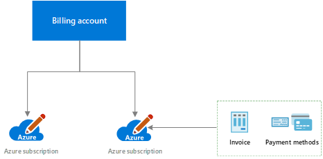
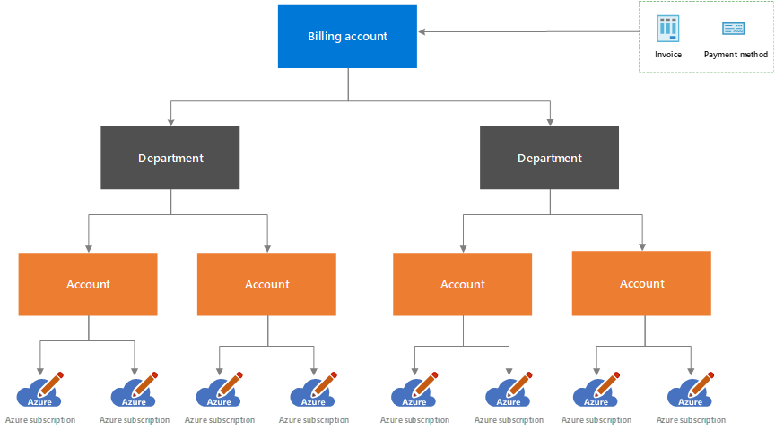
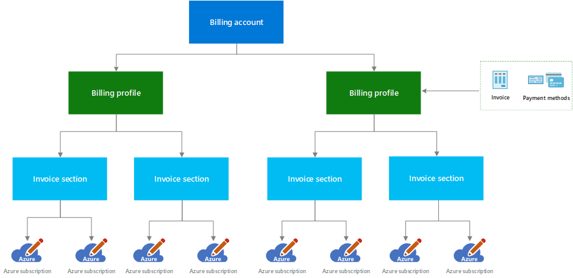
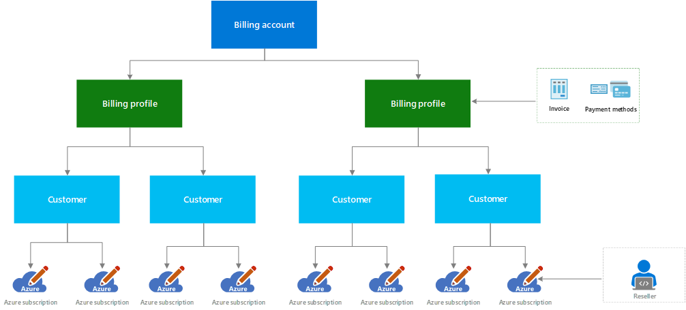

# Billing accounts and scopes in the Azure portal

A billing account is created when you sign up to use Azure. You use your billing account to manage your invoices, payments, and track costs. You can have access to multiple billing accounts. For example, you might have signed up for Azure for your personal projects. You could also have access through your organization's Enterprise Agreement or Microsoft Customer Agreement. For each of these scenarios, you would have a separate billing account.

Azure portal supports the following type of billing accounts:

- **Microsoft Online Services Program**: A billing account for a Microsoft Online Services Program is created when you sign up for Azure through the Azure website. For example, when you sign up for an [Azure Free Account](https://azure.microsoft.com/offers/ms-azr-0044p/), [account with pay-as-you-go rates](https://azure.microsoft.com/offers/ms-azr-0003p/) or as a [Visual studio subscriber](https://azure.microsoft.com/pricing/member-offers/credit-for-visual-studio-subscribers/).

- **Enterprise Agreement**: A billing account for an Enterprise Agreement is created when your organization signs an [Enterprise Agreement (EA)](https://azure.microsoft.com/pricing/enterprise-agreement/) to use Azure.

- **Microsoft Customer Agreement**: A billing account for a Microsoft Customer Agreement is created when your organization works with a Microsoft representative to sign a Microsoft Customer Agreement. Some customers in select regions, who sign up through the Azure website for an [account with pay-as-you-go rates](https://azure.microsoft.com/offers/ms-azr-0003p/) or an [Azure Free Account](https://azure.microsoft.com/offers/ms-azr-0044p/) may have a billing account for a Microsoft Customer Agreement as well. For more information, see [Get started with your billing account for Microsoft Customer Agreement](billing-mca-overview.md).

- **Microsoft Partner Agreement**: A billing account for a Microsoft Partner Agreement is created for Cloud Solution Provider (CSP) partners to manage their customers in the new commerce experience. Partners need to have at least one customer with an [Azure plan](https://docs.microsoft.com/partner-center/purchase-azure-plan) to manage their billing account in the Azure portal. For more information, see [Get started with your billing account for Microsoft Partner Agreement](mpa-overview.md).

To determine the type of your billing account, see [Check the type of your billing account](#check-the-type-of-your-account).

## Scopes for billing accounts
A scope is a node within a billing account that you use to view and manage billing. It is where you manage billing data, payments, invoices, and conduct general account management. 

### Microsoft Online Services Program

 

|Scope  |Definition  |
|---------|---------|
|Billing account     | Represents a single owner (Account administrator) for one or more Azure subscriptions. An Account Administrator is authorized to perform various billing tasks like create subscriptions, view invoices or change the billing for subscriptions.  |
|Subscription     |  Represents a grouping of Azure resources. Invoice is generated at this scope. It has its own payment methods that are used to pay its invoice.|

### Enterprise Agreement

|Scope  |Definition  |
|---------|---------|
|Billing account    | Represents an Enterprise Agreement enrollment. Invoice is generated at this scope. It is structured using departments and accounts. |
|Department     |  Optional grouping of accounts.      |
|Account     |  Represents a single account owner. Azure subscriptions are created under this scope.  |

### Microsoft Customer Agreement

|Scope  |Tasks  |
|---------|---------|
|Billing account     |   Represents a customer agreement for multiple Microsoft products and services. It is structured using billing profiles and invoice sections.   |
|Billing profile     |   Represents an invoice and its payment methods. Invoice is generated at this scope. It can have multiple invoice sections.      |
|Invoice section     |   Represents a group of costs in an invoice. Subscriptions and other purchases are associated to this scope.    |

### Microsoft Partner Agreement

|Scope  |Tasks  |
|---------|---------|
|Billing account     |   Represents a partner agreement to manage customers' Microsoft products and services in the new commerce experience. It is structured using billing profiles and customers.   |
|Billing profile     |   Represents an invoice for a currency. Invoice is generated at this scope.     |
|Customer    |   Represents a customer for a Cloud Solution Provider (CSP) partner. Subscriptions and other purchases are associated to this scope.    |
|Reseller    |   Reseller that provides services to the customer. It is an optional field for a subscription and is applicable only for Indirect providers in the CSP two-tier model.     |

## Switch billing scope in the Azure portal

1. Sign in to the [Azure portal](https://portal.azure.com).

2. Search for **Cost Management + Billing**.

   

3. In the overview page, select **Switch scope**.

   

   > [!Note]
    >
    > You will not see Switch scope if you only have access to one scope.

4. Select a scope to view details.

   

## Check the type of your account
[!INCLUDE [billing-check-mca](../../includes/billing-check-account-type.md)]

## Need help? Contact us.

If you have questions or need help,  [create a support request](https://go.microsoft.com/fwlink/?linkid=2083458).

## Next steps
- Learn how to start [analyzing your costs](../cost-management/quick-acm-cost-analysis.md).