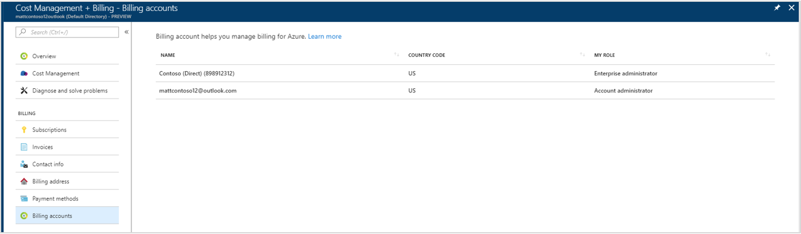

# View all your billing accounts in Azure portal  

Billing accounts define your Azure billing relationships. You can have multiple billing accounts. For example, you might have an Azure subscription that you use for personal projects. You could also have access to Azure through your organization's Enterprise Agreement. Go to [Cost Management + Billing](https://portal.azure.com/#blade/Microsoft_Azure_Billing/BillingMenuBlade/Overview) in the Azure portal to view all your billing accounts.

Currently you can only view your personal and Enterprise Agreement billing accounts. By default, the [Cost Management + Billing](https://portal.azure.com/#blade/Microsoft_Azure_Billing/BillingMenuBlade/Overview) page shows your personal billing account. However, you can navigate to **Billing accounts** and change the account.

For personal billing accounts, you can manage and view all your charges in the [Azure portal](https://portal.azure.com). However, for Enterprise Agreement accounts, you can only view Azure reservation purchases, balance, and month-to-date charges. These Enterprise agreement features are in preview and are available only if you are in an Enterprise administrator role.

## Change billing account view 

1.	Log in to the [Azure portal](https://portal.azure.com).

2.	From left-hand side of the portal, select **Cost Management + Billing**. 

3.	By default, if you have one, you see your personal billing account. If you don't have a personal billing account or you want to change to an Enterprise Agreement account, select **Billing accounts**.

4.  Select an account to view details. For Enterprise Agreements, you will only see the billing accounts, where you are an Enterprise administrator. Other Enterprise Agreement roles will be supported in the future.

    

 
## Need help? Contact support

If you need help, [contact support](https://portal.azure.com/?#blade/Microsoft_Azure_Support/HelpAndSupportBlade) to get your issue resolved quickly.
