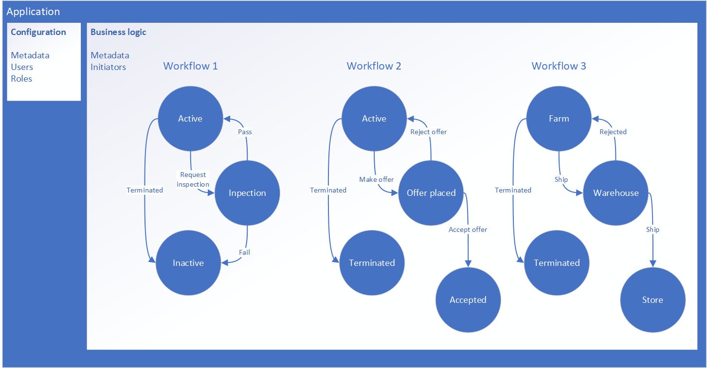

# Azure Blockchain App Builder REST API Overview

The [Azure Blockchain App Builder]() helps organizations write smart contracts to enable their business scenarios by generating an end-to-end blockchain application. The Blockchain App Builder REST API is provided as part of an Azure Blockchain App Builder deployment. 

Developers can use the Blockchain App Builder REST API to do the following:

* Create blockchain apps
* Manage blockchain apps within their consortium
* Manage users or organizations associated with their consortium
* Integrate blockchain into their organization's applications or third party applications
* Create blockchain mobile or web apps
* Perfom transactions on a blockchain
* Retrieve transactional data from a blockchain
* Query metadata

Azure Blockchain App Builder applications are defined by configuration information and business logic. An application consists of one or more workflows. Each workflow consists of one or more smart contracts that contain business logic in code files. Each smart contract flow is defined by one or more states. Authorized users can take actions to transition to the next state in the workflow. 

 For example, you could create a blockchain app to manage and track organic goods. The app is represented as the following workflows:

* A workflow for registering and managing factories and farms as being organically certified. 
* A workflow to manage the marketplace for buying and selling goods.  
* A workflow managing and tracking the logistics of goods across your supply chain.

The application is a grouping of all the workflows.  Each workflow acts as a state machine to control business logic flow. Workflows can be independent or interact with each other.

## Base URL

When making a request to the REST API, all URLs have the following base:
`https://{blockchain-app}/api/v1`

The URI host is based on the deployed blockchain app URL.

## Authentication

HTTP requests to the App Builder REST API are protected with Azure Active Directory (Azure AD). 

To make an authenticated request to the App Builder APIs, client code requires authentication with valid credentials before you can call the API. Authentication is coordinated between the various actors by Azure AD, and provides your client with an [access token](https://docs.microsoft.com/en-us/azure/active-directory/develop/active-directory-dev-glossary#access-token) as proof of the authentication. The token is then sent in the HTTP Authorization header of REST API requests. To learn more about Azure AD authentication, see [Azure Active Directory for developers](https://docs.microsoft.com/en-us/azure/active-directory/develop/active-directory-developers-guide). 

## REST Operation Groups

The API is organized into the following operation groups:

|Operation group |Description |
|----------------|------------|
|[Applications]() | Definition of a blockchain application |
|[Connectors]()   | Connection to a chain instance |
|[Ledgers]()      | Supported chain types |
|[Users]()        | Users of the blockchain app |
|[Contracts]()    | Smart contract instances |

## Next steps

link - Using the API Scenario 1
link - Using the API Scenario 2

