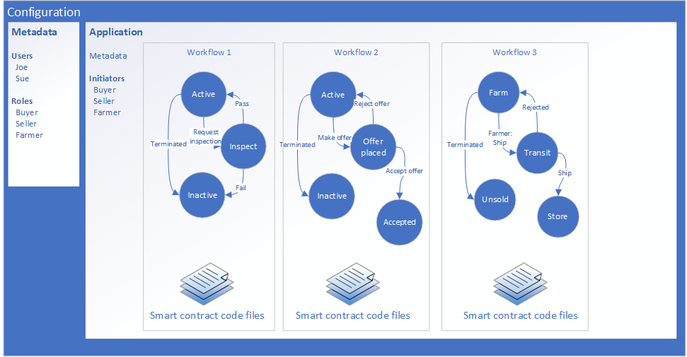

# Azure Blockchain Workbench configuration reference

 Azure Blockchain Workbench applications are multi-party workflows defined by configuration metadata and smart contract code. Configuration metadata defines the high-level workflows and interaction model of the blockchain application. Smart contracts define the business logic of the blockchain application. Workbench uses configuration and smart contract code to generate end-to-end blockchain application user experiences.

Configuration metadata specifies the following information for each blockchain application: 

* Name and description of the blockchain application.
* Unique user roles who can act or participate within the blockchain application.
* One or more workflows. Each workflow acts as a state machine to control business logic flow. Workflows can be independent or interact with one another.

Each defined workflow specifies the following configuration:

* Name and description of the workflow.
* States that define the status within the workflow.
* Actions to transition to the next state.
* User roles permitted to initiate each action
* Smart contracts that represent business logic in code files.



## Application

A blockchain application contains configuration metadata, workflows, and user roles who can act or participate within the application.

| Field | Description | Required | Sample value  |
|-------|-------------|:--------:|---------------|
| ApplicationName | Unique application name. The corresponding smart contract must use the same **ApplicationName** for the applicable contract class.  | Y | `"ApplicationName": "AssetTransfer"` |
| DisplayName | Friendly display name of the application. | Y | `"DisplayName": "Asset Transfer"` |
| Description | Description of the application. | N | `"Description": "Allows transfer of assets between a buyer and a seller"`|
| ApplicationRoles | Collection of [ApplicationRoles](#application-roles). Unique user roles who can act or participate within the application.  | Y | `"ApplicationRoles": [{"Name": "Appraiser", "Description": "User that signs off on the asset price" }]` |
| Workflows | Collection of  [Workflows](#workflows). Each workflow acts as a state machine to control business flow. | Y | `"Workflows": [{ "Name": "AssetTransfer", "DisplayName": "Asset Transfer", "Description": "Asset transfer business logic", "Initiators": [ "Owner" ], "StartState":  "Active", "Properties": [ ... ], "Constructor": { ... }, "Functions": [ ... ], "States": [ ... ] }]` |

For an example, see [configuration file example](#configuration-file-example).

## Workflows

A workflow is defined by one or more states that acts as a state machine. Each workflow consists of one or more smart contracts, which represent the business logic in code files.

| Field | Description | Required | Sample value  |
|-------|-------------|:--------:|---------------|
| Name | Unique workflow name. The corresponding smart contract must use the same **Name** for the applicable contract class. | Y | `"Name": "AssetTransfer"` |
| DisplayName | Friendly display name of the workflow. | Y | `"DisplayName": "Asset Transfer"` |
| Description | Description of the workflow. | N | `"Description": "Asset transfer business logic"` |
| Initiators | Collection of [ApplicationRoles](#application-roles). User roles who can create contracts in the workflow. | Y | `"Initiators": [ "Owner" ]` |
| StartState | Name of the initial state of the workflow. | Y | `"StartState":  "Active"` |
| Properties | Collection of [identifiers](#identifiers). Represents data that can be synchronized off-chain or visualized in a user experience tool. | Y | `"Properties": [{ "Name": "AskingPrice", "DisplayName": "Asking Price", "Description": "The asking price for the asset", "Type": { "Name": "money" } }]` |
| Constructor | Defines input parameters for creating a smart contract instance | Y | `"Constructor": { "Parameters": [{ "Name": "price", "Description": "The price of this asset", "DisplayName": "Price", "Type": { "Name": "money" }}]}` |
| Functions | A collection of [functions](#functions) that can be executed on the smart contract. | N | `"Functions": [{ "Name": "Terminate", "DisplayName": "Terminate", "Description": "Cancel the asset transfer", "Parameters":[] }]` |
| States | A collection of smart contract [states](#states). | Y | `"States": [{ "Name": "Active", "DisplayName": "Active", "Description": "The initial state of the asset transfer workflow", "PercentComplete": 20, "Style": "Success", "Transitions": [ ... ] }]` |

For an example, see [configuration file example](#configuration-file-example).

## Constructor

Defines input parameters for a new smart contract instance of a workflow.

| Field | Description | Required | Sample value  |
|-------|-------------|:--------:|---------------|
| Parameters | Collection of [identifiers](#identifiers) required to initiate a smart contract. | Y | `"Parameters": [{ "Name": "price", "Description": "The price of this asset", "DisplayName": "Price", "Type": { "Name": "money" } }]` |

### Constructor example

```json
{
  "Parameters": [
    {
      "Name": "description",
      "Description": "The description of this asset",
      "DisplayName": "Description",
      "Type": {
        "Name": "string"
      }
    },
    {
      "Name": "price",
      "Description": "The price of this asset",
      "DisplayName": "Price",
      "Type": {
        "Name": "money"
      }
    }
  ]
}

```

## Functions

Defines functions that can be executed on the workflow.

| Field | Description | Required | Sample value  |
|-------|-------------|:--------:|---------------|
| Name | The unique name of the function. The corresponding smart contract must use the same **Name** for the applicable function. | Y | `"Name": "Modify"` |
| DisplayName | Friendly display name of the function. | Y | `"DisplayName": "Modify"` |
| Description | Description of the function | N | `"Description": "Modify the attributes of this asset transfer instance"` |
| Parameters | Collection of [identifiers](#identifiers) required to initiate a smart contract. | Y | `"Parameters": [{ "Name": "price", "Description": "The price of this asset", "DisplayName": "Price", "Type": { "Name": "money" }}]` |

### Function examples

```json
"Functions": [
  {
    "Name": "Modify",
    "DisplayName": "Modify",
    "Description": "Modify the description/price attributes of this asset transfer instance",
    "Parameters": [
      {
        "Name": "description",
        "Description": "The new description of the asset",
        "DisplayName": "Description",
        "Type": {
          "Name": "string"
        }
      },
      {
        "Name": "price",
        "Description": "The new price of the asset",
        "DisplayName": "Price",
        "Type": {
          "Name": "money"
        }
      }
    ]
  },
  {
    "Name": "Terminate",
    "DisplayName": "Terminate",
    "Description": "Used to cancel this particular instance of asset transfer",
    "Parameters": []
  }
]

```

## States

A collection of smart contract states within a workflow.

| Field | Description | Required | Sample value  |
|-------|-------------|:--------:|---------------|
| Name | Unique name of the state. The corresponding smart contract must use the same Name for the applicable state. | Y | Active |
| DisplayName | Friendly display name | Y | Active |
| Description | Descriptive text | N | The initial state of the asset transfer workflow |
| PercentComplete | Value representing the percent completion at this state. | Y | 20 |
| Style | Guessing some kind of representation in UI | Y | Success |
| Transitions | Collection of available [transitions](#transitions) to the next state. | N | For sample, see [transitions](#transitions) |

## Transitions

Available actions to the next state. Each user role can initiate actions at each state, where an action may transition a state to another state in the workflow.

| Field | Description | Required | Sample value  |
|-------|-------------|:--------:|---------------|
| AllowedRoles | List of roles allowed to initiate the transition? | N | Buyer |
| AllowedInstanceRoles | List of instance roles allowed to initiate the transition? | N | InstanceOwner |
| DisplayName | Friendly display name | Y | Make Offer |
| Description | Descriptive text | N | Make an offer for this asset |
| Function | Function to initiate for transition | Y | MakeOffer |
| NextState | Next contract state after transition | Y | OfferPlaced |

## Application roles

Application roles control access by assigning users to actions in the workflow.

| Field | Description | Required | Sample value  |
|-------|-------------|:--------:|---------------|
| Name | Unique name | Y | Appraiser |
| Description | Descriptive text | N | User that signs off on the asset price |

## Identifiers

| Field | Description | Required | Sample value  |
|-------|-------------|:--------:|---------------|
| Name | Unique name | Y | AskingPrice |
| DisplayName | Friendly display name | Y | Asking Price |
| Description | Descriptive text | N | The asking price for the asset |
| Type | Collection of data types | Y | money |

## Configuration file example

``` json
{
  "ApplicationName": "AssetTransfer",
  "DisplayName": "Asset Transfer",
  "Description": "Allows transfer of assets between a buyer and a seller, with appraisal/inspection functionality",
  "ApplicationRoles": [
    {
      "Name": "Appraiser",
      "Description": "User that signs off on the asset price"
    },
    {
      "Name": "Buyer",
      "Description": "User that places an offer on an asset"
    },
    {
      "Name": "Inspector",
      "Description": "User that inpsects the asset and signs off on inspection"
    },
    {
      "Name": "Owner",
      "Description": "User that signs off on the asset price"
    }
  ],
  "Workflows": [
    {
      "Name": "AssetTransfer",
      "DisplayName": "Asset Transfer",
      "Description": "Handles the business logic for the asset transfer scenario",
      "Initiators": [ "Owner" ],
      "StartState":  "Active",
      "Properties": [
        {
          "Name": "State",
          "DisplayName": "State",
          "Description": "Holds the state of the contract",
          "Type": {
            "Name": "state"
          }
        },
        {
          "Name": "Description",
          "DisplayName": "Description",
          "Description": "Describes the asset being sold",
          "Type": {
            "Name": "string"
          }
        },
        {
          "Name": "AskingPrice",
          "DisplayName": "Asking Price",
          "Description": "The asking price for the asset",
          "Type": {
            "Name": "money"
          }
        },
        {
          "Name": "OfferPrice",
          "DisplayName": "Offer Price",
          "Description": "The price being offered for the asset",
          "Type": {
            "Name": "money"
          }
        },
        {
          "Name": "InstanceAppraiser",
          "DisplayName": "Instance Appraiser",
          "Description": "The user that appraises the asset",
          "Type": {
            "Name": "Appraiser"
          }
        },
        {
          "Name": "InstanceBuyer",
          "DisplayName": "Instance Buyer",
          "Description": "The user that places an offer for this asset",
          "Type": {
            "Name": "Buyer"
          }
        },
        {
          "Name": "InstanceInspector",
          "DisplayName": "Instance Inspector",
          "Description": "The user that inspects this asset",
          "Type": {
            "Name": "Inspector"
          }
        },
        {
          "Name": "InstanceOwner",
          "DisplayName": "Instance Owner",
          "Description": "The seller of this particular asset",
          "Type": {
            "Name": "Owner"
          }
        }
      ],
      "Constructor": {
        "Parameters": [
          {
            "Name": "description",
            "Description": "The description of this asset",
            "DisplayName": "Description",
            "Type": {
              "Name": "string"
            }
          },
          {
            "Name": "price",
            "Description": "The price of this asset",
            "DisplayName": "Price",
            "Type": {
              "Name": "money"
            }
          }
        ],
        "Postconditions": [
          {
            "Expression": "Equal(Properties('Description'), Parameters('description'))"
          },
          {
            "Expression": "Equal(Properties('AskingPrice'), Parameters('price'))"
          },
          {
            "Expression": "Equal(Properties('InstanceOwner'), Parameters('sender'))"
          }
        ]
      },
      "Functions": [
        {
          "Name": "Modify",
          "DisplayName": "Modify",
          "Description": "Modify the description/price attributes of this asset transfer instance",
          "Parameters": [
            {
              "Name": "description",
              "Description": "The new description of the asset",
              "DisplayName": "Description",
              "Type": {
                "Name": "string"
              }
            },
            {
              "Name": "price",
              "Description": "The new price of the asset",
              "DisplayName": "Price",
              "Type": {
                "Name": "money"
              }
            }
          ],
          "Postconditions": [
            {
              "Expression": "Equal(Properties('Description'), Parameters('description'))"
            },
            {
              "Expression": "Equal(Properties('AskingPrice'), Parameters('price'))"
            }
          ]
        },
        {
          "Name": "Terminate",
          "DisplayName": "Terminate",
          "Description": "Used to cancel this particular instance of asset transfer",
          "Parameters": []
        },
        {
          "Name": "MakeOffer",
          "DisplayName": "Make Offer",
          "Description": "Place an offer for this asset",
          "Preconditions": [
            {
              "Expression": "Not(IsNull(Parameters('inspector')))"
            },
            {
              "Expression": "Not(IsNull(Parameters('appraiser')))"
            },
            {
              "Expression": "NotEqual(Parameters('offerPrice'), 0)"
            }
          ],
          "Parameters": [
            {
              "Name": "inspector",
              "Description": "Specify a user to inspect this asset",
              "DisplayName": "Inspector",
              "Type": {
                "Name": "Inspector"
              }
            },
            {
              "Name": "appraiser",
              "Description": "Specify a user to appraise this asset",
              "DisplayName": "Appraiser",
              "Type": {
                "Name": "Appraiser"
              }
            },
            {
              "Name": "offerPrice",
              "Description": "Specify your offer price for this asset",
              "DisplayName": "Offer Price",
              "Type": {
                "Name": "money"
              }
            }
          ],
          "Postconditions": [
            {
              "Expression": "Equal(Properties('InstanceInspector'), Parameters('inspector'))"
            },
            {
              "Expression": "Equal(Properties('InstanceAppraiser'), Parameters('appraiser'))"
            },
            {
              "Expression": "Equal(Properties('OfferPrice'), Parameters('offerPrice'))"
            },
            {
              "Expression": "Equal(Properties('InstanceBuyer'), Parameters('sender'))"
            }
          ]
        },
        {
          "Name": "Reject",
          "DisplayName": "Reject",
          "Description": "Reject the user's offer",
          "Parameters": []
        },
        {
          "Name": "AcceptOffer",
          "DisplayName": "Accept Offer",
          "Description": "Accept the user's offer",
          "Parameters": []
        },
        {
          "Name": "RescindOffer",
          "DisplayName": "Rescind Offer",
          "Description": "Rescind your placed offer",
          "Parameters": []
        },
        {
          "Name": "ModifyOffer",
          "DisplayName": "Modify Offer",
          "Description": "Modify the price of your placed offer",
          "Parameters": [
            {
              "Name": "offerPrice",
              "DisplayName": "Price",
              "Type": {
                "Name": "money"
              }
            }
          ],
          "Postconditions": [
            {
              "Expression": "Equal(Properties('OfferPrice'), Parameters('offerPrice'))"
            }
          ]
        },
        {
          "Name": "Accept",
          "DisplayName": "Accept",
          "Description": "Accept the inspection/appraisal results",
          "Parameters": []
        },
        {
          "Name": "MarkInspected",
          "DisplayName": "Mark Inspected",
          "Description": "Mark the asset as inspected",
          "Parameters": []
        },
        {
          "Name": "MarkAppraised",
          "DisplayName": "Mark Appraised",
          "Description": "Mark the asset as appraised",
          "Parameters": []
        }
      ],
      "States": [
        {
          "Name": "Active",
          "DisplayName": "Active",
          "Description": "The initial state of the asset transfer workflow",
          "PercentComplete": 20,
          "Value": 0,
          "Style": "Success",
          "Transitions": [
            {
              "AllowedRoles": [],
              "AllowedInstanceRoles": [ "InstanceOwner" ],
              "Description": "Cancels this instance of asset transfer",
              "Function": "Terminate",
              "NextState": "Terminated",
              "DisplayName": "Terminate Offer"
            },
            {
              "AllowedRoles": [ "Buyer" ],
              "AllowedInstanceRoles": [],
              "Description": "Make an offer for this asset",
              "Function": "MakeOffer",
              "NextState": "OfferPlaced",
              "DisplayName": "Make Offer"
            },
            {
              "AllowedRoles": [],
              "AllowedInstanceRoles": [ "InstanceOwner" ],
              "Description": "Modify attributes of this asset transfer instance",
              "Function": "Modify",
              "NextState": "Active",
              "DisplayName": "Modify"
            }
          ]
        },
        {
          "Name": "OfferPlaced",
          "DisplayName": "Offer Placed",
          "Description": "Offer has been placed for the asset",
          "PercentComplete": 30,
          "Style": "Success",
          "Value": 1,
          "Transitions": [
            {
              "AllowedRoles": [],
              "AllowedInstanceRoles": [ "InstanceOwner" ],
              "Description": "Accept the proposed offer for the asset",
              "Function": "AcceptOffer",
              "NextState": "PendingInspection",
              "DisplayName": "Accept Offer"
            },
            {
              "AllowedRoles": [],
              "AllowedInstanceRoles": [ "InstanceOwner" ],
              "Description": "Reject the proposed offer for the asset",
              "Function": "Reject",
              "NextState": "Active",
              "DisplayName": "Reject"
            },
            {
              "AllowedRoles": [],
              "AllowedInstanceRoles": [ "InstanceOwner" ],
              "Description": "Cancel this instance of asset transfer",
              "Function": "Terminate",
              "NextState": "Terminated",
              "DisplayName": "Terminate"
            },
            {
              "AllowedRoles": [],
              "AllowedInstanceRoles": [ "InstanceBuyer" ],
              "Description": "Rescind the offer you previously placed for this asset",
              "Function": "RescindOffer",
              "NextState": "Active",
              "DisplayName": "Rescind Offer"
            },
            {
              "AllowedRoles": [],
              "AllowedInstanceRoles": [ "InstanceBuyer" ],
              "Description": "Modify the price that you specified for your offer",
              "Function": "ModifyOffer",
              "NextState": "OfferPlaced",
              "DisplayName": "Modify Offer"
            }
          ]
        },
        {
          "Name": "PendingInspection",
          "DisplayName": "Pending Inspection",
          "Description": "Asset is pending inspection",
          "PercentComplete": 40,
          "Style": "Success",
          "Value": 2,
          "Transitions": [
            {
              "AllowedRoles": [],
              "AllowedInstanceRoles": [ "InstanceOwner" ],
              "Description": "Reject the offer",
              "Function": "Reject",
              "NextState": "Active",
              "DisplayName": "Reject"
            },
            {
              "AllowedRoles": [],
              "AllowedInstanceRoles": [ "InstanceOwner" ],
              "Description": "Cancel the offer",
              "Function": "Terminate",
              "NextState": "Terminated",
              "DisplayName": "Terminate"
            },
            {
              "AllowedRoles": [],
              "AllowedInstanceRoles": [ "InstanceBuyer" ],
              "Description": "Rescind the offer you placed for this asset",
              "Function": "RescindOffer",
              "NextState": "Active",
              "DisplayName": "Rescind Offer"
            },
            {
              "AllowedRoles": [],
              "AllowedInstanceRoles": [ "InstanceInspector" ],
              "Description": "Mark this asset as inspected",
              "Function": "MarkInspected",
              "NextState": "Inspected",
              "DisplayName": "Mark Inspected"
            },
            {
              "AllowedRoles": [],
              "AllowedInstanceRoles": [ "InstanceAppraiser" ],
              "Description": "Mark this asset as appraised",
              "Function": "MarkAppraised",
              "NextState": "Appraised",
              "DisplayName": "Mark Appraised"
            }
          ]
        },
        {
          "Name": "Inspected",
          "DisplayName": "Inspected",
          "PercentComplete": 45,
          "Style": "Success",
          "Value": 3,
          "Transitions": [
            {
              "AllowedRoles": [],
              "AllowedInstanceRoles": [ "InstanceOwner" ],
              "Description": "Reject the offer",
              "Function": "Reject",
              "NextState": "Active",
              "DisplayName": "Reject"
            },
            {
              "AllowedRoles": [],
              "AllowedInstanceRoles": [ "InstanceOwner" ],
              "Description": "Cancel the offer",
              "Function": "Terminate",
              "NextState": "Terminated",
              "DisplayName": "Terminate"
            },
            {
              "AllowedRoles": [],
              "AllowedInstanceRoles": [ "InstanceBuyer" ],
              "Description": "Rescind the offer you placed for this asset",
              "Function": "RescindOffer",
              "NextState": "Active",
              "DisplayName": "Rescind Offer"
            },
            {
              "AllowedRoles": [],
              "AllowedInstanceRoles": [ "InstanceAppraiser" ],
              "Description": "Mark this asset as appraised",
              "Function": "MarkAppraised",
              "NextState": "NotionalAcceptance",
              "DisplayName": "Mark Appraised"
            }
          ]
        },
        {
          "Name": "Appraised",
          "DisplayName": "Appraised",
          "Description": "Asset has been appraised, now awaiting inspection",
          "PercentComplete": 45,
          "Style": "Success",
          "Value": 4,
          "Transitions": [
            {
              "AllowedRoles": [],
              "AllowedInstanceRoles": [ "InstanceOwner" ],
              "Description": "Reject the offer",
              "Function": "Reject",
              "NextState": "Active",
              "DisplayName": "Reject"
            },
            {
              "AllowedRoles": [],
              "AllowedInstanceRoles": [ "InstanceOwner" ],
              "Description": "Cancel the offer",
              "Function": "Terminate",
              "NextState": "Terminated",
              "DisplayName": "Terminate"
            },
            {
              "AllowedRoles": [],
              "AllowedInstanceRoles": [ "InstanceBuyer" ],
              "Description": "Rescind the offer you placed for this asset",
              "Function": "RescindOffer",
              "NextState": "Active",
              "DisplayName": "Rescind Offer"
            },
            {
              "AllowedRoles": [],
              "AllowedInstanceRoles": [ "InstanceInspector" ],
              "Description": "Mark the asset as inspected",
              "Function": "MarkInspected",
              "NextState": "NotionalAcceptance",
              "DisplayName": "Mark Inspected"
            }
          ]
        },
        {
          "Name": "NotionalAcceptance",
          "DisplayName": "Notional Acceptance",
          "Description": "Asset has been inspected and appraised, awaiting final sign-off from buyer and seller",
          "PercentComplete": 50,
          "Style": "Success",
          "Value": 5,
          "Transitions": [
            {
              "AllowedRoles": [],
              "AllowedInstanceRoles": [ "InstanceOwner" ],
              "Description": "Sign-off on inspection and appraisal",
              "Function": "Accept",
              "NextState": "SellerAccepted",
              "DisplayName": "SellerAccept"
            },
            {
              "AllowedRoles": [],
              "AllowedInstanceRoles": [ "InstanceOwner" ],
              "Description": "Reject the proposed offer for the asset",
              "Function": "Reject",
              "NextState": "Active",
              "DisplayName": "Reject"
            },
            {
              "AllowedRoles": [],
              "AllowedInstanceRoles": [ "InstanceOwner" ],
              "Description": "Cancel this instance of asset transfer",
              "Function": "Terminate",
              "NextState": "Terminated",
              "DisplayName": "Terminate"
            },
            {
              "AllowedRoles": [],
              "AllowedInstanceRoles": [ "InstanceBuyer" ],
              "Description": "Sign-off on inspection and appraisal",
              "Function": "Accept",
              "NextState": "BuyerAccepted",
              "DisplayName": "BuyerAccept"
            },
            {
              "AllowedRoles": [],
              "AllowedInstanceRoles": [ "InstanceBuyer" ],
              "Description": "Rescind the offer you placed for this asset",
              "Function": "RescindOffer",
              "NextState": "Active",
              "DisplayName": "Rescind Offer"
            }
          ]
        },
        {
          "Name": "BuyerAccepted",
          "DisplayName": "Buyer Accepted",
          "Description": "Buyer has signed-off on inspection and appraisal",
          "PercentComplete": 75,
          "Style": "Success",
          "Value": 6,
          "Transitions": [
            {
              "AllowedRoles": [],
              "AllowedInstanceRoles": [ "InstanceOwner" ],
              "Description": "Sign-off on inspection and appraisal",
              "Function": "Accept",
              "NextState": "SellerAccepted",
              "DisplayName": "Accept"
            },
            {
              "AllowedRoles": [],
              "AllowedInstanceRoles": [ "InstanceOwner" ],
              "Description": "Reject the proposed offer for the asset",
              "Function": "Reject",
              "NextState": "Active",
              "DisplayName": "Reject"
            },
            {
              "AllowedRoles": [],
              "AllowedInstanceRoles": [ "InstanceOwner" ],
              "Description": "Cancel this instance of asset transfer",
              "Function": "Terminate",
              "NextState": "Terminated",
              "DisplayName": "Terminate"
            }
          ]
        },
        {
          "Name": "SellerAccepted",
          "DisplayName": "Seller Accepted",
          "Description": "Seller has signed-off on inspection and appraisal",
          "PercentComplete": 75,
          "Style": "Success",
          "Value": 7,
          "Transitions": [
            {
              "AllowedRoles": [],
              "AllowedInstanceRoles": [ "InstanceBuyer" ],
              "Description": "Sign-off on inspection and appraisal",
              "Function": "Accept",
              "NextState": "Accepted",
              "DisplayName": "Accept"
            },
            {
              "AllowedRoles": [],
              "AllowedInstanceRoles": [ "InstanceBuyer" ],
              "Description": "Rescind the offer you placed for this asset",
              "Function": "RescindOffer",
              "NextState": "Active",
              "DisplayName": "Rescind Offer"
            }
          ]
        },
        {
          "Name": "Accepted",
          "DisplayName": "Accepted",
          "Description": "Asset transfer process is complete",
          "PercentComplete": 100,
          "Style": "Success",
          "Value": 8,
          "Transitions": []
        },
        {
          "Name": "Terminated",
          "DisplayName": "Terminated",
          "Description": "Asset transfer has been cancelled",
          "PercentComplete": 100,
          "Style": "Failure",
          "Value": 9,
          "Transitions": []
        }
      ]
    }
  ]
}
```
## Next steps

Try out a tutorial.

* Create your first blockchain app

