# Deploy Azure Blockchain Workbench

Azure Blockchain Workbench is deployed using a solution template in the Azure Marketplace. The template simplifies the deployment of components needed to create blockchain applications. Once deployed, Blockchain Workbench provides access to client apps to create and manage users and blockchain applications.

For more information about the components of Blockchain Workbench, see [Azure Blockchain Workbench architecture](blockchain-workbench-architecture.md).

## Prepare for deployment

Azure Blockchain Workbench requires several prerequisites prior to the deployment. The prerquistes include Azure AD configuration and Azure AD app registrations.

### Azure Active Directory tenant

You need an Azure Active Directory (Azure AD) tenant to host Azure AD and Azure Key Vault apps. You can use an existing tenant or create a new tenant. For more information on Azure AD tenants, see[ How to get an Active Directory tenant](../active-directory/develop/active-directory-howto-tenant.md).

### Azure AD permissions

If you are using an existing Azure AD tenant, you need sufficient permissions to register applications within an Azure AD tenant. The user account needs to be an administrator in the same tenant you are deploying Blockchain Workbench.

### Azure AD client app registration

Blockchain Workbench deployment requires registration of an Azure AD application.

1. Sign in to the [Azure portal](https://portal.azure.com).
2. Select your account in the top right corner, and choose the desired Azure AD tenant. The application registration can be in any tenant in the same subscription as the Azure Blockchain Workbench deployment.
3. In the left-hand navigation pane, select the **Azure Active Directory** service. Select **App registrations** > **New application registration**.

    

4. Provide a **Name** and **Sign-on URL** for the application. You can use placeholder values since they can be changed later during the deployment. 

    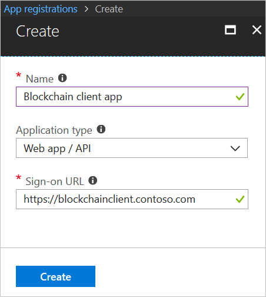

    |Setting  | Value  |
    |---------|---------|
    |Name | `Blockchain client app` |
    |Application type |Web app / API|
    |Sign-on URL | `https://blockchainclient.{tenant}` |

5. Select **Create** to register the Azure AD client application.

### Modify client application manifest

Next, you need to modify the application manifest to use application roles within Azure AD to specify Blockchain Workbench administrators.  For more information about application manifests, see [Azure Active Directory application manifest](../active-directory/develop/active-directory-application-manifest.md).

1. For the app you registered in the previous client app registration section, select **Manifest** in the registered app details pane.

2. You are going to update the **appRoles** section of the manifest. In the Edit manifest pane, select **Edit** and replace `"appRoles": []` with:

    ``` json
    "appRoles": [
         {
           "allowedMemberTypes": [
             "User",
             "Application"
           ],
           "displayName": "Administrator",
           "id": "<A unique GUID>",
           "isEnabled": true,
           "description": "Blockchain Workbench administrator role allows creation of applications, user to role assignments, etc.",
           "value": "Administrator"
         }
       ],
    ```

    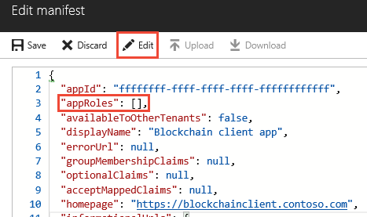

    > [!IMPORTANT]
    > The value **Administrator** is needed to identify Blockchain Workbench administrators.

3.  You will need to generate a GUID and replace the value for the **id** field in the manifest. You can use the PowerShell command `[guid]::NewGuid()` or online tools to generate a GUID. 
4.  Click **Save** to save the application manifest changes.

### Add Graph API key to client application

Blockchain Workbench uses Azure AD as the main identity management system for users interacting with blockchain applications. In order for Blockchain Workbench to access Azure AD and retrieve user information, such as names and emails, you need to add a key to your Azure AD client application.

1. For the app you registered in the previous client app registration section, select **Settings** in the registered app details pane.
2. Select **Keys**.
3. Add a new key by specifying a key **description** and choosing **expires** duration value. 

    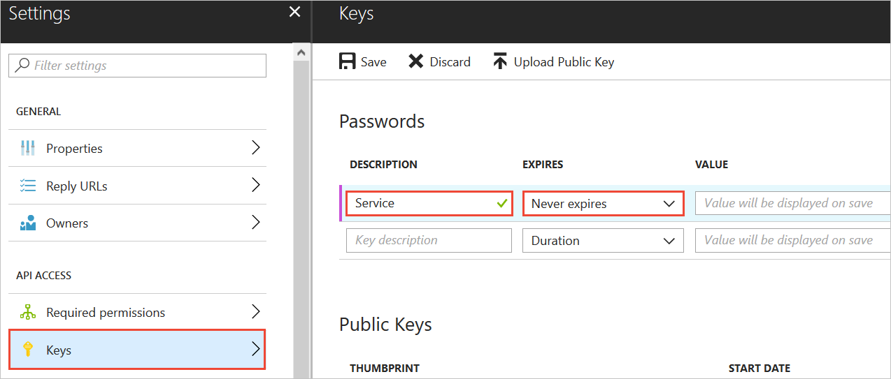

    |Setting  | Value  |
    |---------|---------|
    | Description | `Service` |
    | Expires | Never expires |

4. Select **Save**. 
5. Copy the value of the key and store it for later. You need it for deployment.
    > [!IMPORTANT]
    >  If you don't save the key for the deployment, you will need to generate a new key. You can't retrieve the key value from the portal later.

### Add Graph API required permissions

The client app needs to request permission from the user to access the directory. Set the following required permission for the client app.

1. In the Blockchain client app registration, select **Settings > Required permissions > Select an API > Microsoft Graph** .

    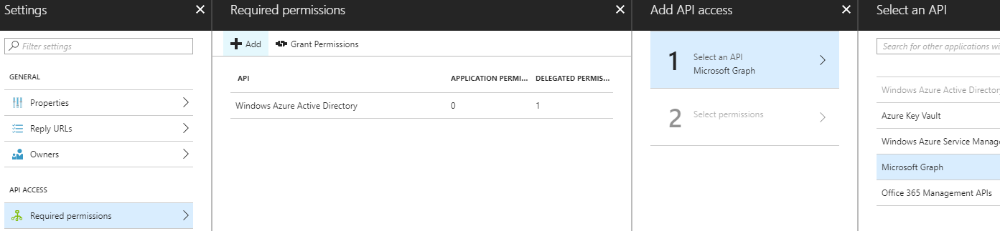

    Click **Select**.

2. In **Enable Access** under **Application permissions**, choose **Read all users' full profiles**.

    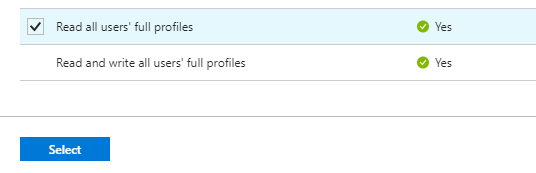

    Click **Select** then click **Done**.

3. In **Required permissions**, select **Grant Permissions** then select **Yes** for the verification prompt.

   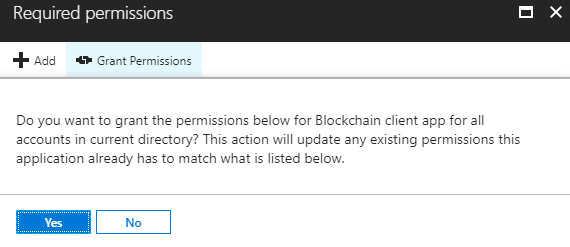

   Granting permission allows Blockchain Workbench to access users in the directory. The read permission is required to search and add members to Blockchain Workbench.

### Get client app application ID and tenant

The Azure AD client application ID and tenant information are required for deployment. You need to collect and store the information for use during deployment.

1. For the app you registered in the client app registration section, select **Settings** > **Properties**.
2.  In the **Properties** pane, copy and store the following values for later use during deployment.

    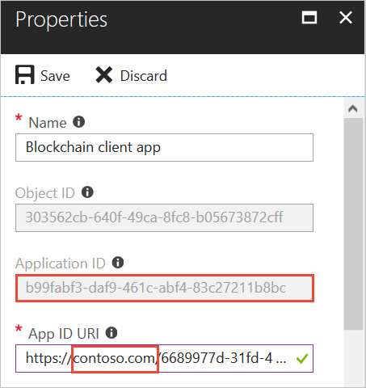

    | Setting to store  | Use in deployment |
    |------------------|-------------------|
    | Application ID | Active Directory Blockchain client app registration application ID |
    | App ID URI (tenant name) | Active Directory tenant domain name. You only need to save the tenant name. For example, `contoso.com`. |

### Create an Azure AD Key Vault application

Blockchain Workbench deployment requires registration of an Azure AD Key Vault application.

1. In the Azure portal left-hand navigation pane, select the **Azure Active Directory** service. Select **App registrations** > **New application registration**.
2. Provide a **Name** and **Sign-on URL** for the application. You can use placeholder values since they can be changed later during the deployment.

    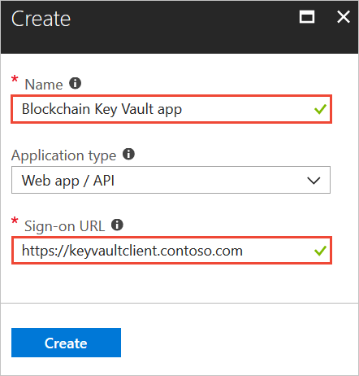

    | Setting  | Value  |
    |---------|---------|
    | Name | `Blockchain Key Vault app` |
    | Application type | Web app / API |
    | Sign-on URL | `https://keyvaultclient.{tenant}` |

5. Select **Create** to register the Azure AD Key Vault application.

### Get Key Vault app application ID 

The Key Vault Azure AD application ID is required for deployment. Collect and make store the information for use during deployment.

1. For the app you registered in the previous client app registration section, select **Settings** in the registered app details pane.
2. Select **Properties** in the **Settings** pane.
3.  Within Properties pane, copy and store the following values for later use during deployment.

    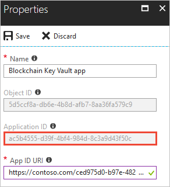

    | Setting to store  | Use in deployment |
    |------------------|-------------------|
    | Application ID | Active Directory Blockchain Keyvault app registration application ID |

### Get directory ID

The Azure AD directory ID is required for deployment. Collect and make note of the information for use during deployment.

1. In the left-hand navigation pane, select the **Azure Active Directory** service. Select **Properties**.
2. Within **Properties** pane, copy and store the **Directory ID** for later use during deployment.

    

    | Setting to store  | Use in deployment |
    |------------------|-------------------|
    | Directory ID | Active Directory Tenant Domain Name |

## Deploy Blockchain Workbench

Once the prerequisite steps have been completed, you are ready to deploy the Blockchain Workbench. The following sections outline how to deploy the framework.

1.  Sign in to the [Azure portal](https://portal.azure.com).
2.  In the left pane, select **Create a resource**. The Azure Marketplace is displayed in the portal.

    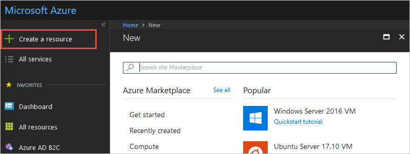

3.  Select the **Blockchain** category on the left and select **See all** to the upper
    right of the featured Blockchain marketplace offerings.

    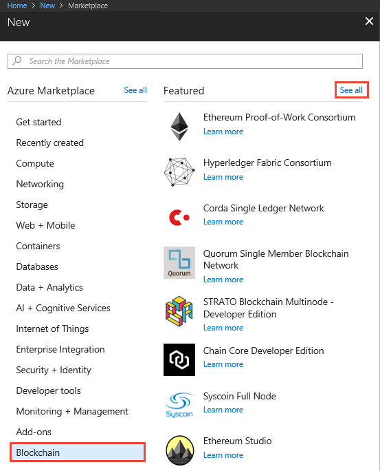

4.  Search for `Azure Blockchain Workbench` in the **Search the Marketplace** search bar. 

    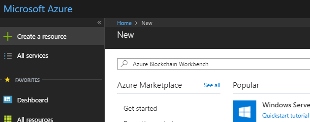

    > [!NOTE]
    > If you see **No results were found** while typing in the search bar, be sure to press **Enter** after typing the search keywords.

5.  Select **Azure Blockchain Workbench**.

    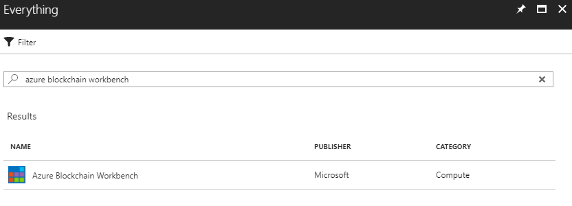

6.  Select **Create**.
7.  Complete the basic settings.

    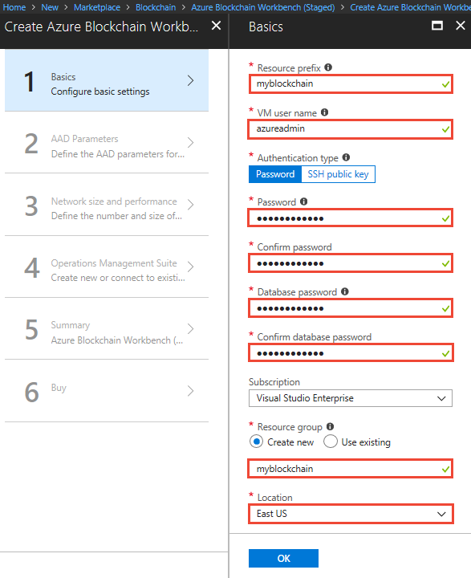

    | Setting | Description  |
    |---------|--------------|
    | Resource prefix | Short unique identifier for your deployment. This value is used as a base for naming resources. |
    | VM user name | The user name is used as administrator for all virtual machines (VM). |
    | Authentication type | Select if you want to use a password or key for connecting to VMs. |
    | Password | The password is used for connecting to VMs. |
    | SSH | Use an RSA public key in the single-line format beginning  with **ssh-rsa** or use the multi-line PEM format. You can generate SSH keys using `ssh-keygen` on Linux and OS X, or by using PuTTYGen on Windows. More information on SSH keys, see [How to use SSH keys with Windows on Azure](../virtual-machines/linux/ssh-from-windows.md). |
    | Database password / Confirm database password | Specify the password to use for access to the database created as part of the deployment. |
    | Subscription | Specify the Azure Subscription you wish to use for your deployment. |
    | Resource groups | Create a new Resource group by selecting **Create new** and specify a unique resource group name. |
    | Location | Specify the region you wish to deploy the framework. |

8.  Select **OK** to finish the basic setting configuration section.

9.  Complete the **AAD Parameters** settings.

    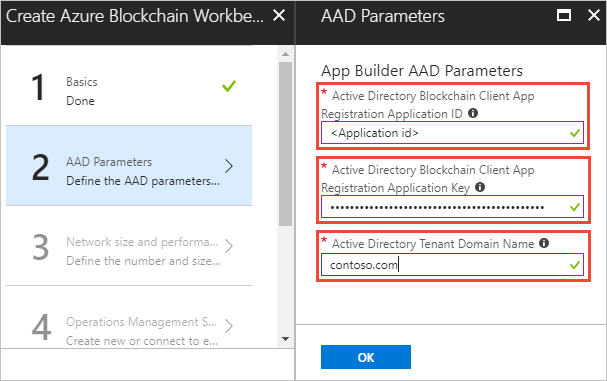

    | Setting | Description  |
    |---------|--------------|
    | Active Directory Blockchain Client App Registration Application ID | Use the Application ID from the Blockchain client app registration collected in the [Get client app application ID and tenant](#get-client-app-application-id-and-tenant) prerequisite section. |
    | Active Directory Blockchain Client App Registration Application Key | Use the Application key from the Blockchain client app registration collected in the [Add Graph API key to client application](#add-graph-api-key-to-client-application) prerequisite section. |
    | Active Directory Tenant Domain Name | Use the Azure AD tenant collected in the [Get client app application ID and tenant](#get-client-app-application-id-and-tenant) prerequisite section. |
    | Active Directory Keyvault App Registration Application ID | Use the Application ID from the Key Vault app registration collected in the [Get Key Vault app application ID](#get-key-vault-app-application-id) prerequisite section. |
    | Active Directory Keyvault App Tenant Object ID | Use the Directory ID collected in the [Get directory ID](#get-directory-id) prerequisite section. |

10. Click **OK** to finish the Azure AD Parameters configuration section.

11. Complete the **Network size and performance** settings.

    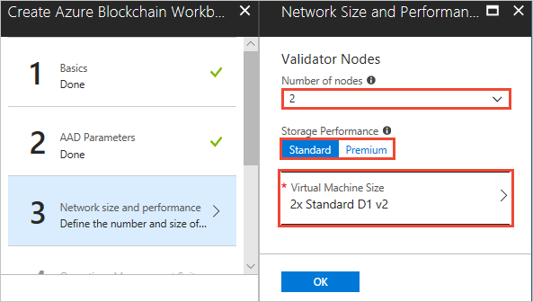

    | Setting | Description  |
    |---------|--------------|
    | Number of nodes | Choose the number of Ethereum PoA validator nodes to be deployed in your network. |
    | Storage Performance | Choose the preferred VM storage performance for your blockchain network. |
    | Virtual Machine Size | Choose the preferred VM size for your blockchain network. |

12. Click **OK** to finish the network size and performance section.

13. Complete the **Operations Management Suite (OMS)** settings.

    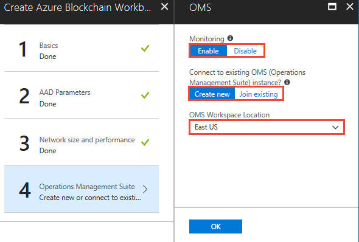

    | Setting | Description  |
    |---------|--------------|
    | Monitoring | Choose whether you want OMS to be used to monitor your blockchain network. |
    | Connect to existing OMS instance | Choose whether you want to use an existing OMS instance or create a new one. 
    | OMS Workspace Location | If creating a new OMS workspace, choose the l location to create the instance.

14. Click **OK** to finish the OMS section.

15. Review the summary to make sure all your parameters are accurate.

    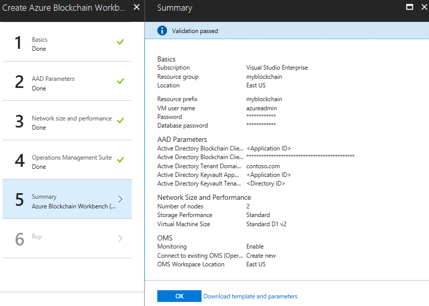

16. Select **Create** to agree to the terms and deploy your Azure Blockchain Workbench.

    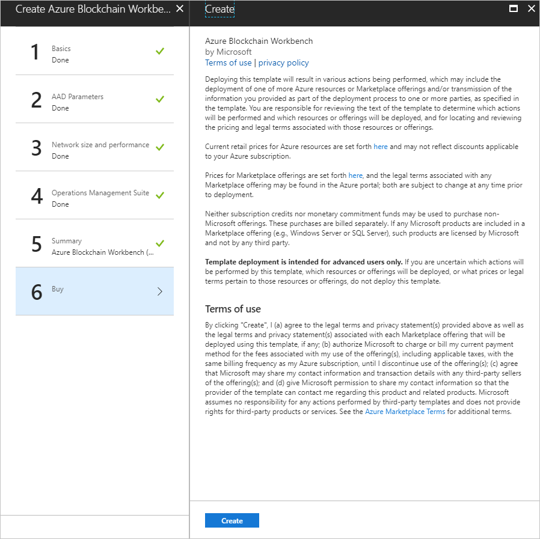

The deployment can take up to 90 minutes. You can use the Azure portal to monitor progress. In the newly created resource group, select **Deployments > Overview** to see the status of the deployed artifacts.

## Blockchain Workbench Web URL

Once the deployment of the Blockchain Workbench has completed, a new resource group contains your Blockchain Workbench resources. Blockchain Workbench services are accessed through a web URL. The following steps show you how to retrieve the web URL of the deployed framework.

1. Sign in to the [Azure portal](https://portal.azure.com).
2. In the left-hand navigation pane, select **Resource groups**
3. Choose the resource group name you specified when deploying Blockchain Workbench.
4. Click the **TYPE** column heading to sort the list alphabetically by type.
5. There are two resources with type **App Service**. Select the resource of type **App Service** *without* the "-api" suffix.

    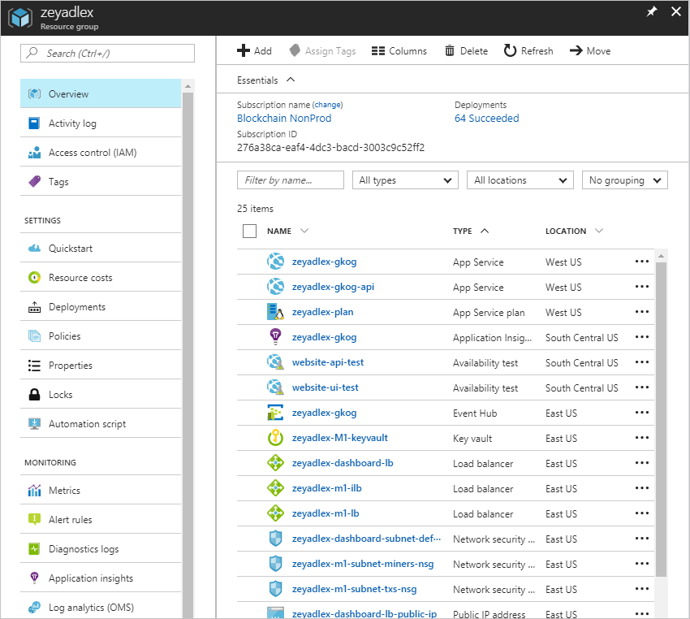

6.  In the App Service **Essentials** section, copy the **URL** value, which represents the web URL to your deployed Blockchain Workbench.

    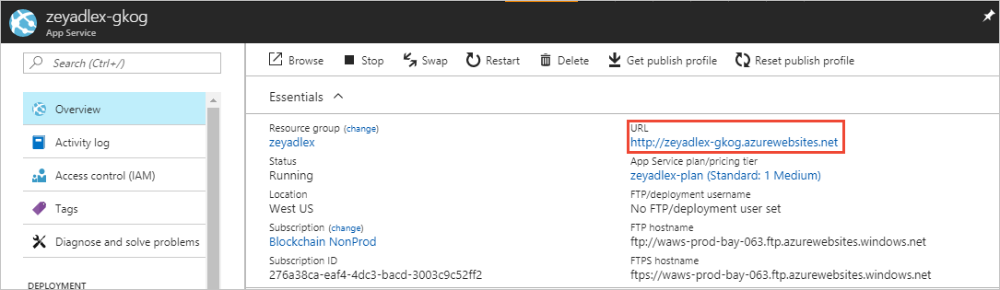

## Configuring the Reply URL

Once the Azure Blockchain Workbench has been deployed, the next step is to make sure the Azure Active Directory (Azure AD) client application is registered to the correct **Reply URL** of the deployed Blockchain Workbench web URL.

1. Sign in to the [Azure portal](https://portal.azure.com).
2. Verify you are in the tenant where you registered the Azure AD client application.
3. In the left-hand navigation pane, select the **Azure Active Directory** service. Select **App registrations**.
4. Select the Azure AD client application you registered in the prerequisite section.
5. Select **Settings > Reply URLs**.
6. Specify the main web URL of the Azure Blockchain Workbench deployment you retrieved in the previous **Get the Azure Blockchain Workbench Web URL** section. The Reply URL is prefixed with `https://` and appended with `/callback`.  For example, `https://tarm24-rv60.azurewebsites.net/callback`

    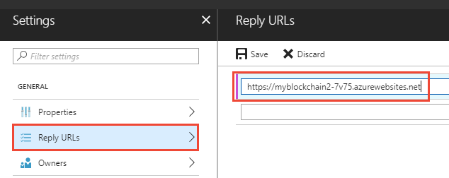

7. Select **Save** to update the client registration.

## Next steps

Now that you have Azure Blockchain Workbench deployed, the next step is to [Manage Users in Azure Blockchain Workbench](blockchain-workbench-manage-users.md).