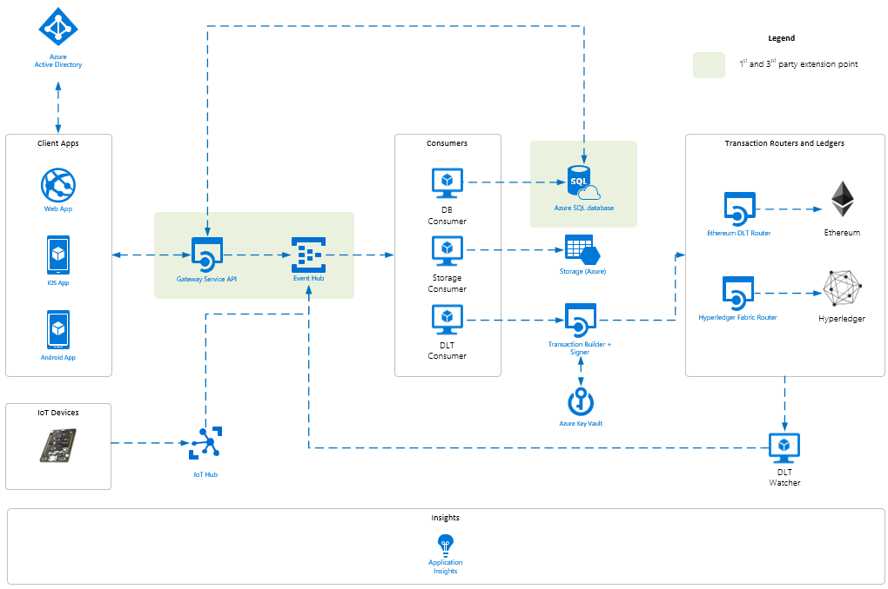

# What is Azure Blockchain Workbench?

 Azure Blockchain Workbench enables you can quickly start and scale blockchain projects. Azure Blockchain Workbench includes modular, pre-built networks and infrastructure to help you simplify development and ease experimentation of blockchain applications. 

With Azure Blockchain Workbench, you can quickly start:

* Creating blockchain applications
* Managing Workbench blockchain apps and users
* Extending your existing applications to use blockchain ledgers

## Components and capabilities

Azure Blockchain Workbench is composed of components that provide the capabilities needed to create blockchain applications.

### Federated identity

Workbench enables a consortium to federate their Enterprise identities using Azure Active Directory (Azure AD). Workbench generates new user accounts for on-chain identities with the enterprise identities stored in Azure AD. The identity mapping facilitates authenticated login to client APIs and applications and leverages the authentication policies of organizations. Workbench also provides the ability to associate enterprise identities to specific roles within a given smart contract. Workbench also provides a mechanism to identify the actions those roles can take and at what time.

### Client applications

Workbench provides automatically generated client applications for web and mobile (iOS, Android), which can be used to validate, test, and view blockchain applications. The application interface is dynamically generated based on smart contract metadata and can accommodate any use case. The simulation clients enable rapid iteration and testing of smart contracts by developers.

### Blockchain transactions

Workbench can deploy a blockchain network, transform messages sent to the API to build transactions in a format expected by that blockchain's native API, and then sign and route those transactions to the appropriate blockchain. Workbench currently supports Ethereum and Hyperledger Fabric.

### Robust integration

Workbench provides a REST-based API for client development, a message-based API for system-to-system integration, and an off-chain data store providing access to data using SQL. Workbench also provides a client library and samples developers can use to create a diversity of client types, such as bots or IoT devices.

### Off-chain data and storage

Workbench automatically synchronizes data stored on the blockchain with an off-chain storage, such as a SQL database. In addition, Workbench relies on Azure Storage to store documents and other media associated with blockchain workflows. The database can be used to extend the system to enable data visualization and intelligence as well as integration with other clients, services, or systems.

### Key management

Workbench uses Key Vault for storage of keys and secrets. The generated client applications use Key Vault to store application keys and establishment of on-chain identities.

### Content hashing and storage

Workbench supports adding documents or media content to transactions. A hashed version of the document is saved in blockchain and the original content is saved in off-chain storage.

### Event Publishing

Workbench automatically delivers events to Event Hub to send messages to downstream consumers. Developers can integrate with Event Hub to drive transactions and to look at results. The ability for off-chain data and storage is built using this functionality.

### Monitoring

Workbench provides end to end application logging using Application Insights. Logging including warnings, errors, and
successes.

## Next steps

Try out a tutorial.

> [!div class="checklist"]
> * Create your first blockchain app

