# Ethereum proof-of-authority consortium

[This solution](https://portal.azure.com/?pub_source=email&pub_status=success#create/microsoft-azure-blockchain.azure-blockchain-ethereumethereum-poa-consortium) is designed to make it easier to
deploy, configure, and govern a multi-member consortium
Proof-of-authority Ethereum network with minimal Azure and Ethereum
knowledge.

With a handful of user inputs and a single-click deployment through the
Azure portal, each member can provision a network footprint, using
Microsoft Azure Compute, networking, and storage services across the
globe. Each member's network footprint consists of a set of
load-balanced validator nodes with which an application or user can
interact to submit Ethereum transactions.

## Concepts

### Terminology

-   **Consensus** - The act of synchronizing data across the
    distributed network through block validation and creation.

-   **Consortium member** - An entity that participates in consensus on
    the Blockchain network.

-   **Admin** - An Ethereum account that is used to manage
    participation for a given consortium member.

-   **Validator** - A machine associated with an Ethereum account that
    participates in consensus on behalf of an Admin.

### Proof-of-authority

For those of you who are new to the blockchain community, the release of
this solution is a great opportunity to learn about the technology in an
easy and configurable manner on Azure. Proof-of-work is a
Sybil-resistance mechanism that leverages computation costs to
self-regulate the network and allow fair participation. This works great
in anonymous, open blockchain networks where competition for
cryptocurrency promotes security on the network. However, in
private/consortium networks the underlying Ether has no value. An
alternative protocol, proof-of-authority, is more suitable for
permissioned networks where all consensus participants are known and
reputable. Without the need for mining, Proof-of-authority is more
efficient while still retaining Byzantine fault tolerance.

### Consortium governance

Since proof-of-authority relies upon a permissioned list of network
authorities to keep the network healthy, it's important to provide a
fair mechanism to make modifications to this permission list. Each
deployment comes with a set of smart-contracts and portal for on-chain
governance of this permissioned list. Once a proposed change reaches a
majority vote by consortium members, the change is enacted. This allows
new consensus participants to be added or compromised participants to be
removed in a transparent way that encourages an honest network.

### Admin account

During the deployment of the proof-of-authority nodes, you will be asked
for an Admin Ethereum address. You may use several different mechanisms
to generate and secure this Ethereum account. Once this address is added
as an authority on the network, you can use this account to participate
in governance. This admin account will also be used to delegate
consensus participation to the validator nodes that are created as part
of this deployment. Since only the public Ethereum address is used, each
admin has the flexibility to secure their private keys in a way that
complies with their desired security model.

### Validator node

In the proof-of-authority protocol, validator nodes take the place of
traditional miner nodes. Each validator has a unique Ethereum identity
that gets added to a smart-contract permission list. Once a validator is
on this list, it can participate in the block creation process. To learn
more about this process, see Parity's documentation on [Authority Round
consensus](https://wiki.parity.io/Aura). Each consortium member can
provision two or more validator nodes across five regions, for
geo-redundancy. Validator nodes communicate with other validator nodes
to come to consensus on the state of the underlying distributed ledger.
To ensure fair participation on the network, each consortium member is
prohibited from using more validators than the first member on the
network (if the first member deploys three validators, each member can
only have up to three validators).

### Identity store

Since each member will have multiple validator nodes running
simultaneously and each node must have a permissioned identity, it's
important that the validators can safely acquire a unique active
identity on the network. To facilitate this, we've built an Identity
Store that gets deployed in each member's subscription which securely
holds the generated Ethereum identities. Upon deployment the
orchestration container will generate an Ethereum private key for each
validator and store it in Azure Key Vault. Before the parity node starts
up, it first acquires a lease on an unused identity to ensure the
identity isn't picked up by another node. The identity is provided to
the client which gives it the authority to start creating blocks. If the
hosting VM experiences an outage, the identity lease will be released,
allowing a replacement node to resume its identity in the future.

### Bootnode registrar

To enable the ease of connectivity, each member will host a set of
connection information at the [data API endpoint](#data-api). This data
includes a list of bootnodes which are provided as peering nodes for the
joining member. As part of this data API, we keep this bootnode list
up-to-date

### Bring your own operator

Often a consortium member will want to participate in network governance
but don't want to operate and maintain their infrastructure. Unlike
traditional systems, having a single operator across the network works
against the decentralized model of blockchain systems. Instead of hiring
a centralized intermediary to operate a network, each consortium member
can delegate infrastructure management to the operator of their
choosing. This allows a hybrid model where each member can choose to
operate his or her own infrastructure or delegate operation to a
different partner. The delegated operation workflow works as follows:

1.  **Consortium Member** generates an Ethereum address (holds private
    key)

2.  **Consortium Member** provides public Ethereum address to
    **Operator**

3.  **Operator** deploys and configures the PoA validator nodes using
    our Azure Resource Manager solution

4.  **Operator** provides the RPC and management endpoint to
    **Consortium Member**

5.  **Consortium Member** uses their private key to sign a request
    accepting the validator nodes **Operator** has deployed to
    participate on their behalf

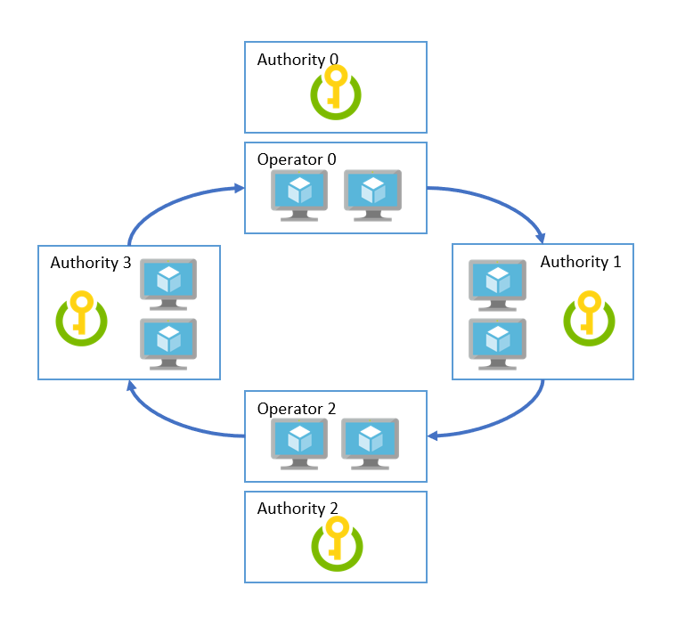

### Azure Monitor

This solution also comes with Azure Monitor to track node and network
statistics. For application developers, this provides visibility into
the underlying blockchain to track block generation statistics. Network
operators can use Azure Monitor to quickly detect and prevent network
outages through infrastructure statistics and queryable logs. See
[Service monitoring](#service-monitoring) for more details.

### Deployment architecture

#### Description

This solution can deploy a single or multi-region based multi-member
Ethereum consortium network. By default, the RPC and peering endpoints
are accessible over public IP to enable simplified connectivity across
subscriptions and clouds. We recommend leveraging [Parity's
permissioning contracts](https://wiki.parity.io/Permissioning) for
application level access-controls. We also support networks deployed
behind VPNs, which leverage VNet gateways for cross-subscription
connectivity. These deployments are more complex, so it is recommended
to start with the public IP model first.

#### Consortium member overview

Each consortium member deployment includes:

-   Virtual Machine Scale Sets (VMSS) for running the PoA validators

-   Azure Load Balancer for distributing RPC, peering, and Governance
    DApp requests

-   Azure Key Vault for securing the validator identities

-   Azure Storage for hosting persistent network information and
    coordinating leasing

-   Azure Monitor for aggregating logs and performance statistics

-   VNet Gateway (optional) for allowing VPN connections across private
    VNets

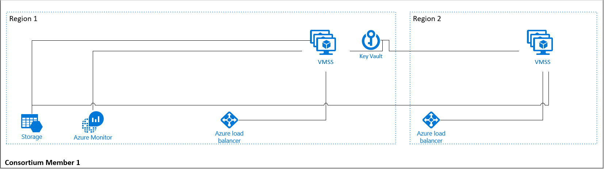

We leverage Docker containers for reliability and modularity. We use
Azure Container Registry to host and serve versioned images as part of
each deployment. The container images consist of:

-   Orchestrator

    -   Runs once during deployment

    -   Generates identities and governance contracts

    -   Stores identities in Identity Store

-   Parity Client

    -   Leases identity from Identity Store

    -   Discovers and connects to peers

-   EthStats Agent

    -   Collects local logs and stats via RPC and pushes to Azure
        Monitor

-   Governance DApp

    -   Web interface for interacting with Governance contracts

## Governance DApp

At the heart of proof-of-authority is decentralized governance. The
governance DApp is a set of pre-deployed smart contracts and a web
application that are used to govern the authorities on the network.
Authorities are broken up into Admin identities and Validator nodes.
Admins have the power to delegate consensus participation to a set of
Validator nodes. Admins also may vote other admins into or out of the
network.

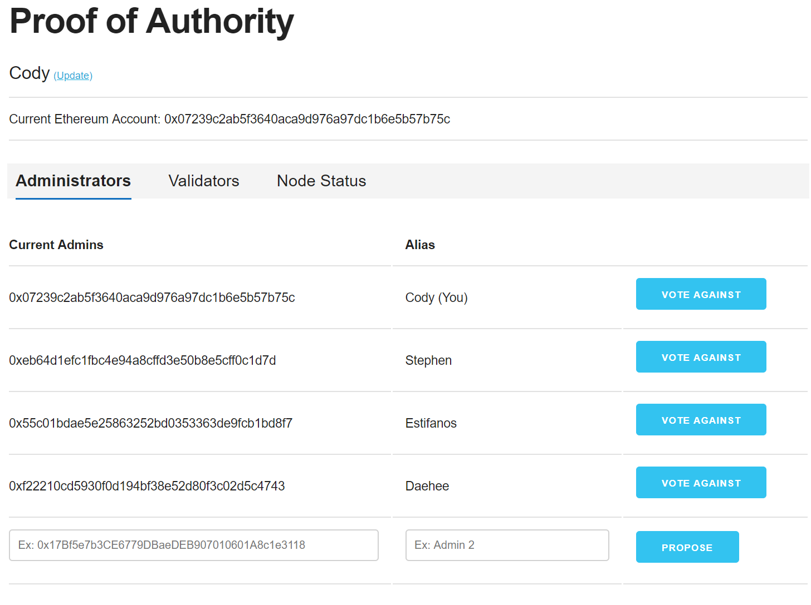

-   **Decentralized Governance -** Changes in network authorities are
    administered through on-chain voting by select administrators.

-   **Validator Delegation -** Authorities can manage their validator
    nodes that are set up in each PoA deployment.

-   **Auditable Change History -** Each change is recorded on the
    blockchain providing transparency and auditability.

## How-to guides

### Deploy Ethereum Proof-of-Authority

Here's an example of a multi-party deployment flow:

1.  Three members each generate an Ethereum account using MetaMask

2.  *Member A* deploys Ethereum PoA, providing their Ethereum Public
    Address

3.  *Member A* provides the consortium URL to *Member B* and *Member C*

4.  *Member B* and *Member C* deploy, Ethereum PoA, providing their
    Ethereum Public Address and *Member A*'s consortium URL

5.  *Member A* votes in *Member B* as an admin

6.  *Member A* and *Member B* both vote *Member C* as an admin

This process requires an Azure subscription that can support deploying
several virtual machines scale sets and managed disks. If necessary,
[create a free Azure account](https://azure.microsoft.com/free/)
to begin.

Once a subscription is secured, go to Azure portal. Select '+',
Marketplace ('See all'), and search for Ethereum PoA Consortium.

The following section will walk you through configuring the first
member's footprint in the network. The deployment flow is divided into
five steps: Basics, Deployment regions, Network size and performance,
Ethereum settings, Azure Monitor.

#### Basics

Under **Basics**, specify values for standard parameters for any
deployment, such as subscription, resource group and basic virtual
machine properties.

A detailed description of each parameter follows:

Parameter Name|Description|Allowed Values|Default Values	
---|---|---|---
Create a new network or join existing network?|Create a new network or join a preexisting consortium network|Create New Join Existing|Create New
Email Address (Optional)|You'll receive an email notification when your deployment completes with information about your deployment.|Valid email address|NA
VM user name|Administrator username of each deployed VM (alphanumeric characters only)|1-64 characters|NA
Authentication type|The method to authenticate to the virtual machine.|Password or SSH public key|Password
Password (Authentication type = Password)|The password for the administrator account for each of the virtual machines deployed.  The password must contain 3 of the following: 1 upper case character, 1 lower case character, 1 number, and 1 special character. While all VMs initially have the same password, you can change the password after provisioning.|12-72 characters|NA
SSH Key (Authentication type = Public Key)|The secure shell key used for remote login.||NA
Subscription|The subscription to which to deploy the consortium network||NA
Resource Group|The resource group to which to deploy the consortium network.||NA
Location|The Azure region for resource group.||NA

A sample deployment is shown below:
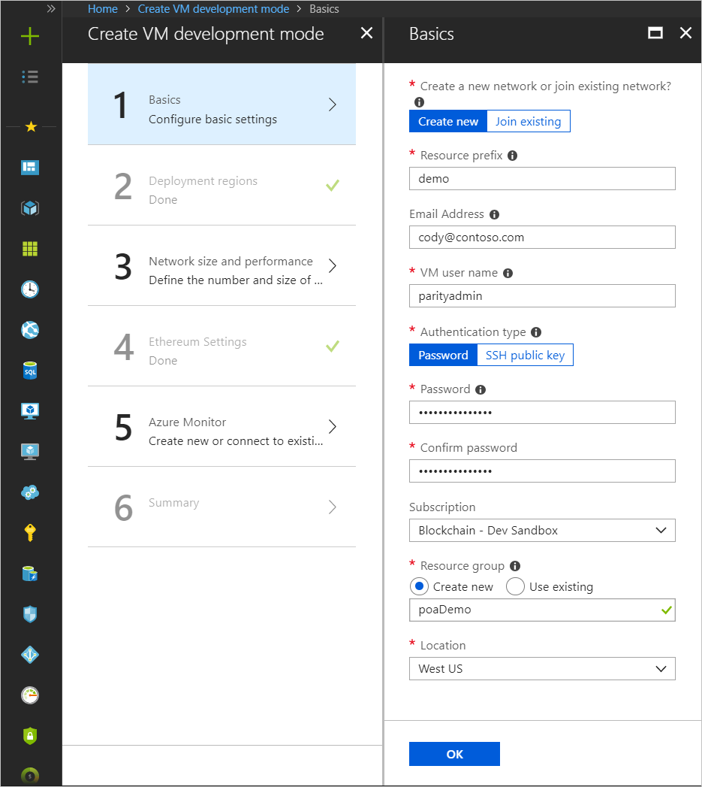

#### Deployment regions

Next, under Deployment regions, specify inputs for number of region(s)
to deploy the consortium network and selection of Azure regions based on
the number of regions given. User can deploy in maximum of 5 regions. We
recommend choosing the first region to match the resource group location
from Basics section. For development or test networks, a single region
per member is recommended. For production, we recommend deploying across
two or more regions for high-availability.

A detailed description of each parameter follows:

  Parameter Name|Description|Allowed Values|Default Values
  ---|---|---|---
  Number of region(s)|Number of regions to deploy the consortium network|1, 2, 3, 4, 5|1
  First region|First region to deploy the consortium network|All allowed Azure regions|NA
  Second region|Second region to deploy the consortium network (Visible only when number of regions is selected as 2)|All allowed Azure regions|NA
  Third region|Third region to deploy the consortium network (Visible only when number of regions is selected as 3)|All allowed Azure regions|NA
  Fourth region|Fourth region to deploy the consortium network (Visible only when number of regions is selected as 4)|All allowed Azure regions|NA
  Fifth region|Fifth region to deploy the consortium network (Visible only when number of regions is selected as 5)|All allowed Azure regions|NA

A sample deployment is shown below:
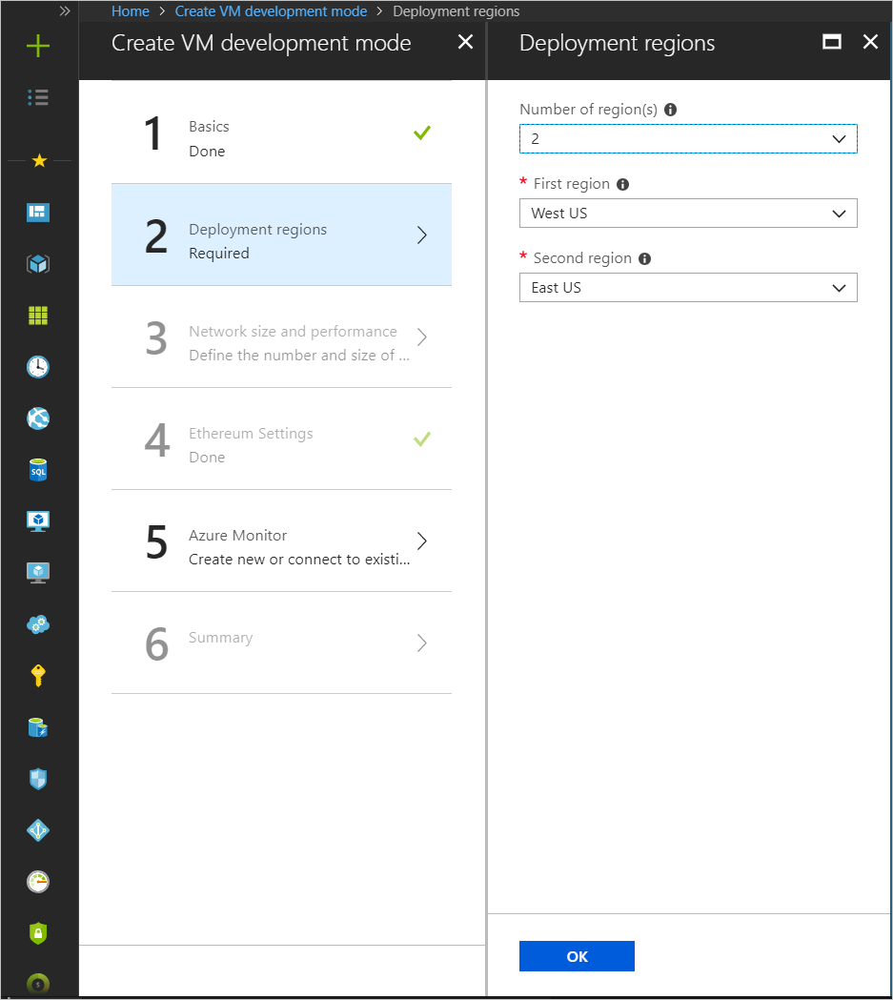

#### Network size and performance 

Next, under 'Network size and performance' specify inputs for the size
of the consortium network, such as number and size of validator nodes.
The validator node storage size will dictate the potential size of the
blockchain. This can be changed after deployment.

A detailed description of each parameter follows:

  Parameter Name|Description|Allowed Values|Default Values
  ---|---|---|---
  Number of load balanced validator nodes|The number of validator nodes to provision as part of the network|2-15|2
  Validator node storage performance|The type of managed disk backing each of the deployed validator nodes.|Standard or Premium|Standard
  Validator node virtual machine size|The virtual machine size used for validator nodes.|Standard A, Standard D, Standard D-v2, Standard F series, Standard DS, and Standard FS|Standard D1 v2

A sample deployment is shown below:
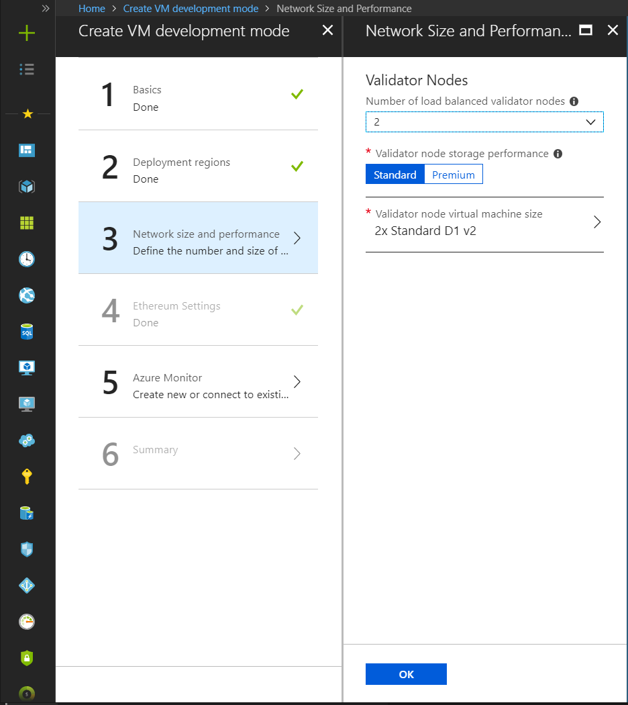

#### Ethereum Settings

Next, under Ethereum settings, specify Ethereum-related configuration
settings, like the network ID and Ethereum account password or genesis
block.

A detailed description of each parameter follows:

  Parameter Name|Description|Allowed Values|Default Values
  ---|---|---|---
Consortium Member ID|The ID associated with each member participating in the consortium network used to configure IP address spaces to avoid collision. In the case of a private network, Member ID should be unique across different organizations in the same network.  A unique member ID is needed even when the same organization deploys to multiple regions. Make note of the value of this parameter since you will need to share it with other joining members to ensure there’s no collision.|0-255|NA
Network ID|The network ID for the consortium Ethereum network being deployed.  Each Ethereum network has its own Network ID, with 1 being the ID for the public network.|5 - 999,999,999|10101010
Admin Ethereum Address|Ethereum account address that is used for participating in PoA governance.  We recommend using MetaMask for generating an Ethereum address.|42 alphanumeric characters starting with 0x|NA
Advanced Options|Advanced options for Ethereum settings|Enable or Disable|Disable
Public IP (Advanced Options = Enable)|Deploys the network behind a VNet Gateway and removes peering access. If this option is selected, all members must use a VNet Gateway for the connection to be compatible.|Public IP Private VNet|Public IP
Transaction Permission Contract (Advanced Options = Enable)|Bytecode for the Transaction Permissioning contract. Restricts smart contract deployment and execution to a permissioned list of Ethereum accounts.|Contract bytecode|NA

A sample deployment is shown below:


#### Azure Monitor

The Azure Monitor blade allows you to configure an Azure Monitor
resource for your network. Azure Monitor will collect and surface useful
metrics and logs from your network, providing the ability to quickly
check the network health or debug issues.

  Parameter Name|Description|Allowed Values|Default Values
  ---|---|---|---
Monitoring|Option to enable Azure Monitor|Enable or Disable|Enable
Connect to existing Log Analytics|Create a new Log Analytics instance as part of Azure Monitor or join an existing instance|Create new or Join existing|Create new
Azure Monitor Location(Connect to Existing Azure Monitor = Create new)|The region where the new Azure Monitor will be deployed|All Azure Monitor  regions|NA
Existing Log Analytics Workspace Id (Connect to Existing Azure Monitor = Join Existing)|Workspace ID of the existing Log Analytics instance||NA
Existing Log Analytics Primary Key (Connect to Existing Azure Monitor = Join Existing)|The primary key used to connect to the existing Azure Monitor instance||NA


A sample deployment is shown below:
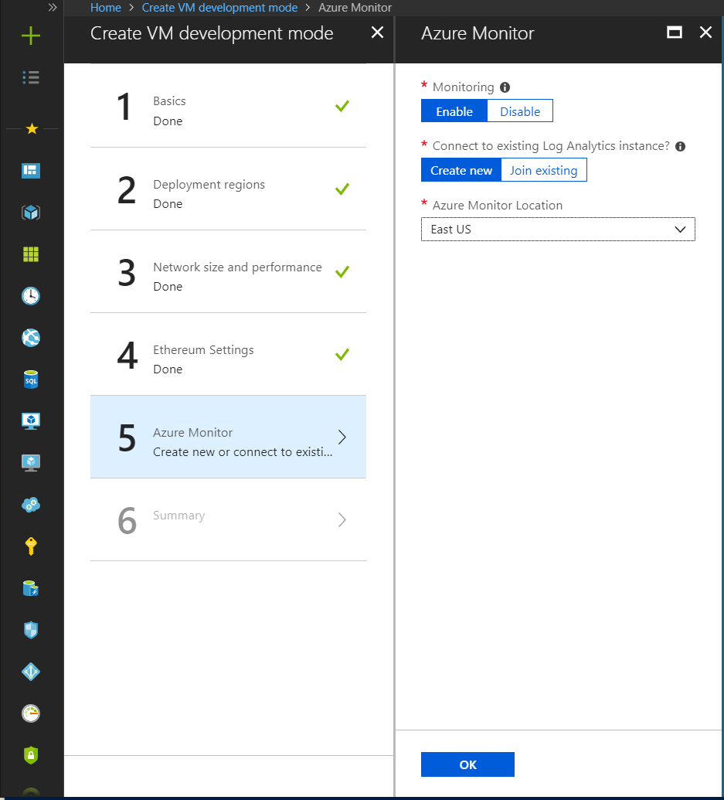

#### Summary

Click through the summary blade to review the inputs specified and to
run basic pre-deployment validation. Before deploying you may download
the template and parameters.

Review legal and privacy terms and click 'Purchase' to deploy. If the
deployment includes VNet Gateways, the deployment will take up 45 to 50
minutes.

#### Post Deployment

##### Deployment Output 

Once the deployment has completed, you'll be able to access the
necessary parameters via the confirmation email or through the Azure
portal. In these parameters you'll find:

-   Ethereum RPC endpoint

-   Governance Dashboard URL

-   Azure Monitor URL

-   Data URL

-   VNet Gateway Resource Id (optional)

##### Confirmation Email 

If you provide an email address ([Basics Section](#basics)), an email
would be sent to the email address with the deployment output
information.


##### Portal

Once the deployment has completed successfully and all resources have
been provisioned you'll be able to view the output parameters in your
resource group.

1.  Locate your resource group in the portal

2.  Navigate to *Deployments*

3.  Select the top deployment with the same name as your resource group

4.  Select *Outputs*

### Growing the consortium

To expand your consortium, you must first connect the physical network.
Using the Public IP-based deployment this first step is seamless. If
deploying behind a VPN, see the section [Connecting VNet
Gateway](#connecting-vnet-gateways) to perform the network connection as
part of [Step 2](#step-2-new-admin-deployment).

#### Step 1: Add the new admin

1.  Collect the new admin's public Ethereum address.

2.  Navigate to the Governance DApp and create a new admin with the
    Ethereum address and an appropriate alias (please use browser
    with the admin's Metamask installed to do this)

3.  Notify the other existing members of the new request so that they
    can vote to add this new admin

4.  Once the vote reaches the 51%, the member will be added as an admin

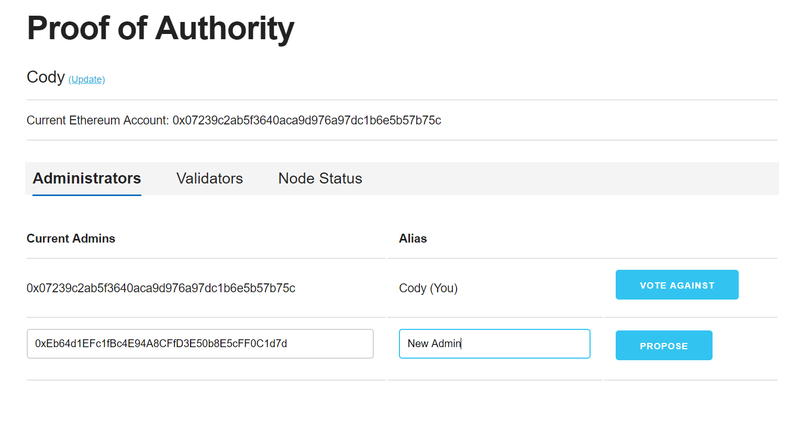

#### Step 2: New admin deployment

1.  Share the following information with the joining member. This
    information can be found in your post-deployment email or in the
    portal deployment output.

    -  Consortium Data Url

    -  The number of nodes you've deployed

    -  VNet Gateway Resource Id (if using VPN)

2.  The deploying member should use the [same
    solution](https://portal.azure.com/?pub_source=email&pub_status=success#create/microsoft-azure-blockchain.azure-blockchain-ethereumethereum-poa-consortium)
    when deploying their network presence with keeping the following in
    mind:

    -  Select *Join Existing*

    -  Choose the same number of validator nodes as the rest of the
        members on the network to ensure fair representation

    -  Use the same Ethereum address that was provided in the [previous
        step](#step-1-add-the-new-admin)

    -  Pass in the provided *Consortium Data Url* on the *Ethereum
        Settings* tab

    -  If the rest of the network is behind a VPN, select *Private
        VNet* under the advanced section

#### Step 3: Delegate validators

The new admin will need to authorize the validators to participate on
their behalf. This cannot be done automatically since only the member
controls their keys.\*

_\*The first member's nodes on the network can automatically be added
because we can precompile their validator nodes into the genesis block
on the network._

The new admin must perform the following steps:

1.  Open the Governance DApp deployed as part of *their* deployment

2.  Navigate to the Validators tab

3.  Select each of the validators that have been deployed and click **Add**

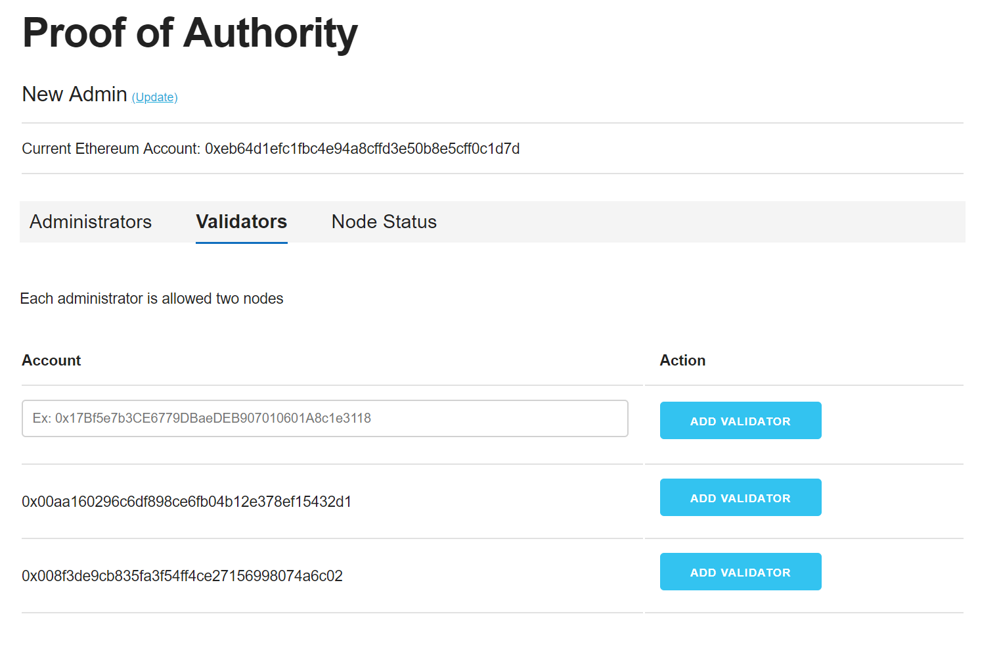

#### Connecting VNet gateways

In the case of a private network, the different members are connected
via VNet gateway connections. Before a member can join the network and
see transaction traffic, an existing member must perform a final
configuration on their VPN gateway to accept the connection. This means
that the Ethereum nodes of the joining member will not run until a
connection is established. It is recommended to create redundant network
connections (mesh) into the consortium to reduce chances of a single
point of failure.

After the new member deploys, the existing member must complete the
bi-directional connection by setting up a VNet gateway connection to the
new member. To achieve this existing member will need:

1.  The VNet gateway ResourceId of the connecting member (see deployment
    output)

2.  The shared connection key

The existing member must run the following PowerShell script to complete
the connection. We recommend using Azure Cloud Shell located in the top
right navigation bar in the
portal.

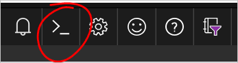

```bash
$MyGatewayResourceId = "<EXISTING_MEMBER_RESOURCEID>"
$OtherGatewayResourceId = "<NEW_MEMBER_RESOURCEID]"
$ConnectionName = "Leader2Member"
$SharedKey = "<NEW_MEMBER_KEY>"

## $myGatewayResourceId tells me what subscription I am in, what ResourceGroup and the VNetGatewayName
$splitValue = $MyGatewayResourceId.Split('/')
$MySubscriptionid = $splitValue[2]
$MyResourceGroup = $splitValue[4]
$MyGatewayName = $splitValue[8]

## $otherGatewayResourceid tells me what the subscription and VNet GatewayName are
$OtherGatewayName = $OtherGatewayResourceId.Split('/')[8]
$Subscription=Select-AzureRmSubscription -SubscriptionId $MySubscriptionid

## create a PSVirtualNetworkGateway instance for the gateway I want to connect to
$OtherGateway=New-Object Microsoft.Azure.Commands.Network.Models.PSVirtualNetworkGateway
$OtherGateway.Name = $OtherGatewayName
$OtherGateway.Id = $OtherGatewayResourceId
$OtherGateway.GatewayType = "Vpn"
$OtherGateway.VpnType = "RouteBased"

## get a PSVirtualNetworkGateway instance for my gateway
$MyGateway = Get-AzureRmVirtualNetworkGateway -Name $MyGatewayName -ResourceGroupName $MyResourceGroup

## create the connection
New-AzureRmVirtualNetworkGatewayConnection -Name $ConnectionName -ResourceGroupName $MyResourceGroup -VirtualNetworkGateway1 $MyGateway -VirtualNetworkGateway2 $OtherGateway -Location $MyGateway.Location -ConnectionType Vnet2Vnet -SharedKey $SharedKey -EnableBgp $True
```

### Service monitoring

You can locate your Azure Monitor portal either by following the link in
the deployment email or locating the parameter in the deployment output
\[OMS\_PORTAL\_URL\].

The portal will first display high-level network statistics and node
overview.


Selecting **Node Overview** will direct you to a portal to view per-node
infrastructure statistics.


Selecting **Network Stats** will direct you to view Ethereum network
statistics.


#### Sample Log Analytics queries

Behind these dashboards is a set of queryable raw logs. You can use
these raw logs to customize the dashboards, investigate failures, or
setup threshold alerting. Below you'll find a set of example queries
that can be ran in the Log Search tool:

##### Lists blocks that have been reported by more than one validator. Useful to help find chain forks.

```sql
MinedBlock_CL
| summarize DistinctMiners = dcount(BlockMiner_s) by BlockNumber_d, BlockMiner_s
| where DistinctMiners > 1
```

##### Get average peer count for a specified validator node averaged over 5 minute buckets.

```sql
let PeerCountRegex = @"Syncing with peers: (\d+) active, (\d+) confirmed, (\d+)";
ParityLog_CL
| where Computer == "vl-devn3lgdm-reg1000001"
| project RawData, TimeGenerated
| where RawData matches regex PeerCountRegex
| extend ActivePeers = extract(PeerCountRegex, 1, RawData, typeof(int)) 
| summarize avg(ActivePeers) by bin(TimeGenerated, 5m)
```

### SSH access

For security reasons, the SSH port access is denied by a network group
security rule by default. To access the virtual machine scale set instances in the PoA
network, you will need to change this rule to \"Allow\"

1.  Start in the Overview section of the deployed resource group from
    Azure portal.

    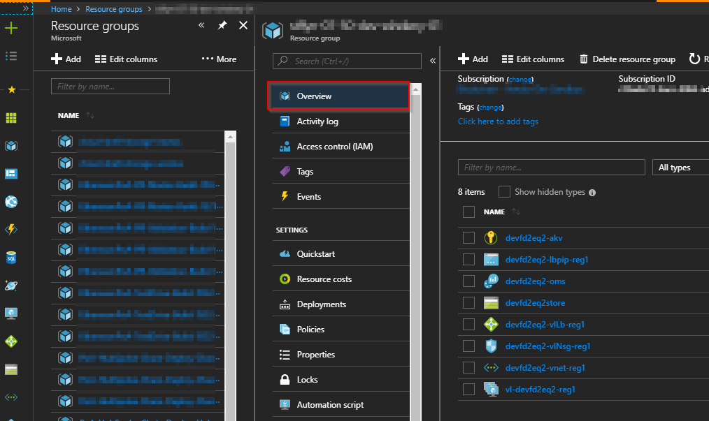

2.  Select the Network Security Group

    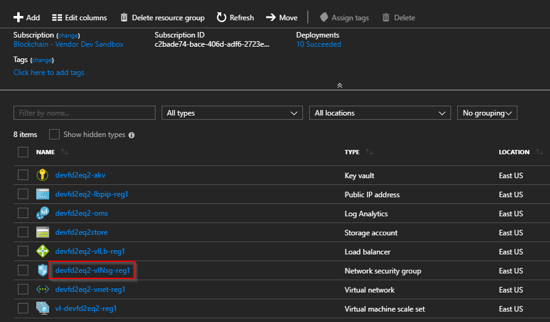

3.  Select the \"allow-ssh\" rule

    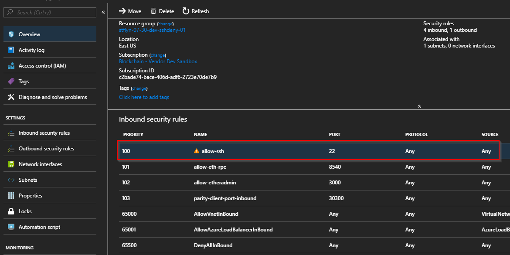

4.  Change \"Action\" to Allow

    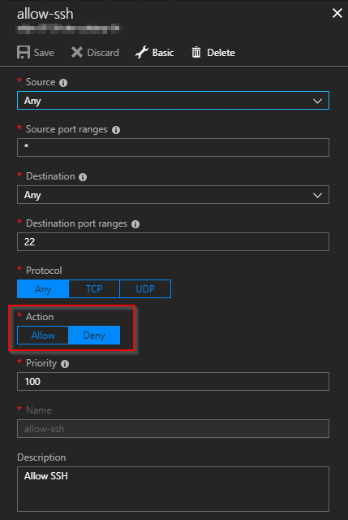

5.  Click \"Save\" (Changes may take a few minutes to apply)

You can now remotely connect to the virtual machines for the validator
nodes via SSH with your provided admin username and password/SSH key.
The SSH command to run to access the first validator node is listed in
the template deployment output parameter as,
'SSH\_TO\_FIRST\_VL\_NODE\_REGION1' (for the sample deployment: ssh - p
4000 poaadmin\@leader4vb.eastus.cloudapp.azure.com). To get to
additional transaction nodes, increment the port number by one (For example, the
first transaction node is on port 4000).

If you deployed to more than one region, change the above command to the
DNS name or IP address of the load balancer in that region. To find the
DNS name or IP address of the other regions, find the resource with the
naming convention \*\*\*\*\*-lbpip-reg\#, and view its DNS name and IP
address properties.

### Azure Traffic Manager load balancing

Azure Traffic Manager can help reduce downtime and improve
responsiveness of the PoA network by routing incoming traffic across
multiple deployments in different regions. Built-in health checks and
automatic re-routing help ensure high availability of the RPC endpoints
and the Governance DApp. This feature is useful if you have deployed to
multiple regions and are production ready.

Use Traffic Manager to:

-   Improve PoA network availability with automatic failover.

-   Increase your networks responsiveness by routing end users to the
    Azure location with lowest network latency.

If you decide to create a Traffic Manager profile, you can use the DNS
name of the profile to access your network. Once
other consortium members have been added to the network, the Traffic
Manager can also be used to load balance across their deployed
validators.

#### Creating a Traffic Manager profile

Search for and select \"Traffic Manager profile\" after clicking the
\"Create a resource\" button in the Azure portal.

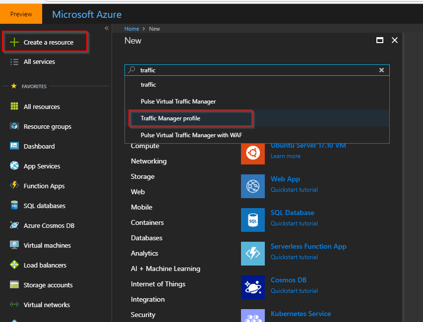

Give the profile a unique name and select the Resource Group that was
created during the PoA deployment.

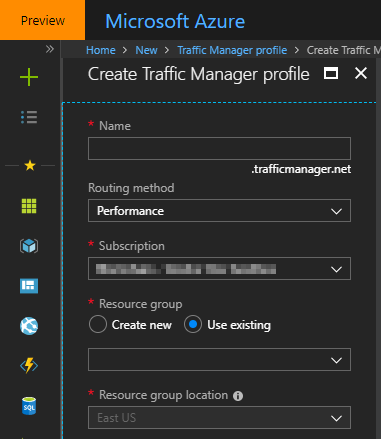

Once it is deployed, then select the instance in the resource group. The
DNS name to access the traffic manager can be found in the Overview tab

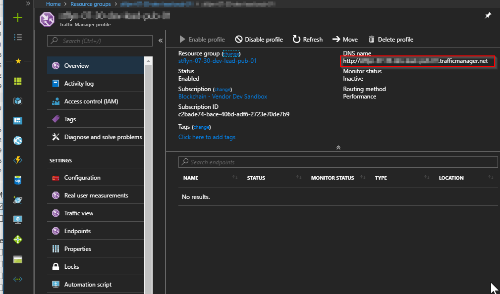

Select the Endpoints tab and click the Add button. Then change the
Target resource type to Public IP address. Then select the public IP
address of the first region\'s load balancer.

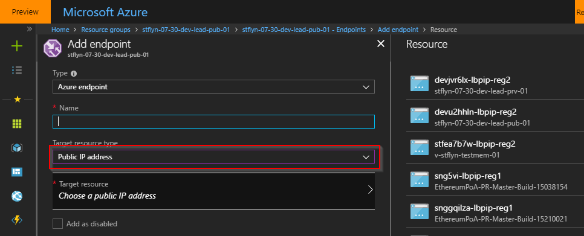

Repeat for each region in the deployed network. Once the endpoints are
in the \"enabled\" status, they will be automatically load and region
balanced at the DNS name of the traffic manager. You can now use this
DNS name in place of the \[CONSORTIUM\_DATA\_URL\] parameter in other
steps of the document.

## Data API

Each consortium member hosts the necessary information for others to
connect to the network. The existing member will provide the
[CONSORTIUM_DATA_URL] prior to the member's deployment. Upon
deployment, a joining member will retrieve information from the JSON
interface at the following endpoint:

`<CONSORTIUM_DATA_URL>/networkinfo`

The response will contain information useful for joining members
(Genesis block, Validator Set contract ABI, bootnodes) as well as
information useful to the existing member (validator addresses). We
encourage use of this standardization to extend the consortium across
cloud providers. This API will return a JSON formatted response with the
following structure:
```json
{
  "$id": "", 
  "type": "object", 
  "definitions": {}, 
  "$schema": "http://json-schema.org/draft-07/schema#", 
  "properties": {
    "majorVersion": {
      "$id": "/properties/majorVersion", 
      "type": "integer", 
      "title": "This schema’s major version", 
      "default": 0, 
      "examples": [
        0
      ]
    }, 
    "minorVersion": {
      "$id": "/properties/minorVersion", 
      "type": "integer", 
      "title": "This schema’s minor version", 
      "default": 0, 
      "examples": [
        0
      ]
    }, 
    "bootnodes": {
      "$id": "/properties/bootnodes", 
      "type": "array", 
      "items": {
        "$id": "/properties/bootnodes/items", 
        "type": "string", 
        "title": "This member’s bootnodes", 
        "default": "", 
        "examples": [
          "enode://a348586f0fb0516c19de75bf54ca930a08f1594b7202020810b72c5f8d90635189d72d8b96f306f08761d576836a6bfce112cfb6ae6a3330588260f79a3d0ecb@10.1.17.5:30300", 
          "enode://2d8474289af0bb38e3600a7a481734b2ab19d4eaf719f698fe885fb239f5d33faf217a860b170e2763b67c2f18d91c41272de37ac67386f80d1de57a3d58ddf2@10.1.17.4:30300"
        ]
      }
    }, 
    "valSetContract": {
      "$id": "/properties/valSetContract", 
      "type": "string", 
      "title": "The ValidatorSet Contract Source", 
      "default": "", 
      "examples": [
        "pragma solidity 0.4.21;\n\nimport \"./SafeMath.sol\";\nimport \"./Utils.sol\";\n\ncontract ValidatorSet …"
      ]
    }, 
    "adminContract": {
      "$id": "/properties/adminContract", 
      "type": "string", 
      "title": "The AdminSet Contract Source", 
      "default": "", 
      "examples": [
        "pragma solidity 0.4.21;\nimport \"./SafeMath.sol\";\nimport \"./SimpleValidatorSet.sol\";\nimport \"./Admin.sol\";\n\ncontract AdminValidatorSet is SimpleValidatorSet { …"
      ]
    }, 
    "adminContractABI": {
      "$id": "/properties/adminContractABI", 
      "type": "string", 
      "title": "The Admin Contract ABI", 
      "default": "", 
      "examples": [
        "[{\"constant\":false,\"inputs\":[{\"name\":\"proposedAdminAddress\",\"type\":\"address\"},…"
      ]
    }, 
    "paritySpec": {
      "$id": "/properties/paritySpec", 
      "type": "string", 
      "title": "The Parity client spec file", 
      "default": "", 
      "examples": [
        "\n{\n \"name\": \"PoA\",\n \"engine\": {\n \"authorityRound\": {\n \"params\": {\n \"stepDuration\": \"2\",\n \"validators\" : {\n \"safeContract\": \"0x0000000000000000000000000000000000000006\"\n },\n \"gasLimitBoundDivisor\": \"0x400\",\n \"maximumExtraDataSize\": \"0x2A\",\n \"minGasLimit\": \"0x2FAF080\",\n \"networkID\" : \"0x9a2112\"\n }\n }\n },\n \"params\": {\n \"gasLimitBoundDivisor\": \"0x400\",\n \"maximumExtraDataSize\": \"0x2A\",\n \"minGasLimit\": \"0x2FAF080\",\n \"networkID\" : \"0x9a2112\",\n \"wasmActivationTransition\": \"0x0\"\n },\n \"genesis\": {\n \"seal\": {\n \"authorityRound\": {\n \"step\": \"0x0\",\n \"signature\": \"0x0000000000000000000000000000000000000000000000000000000000000000000000000000000000000000000000000000000000000000000000000000000000\"\n }\n },\n \"difficulty\": \"0x20000\",\n \"gasLimit\": \"0x2FAF080\"\n },\n \"accounts\": {\n \"0x0000000000000000000000000000000000000001\": { \"balance\": \"1\", \"builtin\": { \"name\": \"ecrecover\", \"pricing\": { \"linear\": { \"base\": 3000, \"word\": 0 } } } },\n \"0x0000000000000000000000000000000000000002\": { \"balance\": \"1\", \"builtin\": { \"name\": \"sha256\", \"pricing\": { \"linear\": { \"base\": 60, \"word\": 12 } } } },\n \"0x0000000000000000000000000000000000000003\": { \"balance\": \"1\", \"builtin\": { \"name\": \"ripemd160\", \"pricing\": { \"linear\": { \"base\": 600, \"word\": 120 } } } },\n \"0x0000000000000000000000000000000000000004\": { \"balance\": \"1\", \"builtin\": { \"name\": \"identity\", \"pricing\": { \"linear\": { \"base\": 15, \"word\": 3 } } } },\n \"0x0000000000000000000000000000000000000006\": { \"balance\": \"0\", \"constructor\" : \"…\" }\n }\n}"
      ]
    }, 
    "errorMessage": {
      "$id": "/properties/errorMessage", 
      "type": "string", 
      "title": "Error message", 
      "default": "", 
      "examples": [
        ""
      ]
    }, 
    "addressList": {
      "$id": "/properties/addressList", 
      "type": "object", 
      "properties": {
        "addresses": {
          "$id": "/properties/addressList/properties/addresses", 
          "type": "array", 
          "items": {
            "$id": "/properties/addressList/properties/addresses/items", 
            "type": "string", 
            "title": "This member’s validator addresses", 
            "default": "", 
            "examples": [
              "0x00a3cff0dccc0ecb6ae0461045e0e467cff4805f", 
              "0x009ce13a7b2532cbd89b2d28cecd75f7cc8c0727"
            ]
          }
        }
      }
    }
  }
}

```
## Development

### Programmatically interacting with a smart contract

> [!WARNING]
> Never send your Ethereum private key over the network! Ensure that
> each transaction is signed locally first and the signed transaction is
> sent over the network.

In the following example, we use *ethereumjs-wallet* to generate an
Ethereum address, *ethereumjs-tx* to sign locally, and *web3* to send
the raw transaction to the Ethereum RPC endpoint.

We'll use this simple Hello-World smart contract for this example:

```javascript
pragma solidity ^0.4.11;
contract postBox {
    string message;
    function postMsg(string text) public {
        message = text;	
    }
    function getMsg() public view returns (string) {
        return message;
    }
}
```

This example assumes the contract is already deployed. You can use
*solc* and *web3* for deploying a contract programmatically. First
install the following node modules:
```
sudo npm install web3@0.20.2
sudo npm install ethereumjs-tx@1.3.6
sudo npm install ethereumjs-wallet@0.6.1
```
This nodeJS script will perform the following:

-   Construct a raw transaction: postMsg

-   Sign the transaction using the generated private key

-   Submit the signed transaction to the Ethereum network

```javascript
var ethereumjs = require('ethereumjs-tx')
var wallet = require('ethereumjs-wallet')
var Web3 = require('web3')

// TODO Replace with your contract address
var address = "0xfe53559f5f7a77125039a993e8d5d9c2901edc58";
var abi = [{"constant": false,"inputs": [{"name": "text","type": "string"}],"name": "postMsg","outputs": [],"payable": false,"stateMutability": "nonpayable","type": "function"},{"constant": true,"inputs": [],"name": "getMsg","outputs": [{"name": "","type": "string"}],"payable": false,"stateMutability": "view","type": "function"}];

// Generate a new Ethereum account
var account = wallet.generate();
var accountAddress = account.getAddressString()
var privateKey = account.getPrivateKey();

 // TODO Replace with your RPC endpoint
 var web3 = new Web3(new Web3.providers.HttpProvider(
    "http://testzvdky-dns-reg1.eastus.cloudapp.azure.com:8545"));
 
// Get the current nonce of the account
 web3.eth.getTransactionCount(accountAddress, function (err, nonce) {
   var data = web3.eth.contract(abi).at(address).postMsg.getData("Hello World");
   var rawTx = {
     nonce: nonce,
     gasPrice: '0x00', 
     gasLimit: '0x2FAF080',
     to: address, 
     value: '0x00', 
     data: data
   }
   var tx = new ethereumjs(rawTx);
   
   tx.sign(privateKey);

   var raw = '0x' + tx.serialize().toString('hex');
   web3.eth.sendRawTransaction(raw, function (txErr, transactionHash) {
     console.log("TX Hash: " + transactionHash);
     console.log("Error: " + txErr);
   });
 });
```

### Debug a smart contract (Truffle Develop)

Truffle has a local develop network that is available for debugging
smart contract. You can find the full tutorial
[here](http://truffleframework.com/tutorials/debugging-a-smart-contract).

### WebAssembly (WASM) support

WebAssembly support is already enabled for you on newly deployed PoA
networks. It allows for smart-contract development in any language that
transpiles to Web-Assembly (Rust, C, C++). See the links below for
additional information

-   Parity Overview of WebAssembly -
    <https://wiki.parity.io/WebAssembly-Home>

-   Tutorial from Parity Tech -
    <https://github.com/paritytech/pwasm-tutorial>

## FAQ

### I notice a bunch of transactions on the network that I didn\'t send. Where are these coming from?

It is insecure to unlock the [personal
API](https://web3js.readthedocs.io/en/1.0/web3-eth-personal.html). Bot
accounts are listening for unlocked Ethereum accounts and attempt to
drain the funds. The bot assumes these accounts contain real-ether and
attempt to be the first to siphon the balance. Do not enable the
personal API on the network. Instead pre-sign the transactions either
manually using a wallet like MetaMask or programmatically as outlined in
the section Programmatically Interacting with a Smart Contract.

### How to SSH onto a VM?

We lock down the SSH port for security reasons. Follow [this guide to
enable the SSH port](#_Accessing_Nodes_via).

### How do I set up an audit member or transaction nodes?

Transaction nodes are a set of Parity clients that are peered with the
network but are not participating in consensus. These nodes can still be
used to submit Ethereum transactions and read the smart contract state.
This works well as a mechanism for providing auditability to regulators
of the network. To achieve this simply follow Step 2 from Growing the
Consortium.

### Why are MetaMask transactions taking a long time?

To ensure transactions are received in the correct order, each Ethereum
transaction comes with an incrementing nonce. If you've used an account
in MetaMask on a different network, you'll need to reset the nonce
value. Click on the settings icon (3-bars), Settings, Reset Account. The
transaction history will be cleared and now you can resubmit the
transaction.

### Are Public IP deployments compatible with Private network deployments?

No, peering requires two-way communication so the entire network must either be public or private.

## Next steps

Get started by using the [Ethereum Proof-of-Authority Consortium](https://portal.azure.com/?pub_source=email&pub_status=success#create/microsoft-azure-blockchain.azure-blockchain-ethereumethereum-poa-consortium) solution.
