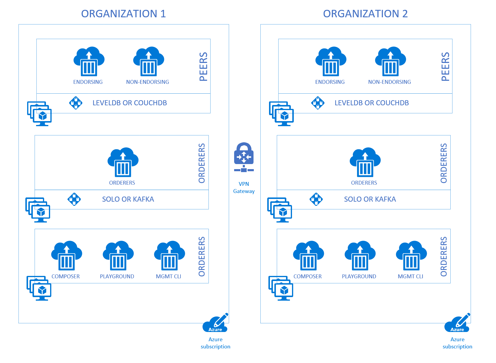
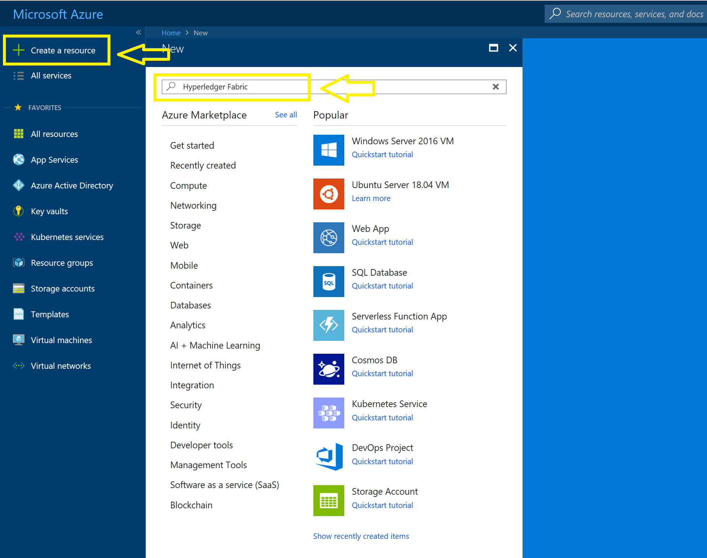
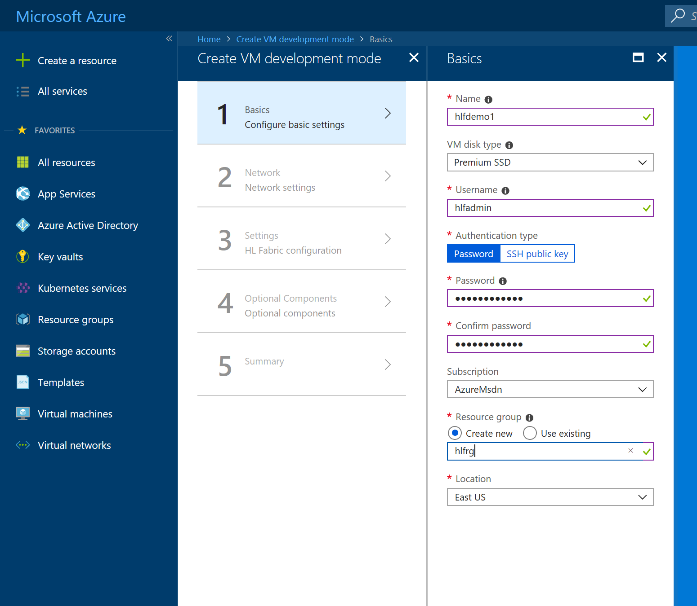
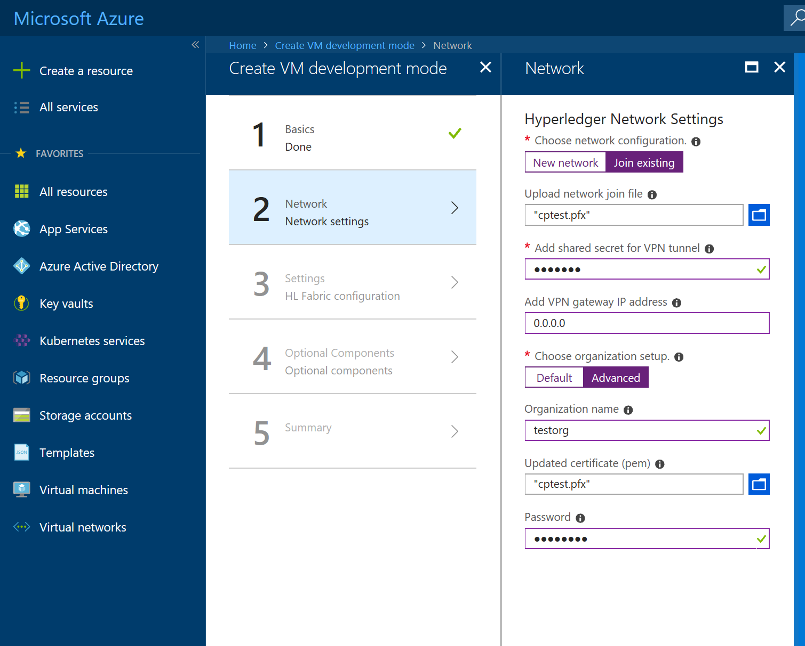
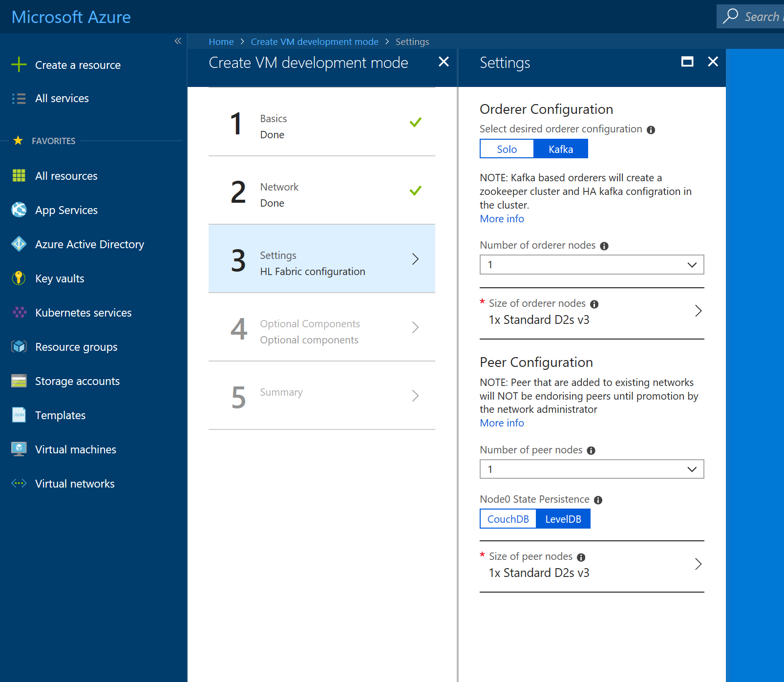
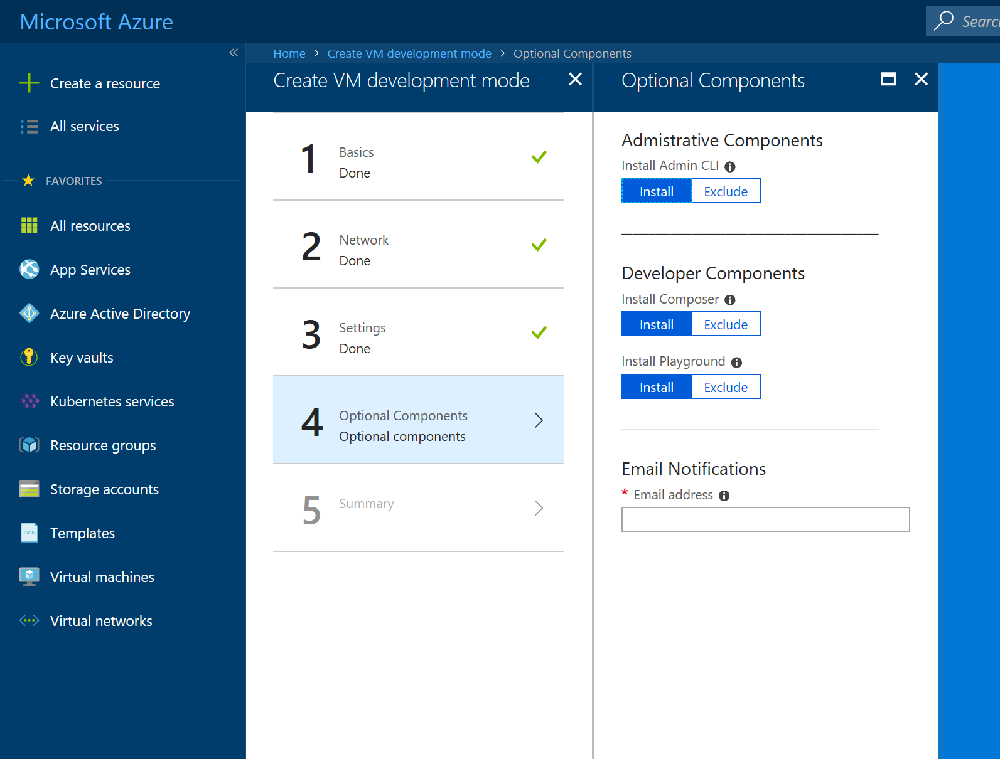

# Hyperledger Fabric consortium

The automation provided by [this solution](https://aka.ms/hlfv2) is designed to make it easier to deploy, configure and govern a multi-member consortium using the Hyperledger Fabric software stack.  Hyperledger Fabric is an enterprise grade distributed ledger that provides modular components, allowing customization of components to fit various scenarios.  The offering in Azure, removes the need to manually configure these individual components, and makes the process of deploying the consortium a simplified process of providing the answer to a few questions.

In just minutes, user can either create new network or join and existing one, using the Azure cloud componets, including compute, networking and storage.  Each participant to this network can customize the nodes that they will be responsible for, with the complexity of configuring these nodes being reduced substantially.

## Concepts

### Terminology

- **Consensus** - The agreement of various nodes on the order and confirmation of correctness of the set of transactions that are formed in a block.
- **Organization** - This is synonymous with members that make up a consortium.  Members are sometimes referred to as participants in the network.
- **Ordering Service** - A collection of nodes that order transactions into a block.  Transactions are ordered on a first-come-first-service basis.  The orderer nodes is implemented in two primary forms, Solo which is primarily for development use only and Kafka which is a production grade option.
- **Peers** - Nodes that contain a copy of the ledger and execute chaincode (business logic) to perform both read and write operation to the ledger.  Peer nodes can either be endorsing peers, which can propose changes to the ledger, and non-endorsing peers which are read-only access.
- **Chaincode** - Business logic, which forms the concept of a "smart contract".  This code is executed on peers to read and modify state in the ledger.
- **Membership Service** - A service that authenticates, authorizes, and manages identities on the network.

## About blockchain

Blockchain technology, at the core is comprised of an immutable transaction ledger that is "commited" based on network of computers, called peers.  Each node contains a copy of the ledger of transactions.  Consensus of the state of this ledger is formed from the nodes of the network voting on what they believe the ledger should contain.  Enterprises have started adopting this technology, primary for B2B cases which we refer to as a consortium.  Public blockchain rely on what is referred to as a trustless network, meaning that anyone can add a node to the network and participate.  In the enterprise context, blockchain technology is slightly different as the network is comprised of nodes from controlled entities, meaning participants on the network are only there after a process of onboarding them, and each have various roles in the network.  Additional elements of these "private" networks are:

- Strong KYC (know your customer) of participants on the network
- Strong permissioning of who can "join" the network to participant
- High transaction throughput
- Privacy of transaction payloads.

## Network Topology

The network topology that is available via the Azure Marketplace is shown below.  The model allows for the deployment of the network, with the following configuration elements.

- **Peers** - The peers provisioned to the network can be either an endorsing or non-endorsing types.  By default each network is configured with 2 peers for high availability, one is endorsing and one is not endorsing.  Additional nodes can be added post deployment with the managment API.  These nodes are implemented via docker containers running on top of Azure Virtual Machine Scale Sets.  The peers can persist the state database of the ledger via [LevelDB or CouchDB](https://hyperledger-fabric.readthedocs.io/en/release-1.2/couchdb_as_state_database.html?highlight=leveldb).
- **Orderers** - The orderer nodes provisioned as part of the deployment can use one of two options for [messaging backend](https://github.com/hyperledger/fabric/tree/master/orderer).  Solo, which is a single process, ideal for development and Kafka which is an enterprise scale solution, ideal for production workloads.
- **Composer** - This is a component that can optionally be deployed as part of the network and functions as primarily a developer focused tool for building application faster on top the ledger.  The [composer](https://github.com/hyperledger/composer) component is NOT deployed in a highly available deployment as this is not a critical component of the network.
- **Playground** - This is another component that can optionaly be deployed as part of the network and functions primarily as a tool that uses composer as the backend to provide a visual front end that users can use to interact with the ledger without writing code.
- **Discovery and Management CLI** - This is a component that allows service discovery and management CLI.  This is used by the template to output the network configuration for other members to use as join material.  The management CLI is used to accept/approve new members as well as other management related functions.

## How to Guides

### Deploy Hyperledger Fabric on Azure

To begin, you will need an Azure subscription that can support deploying several virtual machine scale sets and managed disks. If you do not have an Azure subscription, you can [create a free Azure account](https://azure.microsoft.com/free/).

After logging into the Azure subscription via the [Azure Portal](https://portal.azure.com), select the '+ Create a resource' button in the top left corner of the portal screen.  After this in the search box type 'Hyperledger Fabric'.

The following section will walk through configuring a new network.  The deployment flow is divided into series of steps that the user is stepped through, presenting various settings that can be used to customize the components that are provisioned.

### Basics

Under **Basics**, provide values for the standard parameters used for the deployment to Azure such as subscription id, resource group, and basic settings for the resources that will be created.

A detailed description of each parameter on the **Basics** step is as follows:

Parameter Name|Description|Allowed Values|Default Values	
---|---|---|---
Name|The prefix to name the resources for the deployment|1-15 alphanumeric characters|NA
VM disk type|Performance setting for the VMs that will be created|Premium SSD or Standard HDD|NA
Username|Administrator username of each deployed VM (alphanumeric characters only)|1-64 characters|NA
Authentication type|The method to authenticate to the virtual machine.|Password or SSH public key|Password
Password (Authentication type=Password)|The password for the administrator account for each of the virtual machines deployed. The password must contain 3 of the following: 1 upper case character, 1 lower case character, 1 number, and 1 special character. While all VMs initially have the same password, you can change the password after provisioning.|12-72 characters|NA
SSH Key (Authentication type = Public Key)|The secure shell key used for remote login.||NA
Subscription|The subscription to which to deploy the consortium network||NA
Resource Group|The resource group to which to deploy the consortium network.||NA
Location|The Azure region for resource group.||NA

A sample deployment is shown below:

### Network

Under the **Network** step, provide values for the core consortium network topology.  These are the core organization settings.  The description of these settings are as follows:

Parameter Name|Description|Allowed Values|Default Values	
---|---|---|---
Network configuration|Select an option to create a new network or join an existing one|New network or Join existing|New network
Network join file|Select a network join file provided by the network administrator||NA
Shared secret for VPN|Enter the shared secret for the VPN tunnel|1-15 characters|NA
IP Address for VPN|Enter the IP Address of the VPN gateway|Valid IPv4 address|NA
Organization setup|Select either the default org config or provide a customized setup|Default or Advanced|Default
Organization name|Enter the desired organization name|1-255 characters|NA
Organization root certificate|Upload the root certificate (*.pem) file||NA
Organization root certificate passphrase|Enter the passphrase for the root certificate that is uploaded||NA
VPN Tunnel gateway|Select the option to create a VPN gateway for expanding the network|Yes or No|No

A sample network configuation is shown below:

### Settings

Under the **Settings** step, provide values for the Hyperledger Fabric settings, including the core node configuration.  The description of these settings are as follows:

Parameter Name|Description|Allowed Values|Default Values	
---|---|---|---
Orderer Configuration|Select the orderer backend configuration|Solo or Kafka|Kafka
Number of orderer nodes|Select the number of orderer nodes|1-4|1
Size of orderer nodes|Select the size of compute nodes for the orderer nodes||Standard D2sv3
Peer Configuration|Select the number of peer nodes|1-4|1
Peer (1-4) Persistence option|Select the desired peer state persistence technology|CouchDB or LevelDB|LevelDB
Size of peer nodes|Select the size of the compute nodes||Standard D2sv3

A sample settings configuration is shown below:

### Optional Components 

Under the **Optional Settings** step, provide values for optional components that can be provisioned.  These include administrative APIs and developer focused components.  The description of these settings are as follows:

Parameter Name|Description|Allowed Values|Default Values	
---|---|---|---
Install Administrative CLI|Choose to install the administrative CLI tooling|Install or Exclude|Install
Install Composer|Choose to install the Composer tooling|Install or Exclude|Install
Install Playground|Choose to install the Playground component that uses Composer|Install or Exclude|Install
Email notifications|Enter an email address that will be messaged on deployment completion|Valid email address|NA

A sample optional components configuration is shown below:

### Summary

Click through the summary blade to review the inputs that have been provided.  A validation check will be executed as a pre-flight check on resources that will be deployed.  Additionally, you may download the template and parameters to deploy manually.

Review the legal and privacy terms and click 'Purchase' to initiate the deployment.  The deployment will take up to 45 minutes to complete.

