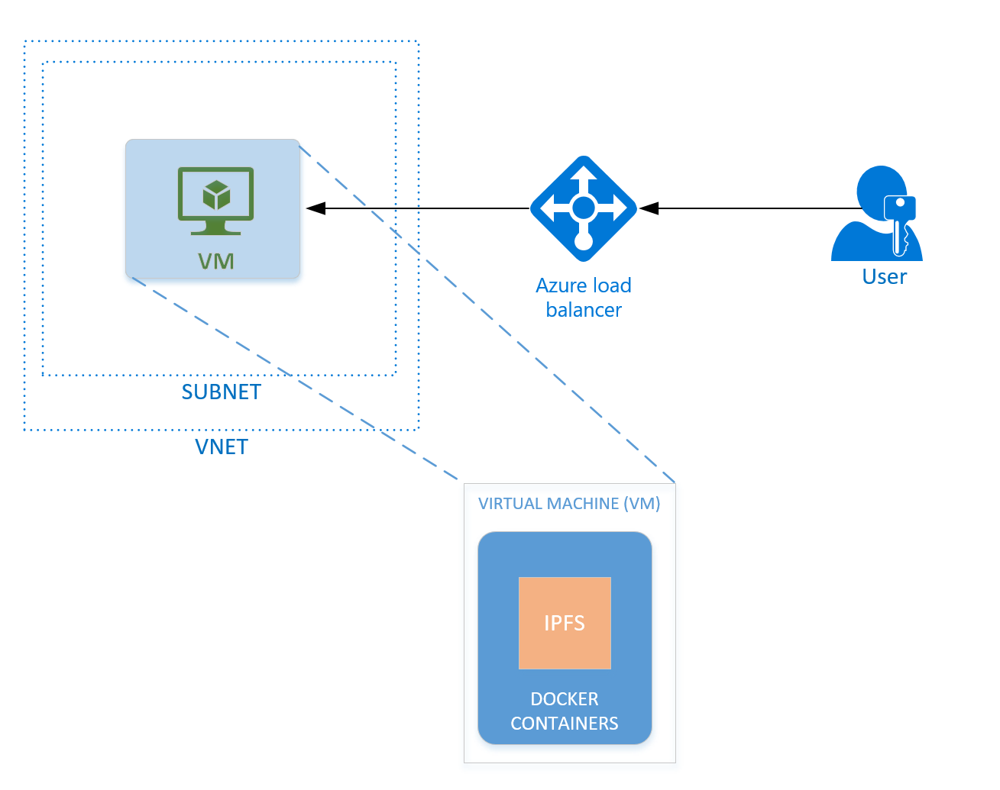

# Private InterPlanetary File System (IPFS)

## Overview

[IPFS](https://ipfs.io/) is an open-source, peer-to-peer, distributed and decentralized storage engine that can be used to drive a content-based model rather than the traditional location-based model. This means that a highly redundant (fault tolerant) and immutable storage object can be created and shared across the network

This solution has been designed in order to simplify the process of creating a [private IPFS network](https://github.com/ipfs/go-ipfs/blob/master/docs/experimental-features.md#private-networks). The basis of a private IPFS network is the following:

- Create an IPFS node that will not boot and sync from public nodes.
- Provide a shared secret to members that wish to join and participate in this private network of nodes.

Creating this network is not incredibly difficult process, however, for private networks, we can make the process a "single click" operation via Azure. Simply provides a few parameters to help us understand required network features such as: location, the number of nodes in your network, and the size of nodes (performance). After providing these parameters, the entire network will be created and ready to use in a matter of minutes.

### Deployment Architecture



This template will handle deploying the underlying networking infrastructure including: Virtual Network (with subnet), Network Interface, and a Network Security Group. The template will also deploy a series of Virtual Machines for each node designated to be part of the network. Each of these nodes runs a Docker container which contains a running instance of IPFS itself. Finally, an Azure Load Balancer is configured to evenly distribute requests to each node in the network.

## Deploying a Network

A network can be deployed via the [Azure Portal] (https://portal.azure.com). Once there, select the '+' icon to 'Create a resource'. This will open the Marketplace blade. Select 'See all' and search for 'IPFS'.

The following section will walk you through each deployment step in order to create the network.

### Basics

Under **Basics**, specify values for standard parameters for any deployment, such as subscription, resource group, and basic Virtual Machine properties.

A detailed description of each parameter follows:

Parameter Name|Description|Allowed Values|Default Value
---|---|---|---
`Resource Prefix` | The prefix each resource in the group will contain. | 1-6 lower-case alphanumeric characters | NA
`VM Disk Type` | The type of managed disk backing each of the deployed IPFS nodes. | Premium SSD or Standard HDD | Premium SSD
`Username` | Administrator username of each deployed VM (alphanumeric characters only). | 1-15 characters | NA
`Authentication Type` | The method to authenticate to each virtual machine. | Pasword or SSH Public Key | Password
`Password` (Authentication Type = Password) | The password for the administrator account for each of the virtual machines deployed. The password must contain 3 of the following: 1 upper case character, 1 lower case character, 1 number, and 1 special character. While all VMs initially have the same password, you can change the password after provisioning. | 12-72 characters | NA
`SSH Key` (Authentication Type = SSH Public Key) | The secure shell key used for remote login. | | NA
`Subscription` | The subscription to which to deploy the IPFS network. | | NA
`Resource Group` | The resource group to which to deploy the consortium network. | | NA
`Location` | The Azure region for resource group. | | NA

A sample deployment is shown below:


### Network Settings

Next, under **Network Settings**, one can specify the number of node(s) as well as the size (performance) of the nodes. You can also choose whether or not you are creating a new network or joining an existing network. Finally, you can configure whether or not to configure a VPN Gateway.

A detailed description of each parameter follows:

Parameter Name|Description|Allowed Values|Default Value
---|---|---|---
`Number of IPFS Compute Nodes` | The number of initial nodes in the IPFS network. | 1-5 | 1
`Size of IPFS Compute Nodes` | The Virtual Machine SKU. | Standard A, Standard D, Standard D_v2, Standard E, Standard F series, and Standard DS | D2s v3
`Network Configuration` | Whether to create a new network or join an existing network. | New Network or Join Existing | New Network
`Bootnode IP Address` (Network Connection Access = Non VPN) | A private ip address of an existing IPFS node in the network you wish to join. | | NA
`Swarm Key` (Network Connection Access = VPN or Non VPN) | The shared IPFS Swarm Key of the network you wish to join | | NA


A sample deployment is shown below:


### Summary

Click through the summary blade to review the inputs specified and to
run basic pre-deployment validation. Before deploying you may download
the template and parameters.

Click 'OK' to begin your Private IPFS Network deployment.

## Post Deployment

### Deployment Output

Once the deployment has completed, you'll be able to access the necessary parameters through the Azure Portal. In these parameters you'll find:

- IPFS Load-Balanced Endpoint
- Swarm Key
- VPN Gateway Resource ID

### Locating Deployment Output 

Once the deployment has completed successfully and all resources have been prevoisioned, you'll be able to view the out paramaters in your Resource Group.

1. Locate the Resource Group in the Azure Portal.
2. Navigate to the `Deployments` blade.
3. Select the `Microsoft.Template` deployment.
4. Select the `Outputs` blade. Here you will see the outputs of the deployment.

### Growing the Network 

#### Joining a Network with VPN Gateway

In order to join a network, an existing member will need to provide you with both a private IP Address (Load Balancer IP) to bootstrap with peers as well as the Swarm Key to allow your nodes to join the Private IPFS Network.  Additionally, a vpn connection is required.  The invitee should provide the VPN Gateway Resource ID as well.

As a joining member, when configuring the network be sure to select `Join existing` on the `Networking settings` blade and enter the given private ip address, swarm key, and member id.

After the deployment is complete for the joining member, an additional step is require to confirm the private VPN connection.  Each member will have a VPN gateway resource id in the deployment output.  This must be shared between both and a single command from each member is required to establish the connection.

##### Leader
Open the cloud shell in the Azure portal and choose Bash for the environment (if cloud shell has not be previously used).  Run the following command in this subscription.
```
az network vpn-connection create -n <name of connection> -g <resource group> --vnet-gateway1 <leader vpn gateway resource id> -l <leader location> --shared-key <shared key for encryption> --vnet-gateway2 <joiner vpn gateway resource id>
```

##### Joiner
Open the cloud shell in the Azure portal and choose Bash for the environment (if cloud shell has not be previously used).  Run the following command in this subscription.
```
az network vpn-connection create -n <name of connection> -g <resource group> --vnet-gateway1 <joiner vpn gateway resource id> -l <leader location> --shared-key <shared key for encryption> --vnet-gateway2 <leader vpn gateway resource id>
```

`NOTE: The connection process will take a few minutes to complete.  The status can be monitored under the VPN gateway resource (connections) in the Azure portal.

### SSH Access

If you wish to remotely access specific Virtual Machines instances within the IPFS Network, you can do so via SSH access. In order to obtain the appropriate SSH information, you'll need to do the following:

1. Locate the Resource Group in the Azure Portal.
2. Navigate into the deployed Load Balancer.
    - Be sure to note the `Public IP address` at the top of the `Overview` blade.
3. Navigate to the `Inbound NAT rules` blade.
4. Here you will see the port used for SSH Access to each Virtual Machine.


5. For example, to SSH into the second deployed Virtual Machine, I can execute the following command (where `ipfsadmin` is the VM Username I defined during deployment):

    `ssh -p 3001 ipfsadmin@168.62.55.71`

6. Once you have remotely connected to a Virtual Machine, you may wish to directly interact with IPFS via the CLI. Since IPFS is ran within a Docker container, you'll have to execute commands directly within the Docker container. To do so, you'll first need to find the Container ID of the running container by running the following command:

    `sudo docker ps -a`

7. Once you have obtained the Container ID, run the following command using the Container ID:

    `sudo docker exec -it "{Container ID}" /bin/bash`

You should now able to execute commands directly against the Golang Docker container. Test this by typing the command `ipfs`.

### IPFS Tutorials

#### Interacting directly with the CLI

While interacting directly with the IPFS CLI is not the intended use of this template, it should give you an idea of how to initially interact with IPFS. Assuming you have completely followed through with the SSH Access steps above, let us begin the first tutorial.

1. Create a file on the Docker container: `echo "Test Contents" > test.txt`
2. Add the file to IPFS: `ipfs add "test.txt"`
3. You should receive a hash back, something like: `QmeEvgx1X5YBcLvMhmp74T44y6YDi1d7GCpnxoc7yjGRGX`
4. Read the contents of the file from IPFS: `ipfs cat QmeEvgx1X5YBcLvMhmp74T44y6YDi1d7GCpnxoc7yjGRGX`, you should receive "`Test Contents`" back.
5. Change the content of the file: `echo "Test Contents #2" > test.txt`
6. Add the updated file to IPFS: `ipfs add "test.txt"`
7. You should receive a hash back, something like:
`QmTqTYYU3w9wsPyaL9Xmwnvb6Ld7zReWhisH4CL3f4hqvK`
8. Confirm the new hash contains the updated contents: `ipfs cat QmeEvgx1X5YBcLvMhmp74T44y6YDi1d7GCpnxoc7yjGRGX` which should return "`Test Contents #2`"

Congratulations, you have successfully added your first files to IPFS!

#### Interacting directly with the REST API

Typically, access to the IPFS network is done via an application (Dapp) using either a library or the REST API.  Because this is a private network, the REST endpoints are not exposed publically.  `CAUTION: There is no access control on the REST API so network level protection is recommended.`  To demonstrate how to use this REST API to write/read files, follow these steps.

1. Login via SSH to any of the nodes in the network.
2. Create a sample file: `echo "Testing" > test.txt`
3. Create the file in IPFS: `curl -F file=@test.txt http://localhost:5001/api/v0/add`
4. Capture the hash return.
5. Login via SSH to another node (or the same node).
6. Read the file: `curl http://localhost:5001/api/v0/cat?arg=<hash from step 4>`