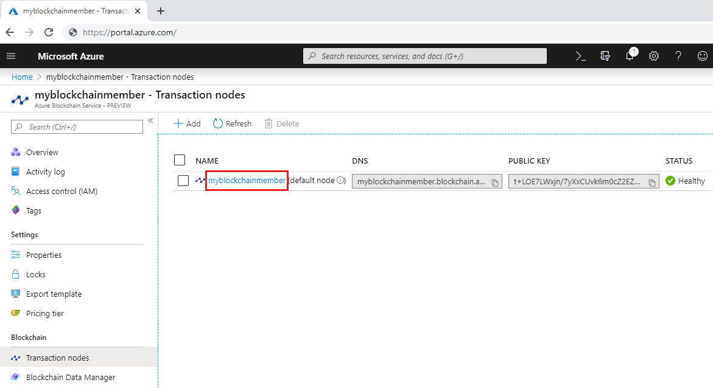
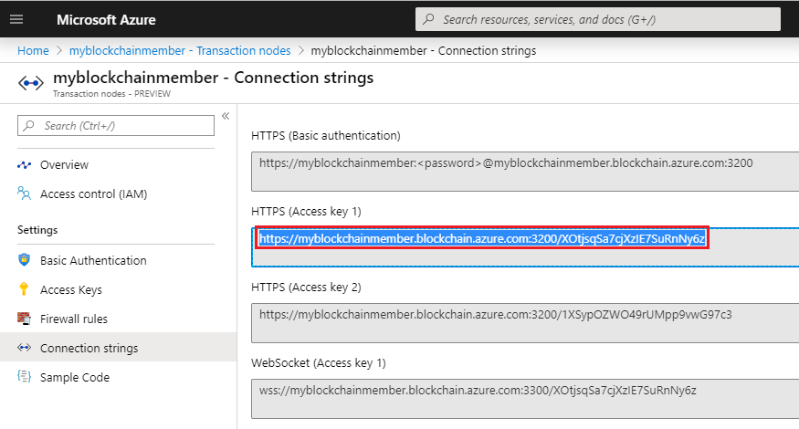
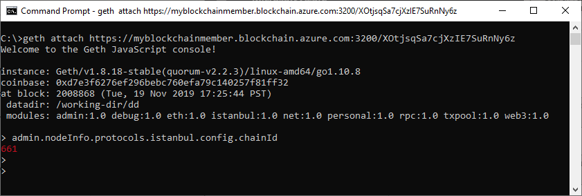

# Quickstart: Use Geth to connect to a transaction node

Geth is a Go Ethereum client you can use to attach to a Geth instance on an Azure Blockchain Service transaction node.

[!INCLUDE [quickstarts-free-trial-note](../../../includes/quickstarts-free-trial-note.md)]

## Prerequisites

* Install [Geth](https://github.com/ethereum/go-ethereum/wiki/geth)
* [Create an Azure Blockchain member](create-member.md)

## Get the Geth connection string

You can find the Geth connection string in the Azure portal.

1. Sign in to the [Azure portal](https://portal.azure.com).
1. Navigate to your Azure Blockchain Service member. Select **Transaction nodes** and the default transaction node link.

    

1. Select **Connection strings**.
1. Copy the connection string from **HTTPS (Access key 1)**. You need the command for the next section.

    

## Connect to Geth

1. Open a command prompt or shell.
1. Use the Geth attach subcommand to attach to the running Geth instance on your transaction node. Paste the connection string as an argument for the attach subcommand. For example,

    ```
    geth attach <connection string>
    ```

1. Once connected to the transaction node's Ethereum console, you can call the web3 JavaScript Dapp API or the admin API.

    For example, Use the following API to find out the chainId.

    ```bash
    admin.nodeInfo.protocols.istanbul.config.chainId
    ```

    In this example, the chainId is 297.

    

1. To disconnect from the console, type `exit`.

## Next steps

In this quickstart, you used the Geth client to attach to a Geth instance on an Azure Blockchain Service transaction node. Try the next tutorial to deploy and send a transaction using Truffle.

> [!div class="nextstepaction"]
> [Send a transaction](send-transaction.md)